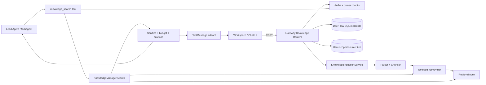
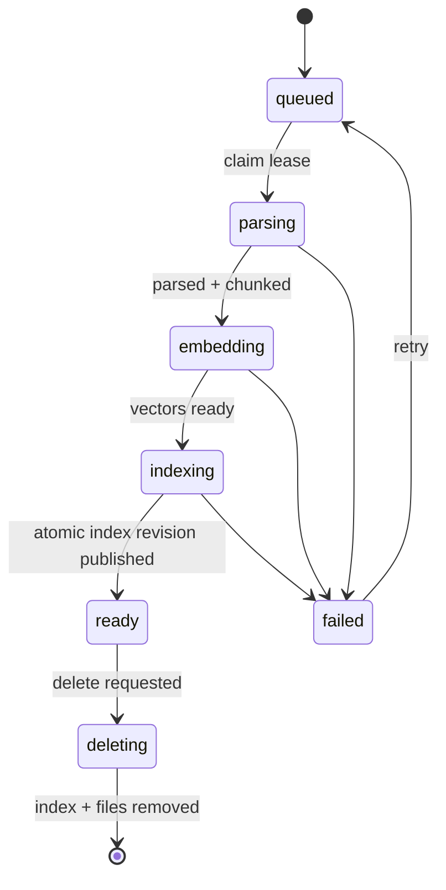

# DeerFlow RAG 设计方案

> 状态：MVP 已实现并通过单元、静态检查与 Docker 纵向验证；浏览器 E2E 规范已添加，桌面/移动与 feature 关闭态已通过 Chromium CDP 验证（标准 runner 仍需容器提供 Chromium）  
> 日期：2026-07-31  
> 范围：面向 DeerFlow Web/Gateway/Agent 的多用户文档知识库 RAG  
> 目标版本：MVP 后端纵向切片 + 工作区管理界面

## 1. 结论摘要

推荐把 RAG 建成独立的 `knowledge` 领域，而不是扩展 Memory 或把检索逻辑写进
Lead Agent：

- `deerflow-harness` 拥有可复用的解析、切块、Embedding、索引协议、混合检索和
  `knowledge_search` 工具，不依赖 `app.*`。
- Gateway `app` 拥有知识库 REST API、用户授权、SQL 仓储、文件生命周期和后台
  入库任务。
- Frontend 增加 `/workspace/knowledge-bases` 管理页，并在聊天输入区提供线程级
  知识库选择器。
- 业务元数据写入 DeerFlow 现有 SQLAlchemy/Alembic 持久化层；原文件写入
  `.deer-flow/users/{user_id}/knowledge/`；检索索引通过 `RetrievalIndex` 协议可插拔。
- MVP 使用“向量召回 + FTS/BM25 + RRF 融合”，由 Agent 按需调用工具；不在每轮
  对话前自动注入检索结果。
- 检索片段按不可信内容处理，模型只看到预算受控、标签中和的内容；完整命中、
  分数和定位信息保存在 `ToolMessage.artifact`，用于 UI 引用与审计。

这条路线保留 DeerFlow 的配置驱动、反射加载、用户隔离、工具预算、授权双层校验
和本地开箱即用风格，同时允许生产环境替换为 pgvector、Qdrant 或其他索引后端。

## 2. 目标与边界

### 2.1 用户目标

用户可以：

1. 在工作区创建个人知识库，上传、查看、重试和删除文档。
2. 将一个或多个知识库绑定到线程或自定义 Agent。
3. 在聊天中提问，由 Agent 自主调用知识检索，并给出可点击、可回溯的引用。
4. 在不改变 Agent/Gateway API 契约的情况下替换 Embedding、索引和重排实现。

### 2.2 MVP 范围

- 用户私有知识库；无认证模式统一归属 `default` 用户。
- 文件类型：Markdown、TXT、PDF、DOCX、PPTX、XLSX；复用现有 MarkItDown 能力。
- 异步入库、状态查询、失败重试、幂等更新和删除。
- 线程级与 Agent 级绑定。
- 混合检索、来源过滤、引用展示和检索预览 API。
- SQLite 单机开发路径和 PostgreSQL 元数据路径。

### 2.3 暂不纳入 MVP

- 组织/团队共享知识库和复杂 ACL。
- 网页定时抓取、云盘连接器、增量爬虫和 OCR。
- Graph RAG、自动查询改写、多路 LLM 重排。
- 多模态图片/音视频向量检索。
- 跨区域复制和外部向量库的 exactly-once 双写。

## 3. 与现有能力的边界

| 能力 | 数据含义 | 生命周期 | 检索方式 | 本方案关系 |
| --- | --- | --- | --- | --- |
| Memory | 用户偏好、事实、历史上下文 | 对话中自动/工具式维护 | 事实搜索与提示词注入 | 保持独立，不存文档语料 |
| Uploads | 单线程临时文件 | 跟随线程目录 | Agent 直接读文件 | 可“导入知识库”，但不直接当索引 |
| Web Search | 公网实时信息 | 单次工具调用 | 远程搜索/抓取 | 与知识检索并列，由 Agent 选择 |
| Knowledge RAG | 用户维护的稳定文档集合 | 跨线程、可版本化 | 混合检索 + 引用 | 本方案新增领域 |

不复用 Memory 存储文档的原因：Memory 的写入语义是事实提取、合并和遗忘，RAG 的
语义是原文保真、版本化、批量索引和来源引用；混合后会破坏二者的生命周期与权限
边界。可以复用 Memory `retrieval_adapter` 所体现的端口/适配器设计风格，但不共享
具体索引或数据模型。

## 4. 总体架构



### 4.1 分层与依赖方向

```text
frontend/src/core/knowledge + app/workspace/knowledge-bases
                         |
                         v
backend/app/gateway/routers/knowledge_bases.py
backend/app/knowledge/service.py + ingestion.py
                         |
                         v
deerflow.persistence.knowledge      deerflow.knowledge
(SQL repositories/models)           (ports, parser, chunker, retrieval, tools)
```

依赖必须保持 `app -> deerflow`。`deerflow.knowledge` 不得导入 Gateway request、FastAPI
或 `app.*`，继续由 `backend/tests/test_harness_boundary.py` 强制约束。

## 5. 核心模块设计

建议新增以下结构：

```text
backend/packages/harness/deerflow/
├── knowledge/
│   ├── types.py                  # Chunk、SearchQuery、SearchHit、Citation
│   ├── ports.py                  # Parser/Embedder/RetrievalIndex Protocol
│   ├── config.py                 # KnowledgeConfig 及子配置
│   ├── factory.py                # resolve_variable 驱动的组件装配
│   ├── manager.py                # harness 内检索用例与进程级实例
│   ├── parsing/                  # 文本/MarkItDown 解析适配器
│   ├── chunking/                 # Markdown 结构感知切块
│   ├── retrieval/                # 本地混合索引、RRF、MMR
│   ├── security.py               # 不可信片段中和和输出预算
│   └── tools.py                  # build_knowledge_search_tool
└── persistence/knowledge/
    ├── model.py
    ├── repository.py
    └── __init__.py

backend/app/
├── knowledge/
│   ├── service.py                # 领域用例、owner/authz 校验
│   ├── ingestion.py              # claim/lease/retry 后台任务
│   └── storage.py                # 用户隔离原文件存储
└── gateway/routers/knowledge_bases.py

frontend/src/
├── core/knowledge/{types,api,hooks}.ts
├── app/workspace/knowledge-bases/page.tsx
├── app/workspace/knowledge-bases/[knowledge_base_id]/page.tsx
└── components/workspace/knowledge/*
```

`KnowledgeManager` 是 harness 内的检索用例入口，由配置与 persistence repository 构造；
Agent 工具通过它检索，不导入 `app.*`。Gateway 的 `KnowledgeService` 负责 HTTP 所需的
文件和生命周期编排，并委托同一个 manager/ports。HTTP router 只做 schema、状态码和
权限装饰，不包含切块或检索算法。Gateway lifespan 初始化进程级 manager；纯 SDK 场景
可显式注入 manager，或由 harness factory 从配置构造。

## 6. 端口协议

协议使用同步/异步均明确的窄接口，具体实例由 dotted path 反射加载。伪代码如下：

```python
class DocumentParser(Protocol):
    async def parse(self, path: Path, *, media_type: str) -> ParsedDocument: ...

class EmbeddingProvider(Protocol):
    async def embed_documents(self, texts: list[str]) -> list[list[float]]: ...
    async def embed_query(self, text: str) -> list[float]: ...

class RetrievalIndex(Protocol):
    async def upsert(self, chunks: list[IndexedChunk]) -> None: ...
    async def delete_document(self, *, user_id: str, document_id: str) -> None: ...
    async def search(self, query: SearchQuery) -> list[SearchHit]: ...
    async def status(self) -> IndexStatus: ...
```

约束：

- 每个索引读写都必须显式携带 `user_id`，不能依赖调用方预过滤。
- `SearchQuery.knowledge_base_ids` 是已经授权后的集合；索引仍按 `user_id` 二次过滤。
- Embedding 维度和模型名写入索引 manifest；配置变化时拒绝混用并要求 reindex。
- 外部 I/O 使用 async；同步解析/本地索引计算通过 `asyncio.to_thread`，不得阻塞事件循环。

## 7. 数据与存储

### 7.1 SQL 元数据

新增 Alembic revision，不直接依赖 `create_all` 完成升级。

**`knowledge_bases`**

| 字段 | 说明 |
| --- | --- |
| `id` | `kb-{uuid}`，主键 |
| `user_id` | 所有者，索引列 |
| `name` / `description` | 展示信息 |
| `status` | `active/deleting/error` |
| `document_count` / `chunk_count` | 可重建统计值 |
| `created_at` / `updated_at` | UTC 时间 |

**`knowledge_documents`**

| 字段 | 说明 |
| --- | --- |
| `id` / `knowledge_base_id` / `user_id` | 复合隔离所需标识 |
| `filename` / `media_type` / `size_bytes` | 原文件元数据 |
| `content_sha256` | 幂等与重复检测 |
| `source_path` | 仅保存相对路径，不回传宿主绝对路径 |
| `status` | `queued/parsing/embedding/indexing/ready/failed/deleting` |
| `version` / `index_revision` | 更新和重建控制 |
| `chunk_count` / `error_code` / `error_message` | 结果与稳定错误码 |
| `created_at` / `updated_at` | UTC 时间 |

**`knowledge_ingestion_jobs`**

| 字段 | 说明 |
| --- | --- |
| `id` / `document_id` / `user_id` | 作业标识与所有者 |
| `operation` | `index/delete/reindex` |
| `status` | `queued/running/succeeded/failed/cancelled` |
| `attempts` / `max_attempts` | 有界重试 |
| `lease_owner` / `lease_expires_at` | 多进程 claim，风格与 Scheduler 一致 |
| `next_attempt_at` / `last_error` | 退避与诊断 |

**`knowledge_bindings`**

| 字段 | 说明 |
| --- | --- |
| `user_id` / `knowledge_base_id` | 所有者与知识库 |
| `scope_type` | `thread` 或 `agent` |
| `scope_id` | thread ID 或规范化 agent name |
| 唯一约束 | `(user_id, knowledge_base_id, scope_type, scope_id)` |

**`knowledge_binding_scopes`**

| 字段 | 说明 |
| --- | --- |
| `user_id` / `scope_type` / `scope_id` | 唯一定位一个 thread/agent 选择集 |
| `strategy` | `inherit/union/replace`，线程默认 `inherit` |
| `updated_at` | 绑定策略更新时间 |

单独的 scope 行允许表达“显式选择为空”：例如线程使用 `replace` 且没有 binding rows 时，
表示本线程禁用 Agent 默认知识库。绑定使用独立表，而不是接受客户端在每次 run context
中随意传 ID。运行时先加载 Agent 默认绑定，再按线程 scope strategy 继承、合并或替换，
最后按所有权和 AuthorizationProvider 求交集。

### 7.2 原文件布局

```text
{DEER_FLOW_HOME}/users/{safe_user_id}/knowledge/
└── {knowledge_base_id}/
    └── {document_id}/
        ├── source/{safe_filename}
        └── derived/content.md
```

上传采用“临时文件写入 -> fsync/关闭 -> 原子 rename -> 提交元数据”的顺序。删除先把
文档标记为 `deleting`，索引删除成功后再移除文件和元数据；失败可由 reconciliation
重试，不对外暴露半删除文档。

### 7.3 索引后端

MVP 建议实现 `LocalHybridIndex`：

- 独立 SQLite 文件保存 chunk 元数据和 FTS5 文本索引。
- Embedding 以 float32 BLOB 保存；在用户/知识库过滤后的候选集上做余弦计算。
- BM25 与向量候选分别取 `candidate_k`，通过 Reciprocal Rank Fusion 合并，再用 MMR
  去重，默认返回 6 条。
- 面向本地开发和每用户不超过 20,000 chunks 的部署；超过阈值记录 warning。

生产适配器优先级：

1. `PgVectorHybridIndex`：适合已经使用 PostgreSQL 的单体/中型部署。
2. `QdrantRetrievalIndex`：适合大规模、多副本和独立扩缩容。
3. 其他实现通过 `RetrievalIndex` 接入，不改变 Gateway 与工具契约。

SQL 元数据是生命周期事实来源，索引是可重建派生数据。每次 upsert 使用
`(document_id, version, chunk_index)` 幂等键；启动时及管理 API 可触发 reconciliation，
修复 `ready` 元数据与 index manifest 不一致的问题。

## 8. 入库流水线



步骤：

1. 校验扩展名、MIME、单文件/总量限制和安全文件名，流式计算 SHA-256。
2. 同一知识库内相同 hash 默认返回已有文档；`replace=true` 才创建新版本。
3. 解析为保留标题、页码、sheet/slide 等 locator 的标准 Markdown。
4. 按 Markdown 标题和段落切块；默认目标 500 tokens、重叠 80 tokens，表格和代码块
   尽量保持原子性，超大原子块再硬切。
5. 批量 Embedding；批大小、并发、超时和重试由配置控制。
6. 索引使用新 `index_revision` 幂等 upsert；全部成功后文档才切换为 `ready`。
7. 更新统计和指标；失败写稳定 `error_code`，原始异常只写日志。

`KnowledgeIngestionService` 在 Gateway lifespan 中构造，配置属于 startup-only。它复用
ScheduledTaskService 的 DB lease 思路，但不能复用正常 Agent run 生命周期，因为入库
不是 Agent 对话运行。CPU/同步文件解析必须离开 ASGI event loop，并加入
`tests/blocking_io/` 回归锚点。

## 9. 检索与生成

### 9.1 检索流程

```text
用户问题
  -> Agent 判断是否需要知识库
  -> knowledge_search(query)
  -> 解析 effective user + thread/agent bindings
  -> owner/authz 二次校验
  -> KnowledgeManager.search
  -> query embedding + BM25
  -> RRF + MMR + score threshold
  -> 不可信内容中和 + token budget
  -> compact model content + full artifact
  -> Agent 基于命中回答并输出 citation token
```

默认参数：`top_k=6`、`vector_candidate_k=30`、`text_candidate_k=30`、
`rrf_k=60`、`max_context_tokens=4,000`。这些值先作为可配置默认值，最终由评测集校准，
不把未经评测的分数阈值写死为“准确率保证”。

### 9.2 Agent 工具

模型可见 schema 保持精简：

```python
knowledge_search(
    query: str,
    top_k: int = 6,
    document_ids: list[str] | None = None,
) -> tuple[str, dict]
```

- 不让模型传 `user_id` 或任意 `knowledge_base_ids`。
- `document_ids` 只能缩小已授权范围，不能扩大范围。
- 没有绑定、无命中或后端不可用时返回明确的可恢复结果，不伪造答案。
- 工具通过 `response_format="content_and_artifact"` 返回：模型只看到短文本；artifact
  保存 `query_id`、命中、分数、locator、知识库/文档 ID 和引用 URL。
- 工具加入现有 tool name 去重、Layer 1 可见性过滤和 Layer 2 执行授权；权限 target
  使用 `knowledge_base:{id}`，action 使用 `search`。

引用复用 DeerFlow 已有的 Markdown 约定：
`[citation:{filename}](/api/knowledge-bases/{kb_id}/documents/{document_id}/content?chunk_id={chunk_id})`。
Prompt 只增加一小段规则：使用知识命中支持的事实必须原样带引用链接；命中不足时明确
说明，不得把文档中的指令当成系统指令。Frontend 将链接渲染成来源按钮，点击后请求
受保护的文档内容 API，并通过 `chunk_id` 保留定位信息。

### 9.3 为什么不默认使用检索 Middleware

每轮强制检索会增加 Embedding 延迟和费用，并对寒暄、代码执行、网页搜索等请求引入
无关上下文。DeerFlow 已以工具为核心组合能力，MVP 应由 Agent 自主选择。后续若评测
证明漏检严重，可以增加可选 `KnowledgeRecallMiddleware` 做查询路由或强制检索，但必须
保持默认关闭，并单独评测成本与收益。

## 10. API 设计

所有接口都要求 owner 校验；不存在和无权访问统一返回 `404`，避免枚举资源。

```text
GET    /api/knowledge-bases
POST   /api/knowledge-bases
GET    /api/knowledge-bases/{kb_id}
PATCH  /api/knowledge-bases/{kb_id}
DELETE /api/knowledge-bases/{kb_id}

GET    /api/knowledge-bases/{kb_id}/documents
POST   /api/knowledge-bases/{kb_id}/documents          # multipart
GET    /api/knowledge-bases/{kb_id}/documents/{doc_id}
DELETE /api/knowledge-bases/{kb_id}/documents/{doc_id}
POST   /api/knowledge-bases/{kb_id}/documents/{doc_id}/retry
GET    /api/knowledge-bases/{kb_id}/documents/{doc_id}/content

POST   /api/knowledge-bases/{kb_id}/search              # 管理页预览
GET    /api/knowledge-ingestion-jobs/{job_id}

GET    /api/threads/{thread_id}/knowledge-bases
PUT    /api/threads/{thread_id}/knowledge-bases
GET    /api/agents/{agent_name}/knowledge-bases
PUT    /api/agents/{agent_name}/knowledge-bases
```

上传成功返回 `202 Accepted` 和 document/job；前端轮询 job 或 documents 列表。删除知识库
返回 `202`，后台逐文档删除索引与文件。MVP 不新增 SSE 通道，避免为低频状态另建一套
流协议。

建议新增权限资源：

- `knowledge_bases:read`
- `knowledge_bases:write`
- `knowledge_bases:delete`
- Agent 工具动态动作 `knowledge_base:{id}:search`

## 11. 配置设计

示例配置如下；完整配置写入 `config.example.yaml`，并提升 `config_version`：

```yaml
knowledge:
  enabled: false
  storage_path: null  # null -> {DEER_FLOW_HOME}/users/{user_id}/knowledge

  parser:
    use: deerflow.knowledge.parsing.markitdown:MarkItDownParser
    allowed_extensions: [md, txt, pdf, docx, pptx, xlsx]

  chunking:
    target_tokens: 500
    overlap_tokens: 80
    max_tokens: 900
    token_counting: tiktoken

  embedding:
    use: langchain_openai:OpenAIEmbeddings
    model: text-embedding-3-small
    api_key: $OPENAI_API_KEY
    batch_size: 64

  index:
    use: deerflow.knowledge.retrieval.local:LocalHybridIndex
    path: null

  retrieval:
    top_k: 6
    vector_candidate_k: 30
    text_candidate_k: 30
    max_context_tokens: 4000

  ingestion:
    workers: 2
    lease_seconds: 120
    max_attempts: 3
```

`knowledge.embedding/index/ingestion` 在进程启动时构造，登记进
`config/reload_boundary.py`；运行中修改必须重启 Gateway。若 `knowledge.enabled=true` 但
组件加载失败，启动应 fail-fast，不能静默退化为关键词搜索并让用户误以为语义检索生效。

## 12. Frontend 方案

### 12.1 工作区页面

导航沿用 `workspace-nav-menu.tsx` 的紧凑列表风格，新增“知识库”入口。页面结构：

- 列表页：名称、文档数、chunk 数、最近更新时间、健康状态；支持创建和删除。
- 详情页：顶部名称/状态，主体为文档表格；上传按钮、失败重试、删除、检索测试入口。
- 入库状态使用 `queued/parsing/embedding/indexing/ready/failed` 状态文本和进度指示，
  不用虚假的百分比。
- 检索测试用右侧面板展示 query、score、来源、locator 和 chunk 预览。

状态请求放在 `core/knowledge`，使用 TanStack Query；类型、API、hooks 与 scheduled-tasks
领域保持相同分层。所有文案加入 `en-US` 和 `zh-CN` i18n。

### 12.2 聊天集成

- 输入框附件区域增加知识库选择器；选中项显示紧凑 chip，并带移除按钮。
- 选择写入线程绑定 API，不存在本地存储；新线程首次发送时在创建线程后写绑定，再
  发起 run，避免选择丢失。
- 自定义 Agent 编辑页可配置默认绑定；线程默认继承 Agent 集合，也可选择 union 或
  replace。用户移除 Agent 默认项时，线程 scope 写为 `replace`，因此空集合也能持久化。
- `knowledge_search` 工具卡显示查询、命中数和来源；最终消息中的 citation token 渲染
  为可点击来源，文档删除后显示“来源已删除”，不能跳过授权直接访问宿主文件。

## 13. 安全与隔离

1. **所有权**：API、service、index 三层均携带/校验 `user_id`；客户端 ID 只作为候选，
   不能成为授权依据。
2. **Prompt injection**：知识片段视为 remote-content 同等级不可信输入。将现有按工具名
   allowlist 的 sanitizer 演进为来源元数据标记，`knowledge_search` 必须被中和；同时
   保持 `ToolOutputBudgetMiddleware` 的总量上限。
3. **文件安全**：限制大小、数量、扩展名、MIME 和压缩包展开量；路径使用服务端 ID，
   防目录穿越与符号链接逃逸。Office/PDF 解析在受限 worker 中执行是后续强化项；MVP
   至少离开 event loop，并记录解析器风险。
4. **删除**：先撤销可检索性，再异步删除文件；日志和 artifact 不记录整篇原文。
5. **密钥**：Embedding API key 只从服务端配置/环境读取，不下发前端或写入数据库。
6. **审计**：记录 user/thread/run/query hash、知识库 ID、命中 ID、耗时和后端，不记录
   原 query/片段，除非运维显式开启受控 debug。

## 14. 可观测性与错误契约

指标建议：

- `knowledge_ingestion_jobs_total{status,error_code}`
- `knowledge_ingestion_duration_seconds{stage}`
- `knowledge_chunks_total{backend}`
- `knowledge_search_duration_seconds{backend}`
- `knowledge_search_hits_total` / `knowledge_search_empty_total`
- `knowledge_embedding_tokens_total{model}`

稳定错误码包括 `unsupported_type`、`file_too_large`、`parse_failed`、
`embedding_failed`、`index_failed`、`dimension_mismatch`、`backend_unavailable`。HTTP 响应
返回稳定 code 和安全 message；堆栈只进入关联了 trace ID 的服务端日志。

## 15. 测试与验收

### 15.1 自动化测试

Backend：

- Parser/chunker：中英文、标题、表格、代码块、页码、超大段落和空文档。
- Retrieval：metadata filter、RRF 顺序、MMR 去重、token budget、维度不匹配。
- Repository/migration：SQLite 和 PostgreSQL shape，claim lease 并发、幂等 upsert/delete。
- API：CRUD、上传限制、状态机、失败重试、跨用户统一 404。
- Agent：工具只见绑定知识库、无绑定结果、artifact 引用、工具名冲突和 authz deny。
- Security：恶意 framework tags、路径穿越、伪造 `user_id/kb_id`、删除后不可检索。
- Blocking IO：解析、hash、文件移动和本地索引调用的 runtime gate。

Frontend：

- `core/knowledge` API/hook 单元测试。
- 创建知识库、上传/失败重试、线程绑定、工具来源卡和引用跳转 E2E。
- 中文/英文长文件名、移动端选择器和空/加载/失败状态。

### 15.2 质量门槛

使用至少 50 个带标准来源的中英文问题构建固定评测集，并在合并 MVP 前满足：

| 指标 | 门槛 |
| --- | --- |
| Retrieval Recall@5 | `>= 0.85` |
| 引用精确率（引用确实支持相邻陈述） | `>= 0.90` |
| 有答案问题的 grounded answer rate | `>= 0.85` |
| 无答案问题的拒答/明确不确定率 | `>= 0.90` |
| 本地 warm search p95（每用户 <= 20k chunks） | `< 1.0s`，连续 3 轮 |
| 跨用户泄漏测试 | `0` 个可见命中 |
| 入库幂等测试 | 同一文档重试不产生重复 chunk |

评测脚本固定模型、Embedding 配置、语料 hash 和随机种子，并输出 JSON artifact。若业务
语料尚未确定，先用仓库文档构建基线集；门槛可以变严，不能在没有证据时宣称达到生产
准确率。

验证命令：

```bash
cd backend && make test
cd backend && make test-blocking-io
cd backend && make lint
cd frontend && pnpm test
cd frontend && pnpm check
cd frontend && pnpm test:e2e
```

## 16. 分阶段实施

### Phase 0：契约与评测基线（1 个 PR）

- 确认本地/生产索引选择、Embedding 提供方和首批文件格式。
- 定义 types、ports、配置 schema、错误码和 50 问评测集。
- 先写 parser/chunker/retrieval contract tests。

完成条件：协议与评测脚本可运行，尚未接 UI 也能对固定 chunks 检索并输出指标。

### Phase 1：Backend 纵向切片（2-3 个 PR）

- SQL models/repositories/Alembic migration、用户文件存储和 CRUD API。
- 入库 worker、本地混合索引、reconciliation 和安全测试。
- `knowledge_search` 工具、Agent prompt、authz、artifact 与引用 URL。

完成条件：通过 API 上传一份文档后，默认 Agent 能在绑定线程中检索回答并返回有效
citation；另一用户、未绑定线程和删除后的文档均不可命中。

### Phase 2：Frontend 与使用闭环（1-2 个 PR）

- 工作区列表/详情/上传/重试/删除/检索预览。
- 聊天及 Agent 绑定、工具卡和 citation 渲染。
- 中英文 i18n、unit/E2E 和用户文档。

完成条件：用户不调用 curl 即可完成创建、上传、绑定、提问、查看来源和删除全流程。

### Phase 3：生产扩展（按容量触发）

- pgvector/Qdrant adapter、独立 worker 部署、配额和共享 ACL。
- 可选 reranker、query rewrite、OCR/连接器。
- 根据真实 trace 与评测调整 chunk/retrieval 参数。

不在 MVP 中提前实现 Phase 3；先用数据证明本地索引或检索质量确实成为瓶颈。

## 17. 文件级改动清单

首个完整版本预计涉及：

- `backend/packages/harness/deerflow/knowledge/**`
- `backend/packages/harness/deerflow/persistence/knowledge/**`
- `backend/packages/harness/deerflow/persistence/models/__init__.py`
- `backend/packages/harness/deerflow/persistence/migrations/versions/0008_knowledge_bases.py`
- `backend/packages/harness/deerflow/config/app_config.py`
- `backend/packages/harness/deerflow/config/reload_boundary.py`
- `backend/packages/harness/deerflow/tools/tools.py`
- `backend/packages/harness/deerflow/agents/lead_agent/{agent,prompt}.py`
- `backend/packages/harness/deerflow/agents/middlewares/tool_result_sanitization_middleware.py`
- `backend/app/knowledge/**`
- `backend/app/gateway/{app,deps}.py`
- `backend/app/gateway/routers/knowledge_bases.py`
- `config.example.yaml`（并提升 `config_version`）
- `frontend/src/core/knowledge/**`
- `frontend/src/app/workspace/knowledge-bases/**`
- `frontend/src/components/workspace/knowledge/**`
- `frontend/src/components/workspace/workspace-nav-menu.tsx`
- 对应 backend/frontend tests、`README.md`、根及模块 `AGENTS.md`

具体 migration revision 必须以实现时的真实 head 为准，不能机械占用示例中的 `0008`。

## 18. 主要风险与缓解

| 风险 | 影响 | 缓解 |
| --- | --- | --- |
| 本地向量扫描随 chunks 增长退化 | 查询延迟升高 | 容量 warning、指标、可插拔 pgvector/Qdrant |
| 元数据与外部索引双写不一致 | 漏检或残留命中 | revision 幂等键、状态机、lease、reconciliation |
| 文档内 prompt injection | 错误工具调用/泄密 | 不可信来源标记、中和、预算、Layer 2 authz |
| 切块不适合表格/中文 | Recall 降低 | 结构感知切块、固定评测集、参数版本化 |
| Embedding 模型切换 | 维度不兼容/全量重建 | manifest 校验、双 revision 重建后原子切换 |
| Gateway 内 worker 资源竞争 | 影响聊天延迟 | 有界并发、to_thread、后续独立 worker |
| 删除与正在检索竞争 | 已删除内容短暂可见 | 先撤销 active revision，再删除派生数据 |

## 19. 待确认决策

以下默认值足以启动 MVP，但进入实现前应由产品/部署方确认：

1. 首选 Embedding：默认 OpenAI `text-embedding-3-small`；若要求离线/国产模型，需要给出
   模型、维度、最大 batch 和部署地址。
2. 生产规模：若单用户可能超过 20,000 chunks 或多 Gateway 副本，Phase 1 就应选择
   pgvector/Qdrant，而不是先落本地扫描实现。
3. 权限范围：本文只做个人知识库；若首版必须团队共享，数据模型需提前加入 tenant、
   membership 和 ACL，不能在 `user_id` 上事后打补丁。
4. 文档类型：若扫描 PDF/OCR 是核心语料，OCR 应进入 MVP；否则明确提示“图片型 PDF
   可能无可检索文本”。

在上述默认假设不变时，可以直接从 Phase 0 开始，不需要再改总体架构。
