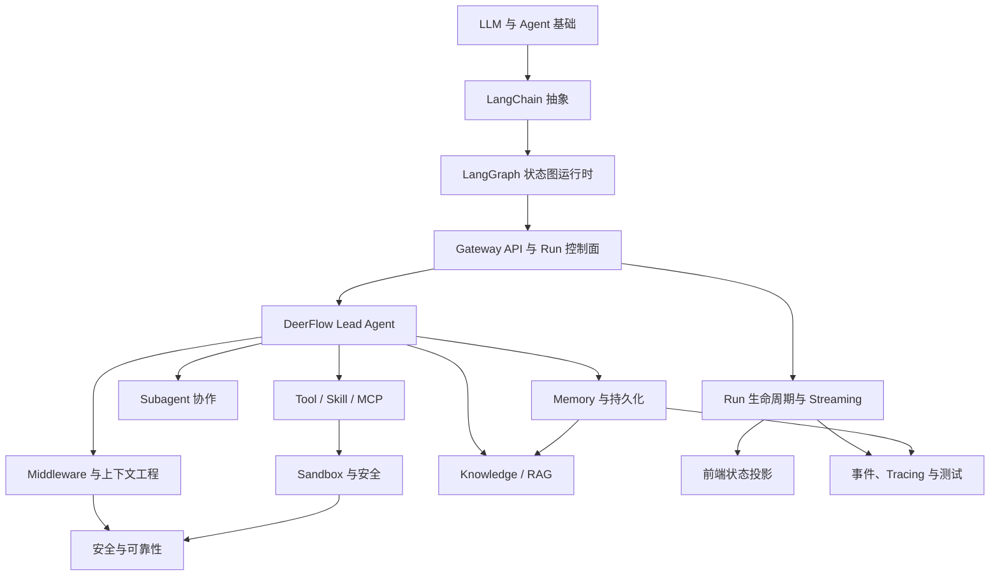

# 00 学习目标与路线

## 1. 用可验收结果定义学习目标

本学习计划的最终目标是：

> 在完成全部模块后，能够不依赖项目说明文档，从源码独立还原 DeerFlow 的端到端架构；能够实现或评审一个包含状态图、工具、沙箱、子 Agent、记忆、流式输出、持久化、可观测性与测试的 Agent 功能；能够对常见面试题给出“原理、源码、权衡、故障”四层回答。

### 验收标准

你应能独立完成以下任务：

- 在 10 分钟内画出 DeerFlow 服务拓扑和一条消息的时序图。
- 准确解释 `Thread`、`Run`、`Checkpoint`、LangGraph `Store`、`RunStore`、`RunEventStore`、`StreamBridge` 的区别。
- 从 `make_lead_agent()` 追踪到 `create_agent()`，说明模型、工具、状态和 Middleware 如何装配。
- 说明至少 8 个 Middleware 的执行阶段、依赖关系与顺序约束。
- 使用 LangGraph 写一个有 reducer、checkpointer、tool calling、streaming 和 interrupt/resume 的最小 Agent。
- 设计一个新 Tool 或 Skill，并说明权限、超时、错误、输出预算、秘密、审计和测试策略。
- 解释 Subagent 的并发上限、超时、max turns、部分结果、step events 和 token 归集。
- 解释为何 Memory、Checkpoint 和 RunEvent 不应合并成一个存储系统。
- 分析一次 stop/reconnect/regenerate/branch/compact 的竞态与一致性边界。
- 比较 LangGraph 远程 SDK 与嵌入式 `DeerFlowClient` 的运行、流式、持久化和部署边界。
- 解释 Gateway 的应用生命周期、安全 Middleware、API 平面、Run 准入和多 Worker 约束。
- 对比官方 LangGraph Server 宿主与 DeerFlow 嵌入式运行时，并说明相对原版 LangChain/LangGraph 的主要设计取舍。
- 回答 `14-interview-guide.md` 中至少 80% 的核心问题。

## 2. 知识地图

## 3. 四个学习阶段

### 阶段一：建立 Agent 框架基础

学习文档：`05、06`。

你需要理解：

- LLM 消息不是普通字符串，而是带角色、ID、工具调用和元数据的协议对象。
- Tool calling 是模型提出结构化调用，运行时执行后用 `ToolMessage` 回填，而不是模型直接执行函数。
- Agent 是一个受状态、工具结果和终止条件控制的循环。
- LangGraph 用状态 channel、reducer、super-step 和 checkpoint 把循环提升为可恢复状态图。
- `RunnableConfig` 是执行配置，不是业务状态。

阶段产出：实现一个最小 LangGraph Agent，并观察 `values`、`messages`、`custom` 三类流。

### 阶段二：理解 DeerFlow Agent 内核

学习文档：`01、19、02、22、03、04、07、18、20`。

你需要理解：

- Gateway 为什么同时提供 REST API 和 LangGraph 兼容 API。
- Gateway 如何装配 Middleware、Router、Run 控制面和进程级基础设施。
- App、Harness、Runtime、Provider、Persistence 和 Capability 模块如何分层及依赖。
- Lead Agent 为什么使用 `create_agent()`，而不是在业务代码中手写主循环。
- ThreadState、runtime context、configurable、metadata 的边界。
- Middleware 顺序如何影响安全、消息协议、错误恢复与上下文压缩。
- Goal 自治循环为什么位于 Run Worker 外层。
- 为什么不用官方 LangGraph Server 当宿主，以及相对原版框架保留了什么、改了什么。

阶段产出：独立画出 Gateway 生命周期图、后端模块依赖图、API 分层图，以及「官方 Server vs DeerFlow 嵌入式」对照时序图。

### 阶段三：掌握生产级能力

学习文档：`08、09、10、11、23、12、13、17`。

你需要理解：

- 工具能力的发现、裁剪、延迟暴露、执行授权与错误标准化。
- Local、AIO、BoxLite 的隔离级别差异。
- request-scoped secrets 如何避免进入 prompt、command、checkpoint 和 trace。
- Subagent 如何共享线程工作区但隔离推理上下文。
- Checkpoint、Store、Repository、Memory 和 Stream 各自解决什么问题。
- Knowledge RAG 与 Memory/Uploads/Web Search 的边界，以及线程绑定、混合检索、`knowledge_search` 安全契约。
- 前端如何合并历史、实时与乐观状态。
- LangGraph 远程 SDK 与嵌入式 `DeerFlowClient` 为什么共享 Agent 内核却保留两条执行路径。
- 为什么 Agent 测试要覆盖确定性逻辑、协议、运行时和端到端行为。

阶段产出：设计一个可安全执行的自定义能力，并完成威胁模型和测试计划；另完成一次“上传 → 绑定 → 检索引用”的 RAG 闭环。

### 阶段四：面试表达与综合实践

学习文档：`14、15、16`。

你需要把知识从“看懂”转化为：

- 能解释；
- 能比较；
- 能排障；
- 能设计；
- 能通过源码证据支撑结论。

阶段产出：完成至少 5 个实验，并进行一次 45 分钟模拟面试。

## 4. 八周建议计划

| 周 | 主题 | 建议产出 |
|---|---|---|
| 第 1 周 | LangChain 消息、模型、工具与 Runnable | 最小 Tool-calling Demo |
| 第 2 周 | LangGraph State、Reducer、Checkpoint、Stream | 可恢复 Agent Demo |
| 第 3 周 | DeerFlow 架构、Gateway、请求链路与官方 Server 对照 | Gateway 生命周期图、官方 vs 嵌入式时序对比、取舍表 |
| 第 4 周 | Agent、Middleware 与上下文工程 | Middleware 顺序表 |
| 第 5 周 | Tool、Skill、MCP、Sandbox、安全 | 一个安全 Tool 设计 |
| 第 6 周 | Subagent、Memory、Persistence、Knowledge RAG | 数据边界、RAG 绑定与一致性图 |
| 第 7 周 | Streaming、Frontend、SDK、Observability、Testing | 一份 SDK 选型与故障排查手册 |
| 第 8 周 | 实战与面试 | Demo、复盘、模拟面试 |

## 5. 面试回答模板

面对“为什么”类问题，建议使用以下结构：

1. **定义概念**：一句话说明它解决什么问题。
2. **说明 DeerFlow 实现**：给出关键符号和路径。
3. **解释设计取舍**：说明收益和代价。
4. **补充故障场景**：没有它会发生什么，边界在哪里。

例如回答“为什么既需要 Checkpointer 又需要 RunEventStore”：

- Checkpointer 保存 reducer 合并后的图状态与恢复信息，是会话可继续执行的权威来源。
- RunEventStore 保存消息、工具、子 Agent、审计等追加事件，服务历史查询和可观测性。
- 两者分离能兼顾状态恢复与高效查询，但产生最终一致性窗口。
- 即使 Journal flush 失败，Checkpoint 仍可能完整；排障时不能把事件缺失误判为图状态丢失。

## 6. 学习纪律

- 不只读文档：每个结论至少定位一个源码符号。
- 不只看 happy path：重点追踪异常、取消、超时、重连和重启。
- 不把 Prompt 当安全边界：寻找确定性代码约束。
- 不把“异步”当“不会阻塞”：检查同步 I/O 是否进入 event loop。
- 不把“持久化”当“强一致”：明确每次写入是否处于同一事务。
- 不背框架名词：用实际数据流和状态变化解释。
- 不追求一次读懂所有文件：先建立主链路，再按问题深入模块。
