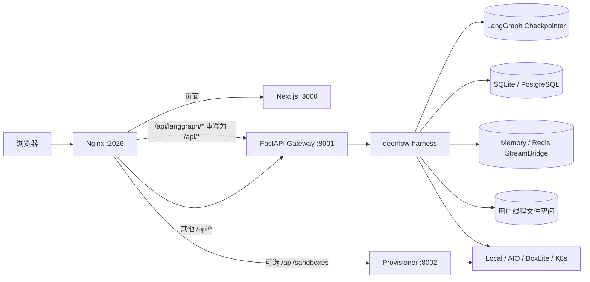
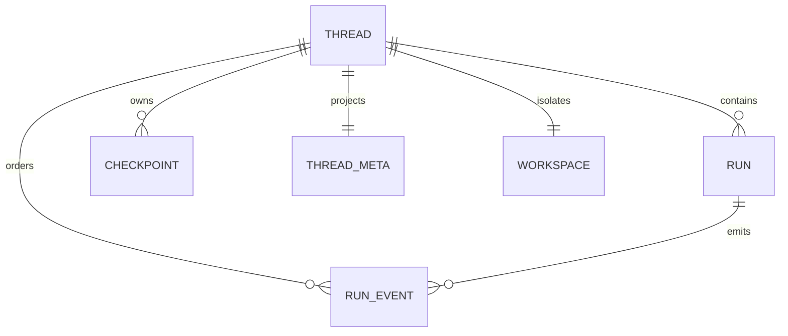

# 01 DeerFlow 系统架构

## 1. 一句话心智模型

DeerFlow 是一个以 **Gateway 内嵌 Agent Runtime** 为中心的全栈系统：Frontend 使用 LangGraph SDK，Gateway 实现兼容 API 并管理 Run，Harness 提供可复用 Agent 内核，Checkpoint、业务 Repository、事件流和文件系统分别保存不同类型的事实。

## 2. 服务拓扑



### 服务职责

| 服务 | 职责 | 不负责什么 |
|---|---|---|
| Nginx | 同源入口、路径改写、SSE 代理、超时与缓冲配置 | 不运行 Agent |
| Frontend | 对话 UI、流消费、状态投影、乐观交互 | 不决定 Agent 执行语义 |
| Gateway | 认证、REST、LangGraph 兼容 API、Run 生命周期、SSE | 不应承载可复用 Agent 领域实现 |
| Harness | Agent、Middleware、Tool、Sandbox、Subagent、Memory、Runtime | 不依赖 `app.*` 应用层 |
| Provisioner | 可选地创建和管理远程/K8s Sandbox | 不执行 Lead Agent 图 |

关键入口：

- `docker/nginx/nginx.local.conf`
- `frontend/src/core/api/api-client.ts`
- `backend/app/gateway/app.py`
- `backend/app/gateway/deps.py`
- `backend/packages/harness/deerflow/`

## 3. Harness / App 分层

后端最重要的边界是：

```text
app.* → deerflow.*       允许
deerflow.* → app.*       禁止
```

### Harness

路径：`backend/packages/harness/deerflow/`

它是可发布、可嵌入的 Agent 框架层，包含：

- Lead Agent 与中间件；
- ThreadState；
- Tool、Skill、MCP；
- Sandbox；
- Subagent；
- Memory；
- Checkpointer、Store、RunManager、StreamBridge、RunJournal；
- Embedded `DeerFlowClient`。

### App

路径：`backend/app/`

它包含产品应用边界：

- FastAPI Gateway；
- HTTP 鉴权与 CSRF；
- REST routers；
- IM channels；
- 用户连接等应用服务。

### 为什么要这样分层

收益：

- Agent Runtime 可脱离 HTTP 运行，例如 TUI 和 Embedded Client。
- FastAPI 与 IM 逻辑不会污染可发布 Harness。
- 可以对依赖方向写自动化边界测试。
- 测试 Agent 时不必启动整个应用。

后端各目录、Provider、Usage、数据所有权和典型改动落点详见 [19 完整后端模块架构](19-backend-module-architecture.md)。

代价：

- 用户身份、配置、持久化和运行上下文必须通过明确接口传入。
- 同一个能力在 Gateway 与 Embedded Client 可能需要适配层。

## 4. Gateway 不是官方 LangGraph Server

Frontend 将 Base URL 指向 `/api/langgraph`，但 Nginx 会把该前缀改写后交给同一个 Gateway。Gateway 自己实现满足当前 SDK 使用的兼容 API：

- threads；
- runs create/stream/wait/cancel/join；
- state/history；
- assistant 基础发现；
- checkpoint 参数。

这是一种 **协议兼容层**，不是完整 LangGraph Platform 复刻。当前边界包括：

- assistant graph/schema 只提供最小兼容信息；
- `events` stream mode 在 worker 中被跳过；
- `enqueue` 虽可出现在接口模型中，但运行时未实现；
- Run 调度、队列、worker ownership 不等价于官方平台。

面试时应回答：DeerFlow 复用了 LangGraph SDK 和图运行时，但自行实现了产品所需的服务端控制面。

对照时序与相对原版 LangChain/LangGraph 的完整取舍表，见 [22 官方 Server 与嵌入式运行时](22-langgraph-server-vs-embedded-runtime.md)。

## 5. 核心领域对象

### Thread

长期会话身份，同时用于：

- Checkpointer 的 `configurable.thread_id`；
- Run 的归属；
- RunEvent 的顺序分区；
- 用户文件目录隔离；
- 线程列表元数据。

### Run

Thread 上的一次执行尝试。一次普通消息、重生成、计划任务、Goal 续跑入口或 IM 触发都与 Run 有关。一个 Thread 包含多个 Run。

### Checkpoint

LangGraph reducer 合并后的图状态快照，包括消息、channel values、版本、parent、pending writes 等，是“会话当前可继续状态”的权威来源。

### RunEvent

追加型历史与观测事件，包括消息、工具、Middleware、Subagent step、workspace changes。它适合查询与审计，但不是完整图状态。

### StreamEvent

短期实时事件，保存在 Memory/Redis StreamBridge 中，用于 SSE。它可以过期和裁剪，不是长期历史。

### ThreadMeta

线程列表查询投影，保存标题、状态、owner、metadata。它不是完整 ThreadState。

## 6. 多平面数据架构



| 数据平面 | 主要用途 | 是否权威 | 生命周期 |
|---|---|---|---|
| Checkpointer | 图状态、恢复、分支 | ThreadState 权威 | 长期 |
| RunStore | Run 状态、模型、token、错误 | Run 业务元数据权威 | 长期 |
| RunEventStore | 历史、审计、step | 过程投影 | 长期 |
| ThreadMetaStore | sidebar、标题、状态 | 查询投影 | 长期 |
| StreamBridge | SSE 实时传输 | 非权威 | 短期 |
| Filesystem | workspace/uploads/outputs | 文件事实 | 长期或按清理策略 |
| MemoryStorage | 用户长期个性化 | 记忆层事实 | 长期、best-effort 更新 |

### 为什么不放在一个数据库对象中

不同数据具有完全不同的访问模式：

- 图恢复需要 channel version 和 pending writes；
- 侧边栏需要按更新时间快速搜索；
- token streaming 需要低延迟广播；
- 历史需要分页和按 run/task 过滤；
- 文件需要大对象和目录语义；
- Memory 是跨线程用户事实。

分离提高了可扩展性，却引入最终一致性。排障时必须先判断“哪一个平面出了问题”。

## 7. 部署形态

### 本地开发

`make dev` 启动 Gateway、Frontend 和 Nginx；Agent Runtime 仍在 Gateway 进程内。

### Docker 开发/生产

通常包含 Gateway、Frontend、Nginx、Redis；可选 Provisioner。生产 Gateway 默认单 worker，这是因为：

- `RunManager` 保存进程内 `asyncio.Task`；
- abort event 和 finalizing 也是进程内状态；
- thread lock 不是分布式锁；
- IM channel service 也有进程归属。

### Redis 的真实作用

Redis StreamBridge 允许一个进程发布、另一个进程订阅 SSE，但它不能自动解决：

- 谁拥有 Run task；
- 跨 worker cancel；
- 同 Thread Run admission；
- 分布式 finalizing gate。

因此“用了 Redis”不等于“完整支持多 worker”。

## 8. 关键设计取舍

### Gateway 内嵌 Runtime

优点：部署简单、认证统一、Frontend/IM/Scheduler 复用同一路径。

缺点：HTTP 服务与重 Agent 工作负载耦合，多实例控制面更复杂。

### Snapshot + Event + Stream 混合

优点：分别优化恢复、查询和实时体验。

缺点：没有跨系统事务，存在短暂不一致。

### 内存控制面 + 持久历史面

活动 Run 以内存 `RunRecord` 为准，因为 SQL 无法保存 `asyncio.Task`；历史 Run 可从数据库 hydrate。数据库恢复出的 `store_only` Run 可读，但当前 worker 未必能取消。

## 9. 常见误区

1. `/api/langgraph` 是独立 LangGraph 服务。错误，它通常只是公开兼容前缀。
2. Thread 是一张完整 SQL 表。错误，它是多个数据平面的聚合身份。
3. RunEvent 可以重放出完整 ThreadState。错误，Checkpoint 才保存图状态细节。
4. Redis 解决了所有多实例问题。错误，它主要解决实时流跨进程可见。
5. Run 成功意味着所有标题、事件和统计都原子成功。错误，许多 finalization 是 best-effort。
6. Workspace 会随 checkpoint 回滚。错误，文件系统不是 LangGraph state。

## 10. 面试题

### 1. 为什么 DeerFlow 需要 Nginx？

同源访问可简化 Cookie、CSRF 和 CORS；同时 Nginx 统一代理 Frontend/Gateway，改写 LangGraph 兼容前缀，并为 SSE 关闭缓冲、配置长超时。

### 2. Gateway 与 Harness 的边界是什么？

Gateway 处理 HTTP、安全和产品 API；Harness 提供可复用 Agent Runtime。依赖只能从 app 指向 deerflow。

### 3. 为什么 Checkpoint、RunEvent 和 StreamEvent 要分开？

三者分别优化状态恢复、长期查询和实时传输，生命周期与数据粒度不同。

### 4. 多 worker 的主要难点是什么？

不是数据库共享，而是 task ownership、取消路由、Run admission、finalizing 和锁的分布式语义。

### 5. ThreadMeta 为什么只是投影？

它保存线程列表需要的字段，不含消息、goal、todo 等完整状态；更新失败不应破坏已经成功的 Agent Run。
