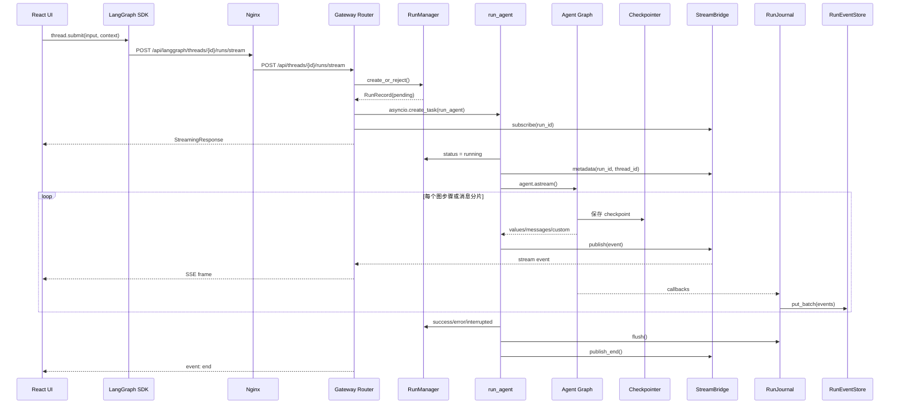

# 02 一次请求的完整生命周期

## 1. 总览

一条聊天消息的主链路是：

```text
InputBox
→ useThreadStream.sendMessage
→ LangGraph SDK thread.submit
→ Nginx /api/langgraph 路径改写
→ FastAPI stream_run
→ services.start_run
→ RunManager.create_or_reject
→ asyncio.create_task(run_agent)
→ make_lead_agent
→ agent.astream
→ Checkpointer / RunJournal / StreamBridge
→ SSE
→ useStream 合并状态
→ React UI
```

## 2. 完整时序图



## 3. 前端提交阶段

核心路径：

- `frontend/src/app/workspace/chats/[thread_id]/page.tsx`
- `frontend/src/core/threads/hooks.ts::useThreadStream`
- `frontend/src/core/api/api-client.ts`

`sendMessage()` 主要完成：

1. 使用 in-flight ref 防止双击重复提交；
2. 创建 optimistic HumanMessage；
3. 若有附件，先上传；
4. 构造标准 LangChain HumanMessage；
5. 将消息放入 `input`；
6. 将模型、mode、thinking、plan、subagent 等放入 `context`；
7. 将 recursion limit 放入 `config`；
8. 调用 SDK `thread.submit()`。

### 新线程的特殊处理

前端会先生成 UUID 供上传和 UI 使用，但首次 Run 创建前不把它作为“已存在 thread”传给 SDK，否则 SDK 的 history 请求可能在后端创建 thread 前先到达并 404。

首次 Run 创建后，页面使用原生 `history.replaceState()` 更新 URL，避免 Next Router 重挂载导致流状态丢失。

## 4. Nginx 与 HTTP 安全边界

默认请求地址：

```text
/api/langgraph/threads/{thread_id}/runs/stream
```

Nginx 改写为 Gateway 的：

```text
/api/threads/{thread_id}/runs/stream
```

Gateway 中间件负责：

- 认证；
- CSRF；
- 可选 CORS；
- trace context；
- 将用户放入 request state 和 ContextVar。

Frontend SDK wrapper 每次状态变更请求动态读取 CSRF Cookie，而不是在单例 client 创建时缓存 token。

## 5. Router 与 Service 层

入口：

- `backend/app/gateway/routers/thread_runs.py::stream_run`
- `backend/app/gateway/services.py::start_run`

Router 很薄：调用 `start_run()` 后返回由 `sse_consumer()` 生成内容的 `StreamingResponse`。

`start_run()` 完成真正的准入工作：

1. 获取 StreamBridge、RunManager、RunContext；
2. 验证模型在配置 allowlist；
3. 验证 thread owner；
4. 在 thread 级锁下进行 Run admission；
5. 根据 multitask strategy 决定 reject、interrupt 或 rollback；
6. 创建/更新 ThreadMeta；
7. 规范化输入消息；
8. 构造 `RunnableConfig`；
9. 校验 checkpoint 属于当前 thread；
10. 只合并允许的 request context；
11. 注入认证用户；
12. 创建后台 `run_agent()` task。

### 为什么 Router 不直接 await Agent

Agent 可能运行数分钟，并包含 LLM、工具和 Subagent。后台 task 与 SSE consumer 分离后：

- HTTP 输出可以立即开始；
- producer 和 consumer 并行；
- 客户端断开时可按策略 cancel 或 continue；
- `/join` 可以订阅同一 Run。

## 6. Run admission 与并发策略

`RunManager.create_or_reject()` 在同一把锁下完成检查和创建，避免：

```text
has_inflight() == false
→ 另一个请求插入 Run
→ 当前请求也插入 Run
```

支持：

- `reject`：已有活动 Run 时返回冲突；
- `interrupt`：取消旧 Run，保留已产生状态；
- `rollback`：取消旧 Run，并写入一个恢复到 Run 前状态的新 checkpoint。

接口模型中可能出现 `enqueue`，但当前运行时不实现，应视为兼容表面与能力边界。

### `finalizing` 为什么也算活动状态

取消 task 后，旧 Run 还需要：

- flush Journal；
- 写 completion；
- 恢复 checkpoint；
- 生成 fallback title；
- 同步 thread metadata；
- 发布 stream end。

新 Run 必须等待旧 Run finalization，否则旧 Run 的晚到写入可能覆盖新状态。

## 7. Worker 启动

入口：`backend/packages/harness/deerflow/runtime/runs/worker.py::run_agent`

Worker 首先：

1. 等待同 Thread 旧 Run finalization；
2. 创建 RunJournal；
3. 将状态从 pending 改为 running；
4. 捕获 Run 前 checkpoint；
5. 捕获 workspace snapshot；
6. 发布 metadata event；
7. 构造 runtime context；
8. 调用 Agent factory；
9. 挂接 checkpointer 和 store；
10. 进入 `agent.astream()`。

### Runtime context

Worker 手工创建 LangGraph `Runtime`，并将其放入 `configurable.__pregel_runtime`。这是因为 DeerFlow 直接驱动 graph，而不是由官方 LangGraph Server 自动注入运行时。

context 中通常包含：

- thread/run/user/agent；
- app config；
- request-scoped data；
- RunJournal；
- trace ID；
- channel/GitHub/secret 等临时信息。

与官方 Server 宿主的时序对比、以及相对原版 LangChain/LangGraph 的设计取舍，见 [22 官方 Server 与嵌入式运行时](22-langgraph-server-vs-embedded-runtime.md)。

## 8. Agent 图执行

`make_lead_agent()` 最终通过 LangChain `create_agent()` 返回 CompiledStateGraph。典型循环是：

```text
before_model middleware
→ model
→ AIMessage(tool_calls?)
→ after_model middleware
→ tools node
→ wrap_tool_call middleware
→ ToolMessage / Command
→ reducer 合并 state
→ model
→ 最终 AIMessage
→ END
```

LangGraph 在 super-step 边界管理：

- 并行节点；
- reducer；
- checkpoint；
- stream mode；
- recursion limit。

Worker 将图事件映射并发布到 StreamBridge。

## 9. 三条并行的数据路径

### 状态路径

```text
Agent state update → reducer → Checkpointer
```

用于恢复、分支、下一轮对话。

### 实时路径

```text
agent.astream chunk → StreamBridge → SSE → Frontend
```

用于逐 token、状态快照和进度。

### 历史/观测路径

```text
LangChain callbacks → RunJournal buffer → RunEventStore
```

用于消息历史、审计、token 和 Subagent step。

这三条路径不是一个事务，因此可能短暂不一致。

## 10. Goal 续跑

普通 ReAct 图完成后，Worker 可能检查 ThreadState 中的 active goal：

1. 读取最新 durable checkpoint；
2. 使用非 thinking evaluator 判断目标是否满足；
3. 再次检查 goal 和 conversation signature，避免用户消息或 clear goal 竞态；
4. 满足则清除 goal；
5. 只有 `goal_not_met_yet` 才生成隐藏 HumanMessage；
6. 再次调用同一个 graph；
7. continuation 有硬上限和 no-progress breaker。

因此 Goal 是 **Run 外层自治循环**，不是 Agent Graph 内的普通节点。

## 11. 结束与清理

Worker `finally` 尽量完成：

- subagent event flush；
- workspace changes；
- Journal flush；
- Run completion 与 token；
- fallback title；
- thread title/status；
- scheduler completion hook；
- `finalizing=false`；
- `publish_end()`；
- 延迟清理 StreamBridge。

这里体现“核心状态与辅助投影分级”：title 或 workspace change 失败通常不应把已经成功的 Agent Run 改为失败。

## 12. SSE Consumer

`sse_consumer()` 支持：

- `Last-Event-ID` 重放；
- heartbeat；
- JSON SSE frame；
- END sentinel；
- 客户端断开检测；
- `on_disconnect=cancel|continue`。

`/wait` 也通过 StreamBridge 等待，而不是简单 `await record.task`，这样才能感知客户端断开并遵循取消策略。

## 13. 前端合并

Frontend 最终消息来自：

```text
RunEvent 历史
+ SDK 实时消息/values
+ optimistic 本地消息
```

实时消息优先于历史副本，ToolMessage 使用 `tool_call_id` 作为更稳定身份。Summarization、regenerate、human input、subtask steps 还各自有短期 overlay 或补偿机制。

## 14. 取消、重连和重启

### Stop

Stop 可能经历本地 abort、异步 cancel、后端 finalization。前端会立即刷新缓存，并延迟再次刷新，以获取最终标题和 token。

### Reconnect

页面刷新后 SDK 可从 sessionStorage 中恢复 run id。兼容 client 会先查询 Run 状态；若已终止则不再 join，避免 stream 已清理后永久 loading。

### Gateway 重启

SQLite 单 worker 模式可在启动时把无本地 task 的 pending/running Run 标记为 error，并为残留 stream 发布 END。Postgres 多 worker 下不能这样全局判断，因为 Run 可能仍由其他 worker 执行；完善方案需要 owner lease 和 heartbeat。

## 15. 面试题

### 1. 为什么 `start_run()` 与 `run_agent()` 分开？

前者负责 HTTP 准入、安全和任务创建，后者负责长时间图执行与 finalization；分离后 SSE、wait、join 和断连策略可以复用同一 Run。

### 2. 为什么需要 Run 前 checkpoint？

用于 rollback 和运行差异判断；rollback 写一个新的恢复 checkpoint，而不是删除历史。

### 3. 为什么 StreamBridge 不能替代 RunEventStore？

StreamBridge 有 TTL 和窗口裁剪，服务实时传输；RunEventStore 服务长期历史与审计。

### 4. 为什么客户端收到 END 后仍可能读到旧标题？

多个持久化平面不是同一事务，title/thread meta 同步属于 finalization 投影，查询可出现短暂延迟。

### 5. 为什么 Goal evaluator 后还要重读 checkpoint？

LLM 评估期间用户可能发送新消息或清除目标；二次校验避免 evaluator 用过期视图覆盖用户操作。
