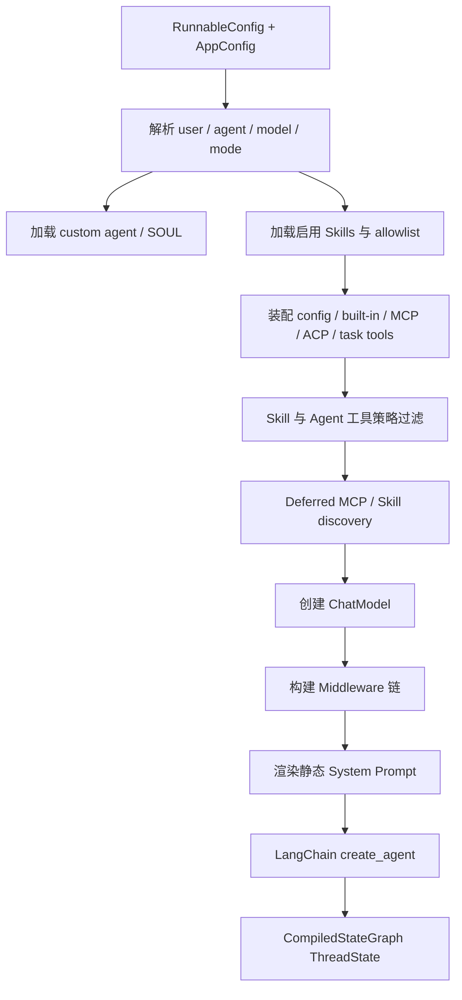

# 03 Agent 核心设计

## 1. 一句话心智模型

DeerFlow 以 LangChain `create_agent()` 生成的标准 ReAct 状态图为内核，通过配置驱动的模型/工具装配、`ThreadState`、严格排序的 Middleware 和 Worker 外层生命周期，把基础 Agent 扩展成生产级 Super Agent Harness。

## 2. 关键源码

- `backend/packages/harness/deerflow/agents/lead_agent/agent.py`
  - `make_lead_agent()`
  - `_make_lead_agent()`
  - `build_middlewares()`
- `backend/packages/harness/deerflow/agents/lead_agent/prompt.py`
  - `apply_prompt_template()`
- `backend/packages/harness/deerflow/agents/thread_state.py`
  - `ThreadState`
  - 各类 reducer
- `backend/packages/harness/deerflow/agents/factory.py`
  - `create_deerflow_agent()`
- `backend/packages/harness/deerflow/models/factory.py`
  - `create_chat_model()`
- `backend/packages/harness/deerflow/tools/tools.py`
  - `get_available_tools()`


## 3. Agent 构建流程




`_make_lead_agent()` 主要完成：

1. 合并 `configurable` 与 `context`，新 context 值优先；
2. 解析用户、模型、thinking、plan mode、subagent 和 custom agent；
3. 加载 custom agent 的 SOUL、工具组和 Skill 白名单；
4. 创建模型，支持 provider、vision、thinking、reasoning effort；
5. 组装工具；
6. 按 Skill `allowed-tools` 和 Agent policy 裁剪；
7. 非交互模式移除 clarification；
8. 组装 deferred tools 和搜索工具；
9. 构建 Middleware；
10. 渲染静态 Prompt；
11. 调用 `create_agent(model, tools, middleware, system_prompt, state_schema=ThreadState)`。


## 4. 为什么使用 `create_agent()`

LangChain 1.x `create_agent()` 返回的本质是 LangGraph `CompiledStateGraph`。它已经处理：

- model node；
- tools node；
- tool call routing；
- model/tool 循环；
- Middleware hooks；
- state reducer；
- streaming；
- checkpointer。

DeerFlow 不需要复制上游基础图实现，可以把复杂度放在产品能力和运行时约束中。

代价是：必须理解 Middleware 顺序、LangGraph 消息协议和上游版本行为。

## 5. Prompt 设计

静态 Prompt 通常包含：

- Agent 角色与 custom soul；
- 系统上下文保密规则；
- clarification-first 工作方式；
- 文件、输出与引用规范；
- Skills 索引/元数据；
- Subagent 使用规则；
- 工具工作流约束。

但日期、Memory、summary、delegation result、active skill 等动态内容不直接固定进基础 Prompt，而由 Middleware 在每次模型请求前注入。

### 为什么分离静态与动态 Prompt

- 静态前缀更适合 provider prompt cache；
- 当前日期和用户记忆会变化；
- 不可信数据不应自动获得 system 权限；
- 动态内容可以按当前 state 精确裁剪。


## 6. ThreadState

`ThreadState` 继承 AgentState 的消息 channel，并增加：


| 字段               | 用途                           |
| ---------------- | ---------------------------- |
| `sandbox`        | 当前线程沙箱引用                     |
| `thread_data`    | workspace/uploads/outputs 路径 |
| `title`          | 自动标题                         |
| `artifacts`      | 向用户展示的输出文件                   |
| `todos`          | 计划模式任务                       |
| `goal`           | 线程目标与评估状态                    |
| `uploaded_files` | 上传上下文                        |
| `viewed_images`  | Vision 图片数据                  |
| `promoted`       | 已提升 deferred tools           |
| `delegations`    | Subagent 委派账本                |
| `skill_context`  | 已加载 Skill 引用                 |
| `summary_text`   | 被压缩的长期上下文摘要                  |


### Reducer 是什么

Reducer 在 DeerFlow 中首先是一个普通 Python 函数，典型签名是：

```python
def merge_channel(existing: T | None, new: T | None) -> T | None:
    ...
```

- `existing`：该 state channel 当前已经积累的值；
- `new`：本次节点、Middleware 或工具提交给该 channel 的增量值；
- 返回值：合并后写回 state、并可能进入 checkpoint 的新值。

函数本身并不会自动执行。它通过 `typing.Annotated` 绑定到 `ThreadState` 字段：

```python
class ThreadState(AgentState):
    artifacts: Annotated[list[str], merge_artifacts]
    todos: Annotated[list | None, merge_todos]
    delegations: Annotated[list[DelegationEntry], merge_delegations]
```

`create_agent(..., state_schema=ThreadState)` 把这个 Schema 交给 LangGraph。LangGraph 解析 `Annotated` 元数据，为相应字段建立带 reducer 的 state channel。以后节点返回局部更新，或者工具返回 `Command(update=...)` 时，由 LangGraph 调用 reducer，而不是由 Middleware 手动调用。

```python
# Middleware/节点提交局部更新
return {"delegations": new_entries}

# 工具提交局部更新
return Command(update={"artifacts": [output_path]})

# 概念上由 LangGraph 执行，而不是业务代码直接执行
state["delegations"] = merge_delegations(
    state.get("delegations"),
    new_entries,
)
```

因此需要区分三个概念：

| 概念 | 职责 |
| --- | --- |
| `ThreadState` | 声明图里有哪些 state channel，以及每个 channel 的类型 |
| 节点、Middleware、工具 | 读取当前 state，并产生局部 state update |
| Reducer | 决定旧值与新 update 如何合并成 channel 的下一状态 |

没有 reducer 的普通字段通常采用单值/覆盖语义；如果同一 graph step 有多个并发写入，可能发生更新冲突。带 reducer 的字段允许 LangGraph 按指定规则折叠多个更新。

### Reducer 什么时候运行

LangGraph 以 super-step 推进图执行。一个 super-step 中可能有多个节点或多个并行工具都基于同一个旧快照运行，然后分别提交局部更新。

```text
                    ┌─ writer A → update A ─┐
旧 state 快照 ──────┤                       ├─ reducer 折叠 → 新 state → checkpoint
                    └─ writer B → update B ─┘
```

概念上，多次写入会被折叠为：

```text
next = reducer(reducer(existing, update_A), update_B)
```

所以 Reducer 不只是“拼数组的辅助函数”，而是一个 state channel 的：

1. **增量合并协议**：新值是替换值、追加项，还是局部 patch；
2. **并发冲突协议**：多个 writer 同时更新时如何处理；
3. **业务不变量守卫**：哪些状态转换合法，哪些必须拒绝；
4. **持久化归一化边界**：最终允许什么内容进入 checkpoint；
5. **清空协议**：如何区分“未修改”和“显式清空”。

注意：Reducer 只负责合并已经产生的更新，不负责决定何时运行 Middleware，也不负责执行工具。

### 为什么不能全部使用 last-write-wins

假设两个并行工具分别产出文件：

```text
旧值：            ["a.md"]
工具 A 更新：     ["b.md"]
工具 B 更新：     ["c.md"]
```

如果直接覆盖，结果取决于最后写入者，可能只剩 `c.md`；使用 `merge_artifacts` 后，结果可以稳定地表达所有增量：

```text
["a.md", "b.md", "c.md"]
```

再比如 Sandbox：两个 writer 写入相同 sandbox ID 是正常的幂等初始化；写入不同 sandbox ID 则意味着线程隔离可能已经被破坏。此时“任选最后一个”会掩盖严重错误，正确策略是直接抛出异常。

### DeerFlow Reducer 的设计实例

#### `merge_sandbox`：幂等写入 + 冲突即失败

规则：

- `new is None`：保留旧值；
- 旧值为空：接受新值；
- 两个 `sandbox_id` 相同：视为幂等写入；
- 两个 `sandbox_id` 不同：抛出 `ValueError`。

这不是普通覆盖字段，而是在保护“一个线程只能对应一个有效沙箱引用”的隔离不变量。

#### `merge_artifacts`：有序集合并集

将旧列表与新列表拼接，然后有序去重。它适合 `present_files` 的增量语义，也允许多个并行工具分别发布输出文件。

需要注意：它没有定义显式删除协议，因此 `[]` 只代表“没有新增 artifact”，不能清空已有值。如果以后需要删除 artifact，应设计明确的操作类型，而不是含糊地复用空列表。

#### `merge_todos`：最后一个显式值获胜

规则：

- `new is None`：writer 没有修改 todos，保留旧值；
- `new == []`：显式清空 todo 列表；
- 其他列表：用完整的新列表替换旧列表。

这里的 `None` 和空列表不能混为一谈。这个 reducer 修复过下游节点产生 `todos=None`、意外抹掉已有计划的问题。

#### `merge_goal`：保留未触碰的目标

与 todos 类似，`None` 表示当前节点没有修改 goal，而非“删除目标”。新的非空目标整体替换旧目标。

因此通过普通 reducer update 无法用 `None` 清空 goal；清理动作需要走明确的 checkpoint channel 修改路径。这种设计避免大量不关心 goal 的节点无意间删除线程目标。

#### `merge_viewed_images`：字典合并 + 空字典清空

规则：

- 普通字典：按图片路径合并，同 key 的新值覆盖旧值；
- `new == {}`：显式清空全部图片；
- `new is None`：保留旧值。

这里空字典被定义为 clear sentinel，和 `merge_artifacts` 对空列表的解释不同。这说明“空容器意味着什么”不是通用规则，而是每个 channel 自己的协议。

#### `merge_promoted`：带版本域的集合并集

`promoted` 同时保存 `catalog_hash` 与工具名列表：

- catalog hash 相同：合并并去重工具名；
- catalog hash 改变：整体替换，旧 promotion 失效；
- `None` 或空更新：保留已有状态。

`catalog_hash` 相当于 promotion 的版本域，防止工具目录变化后，同名工具错误继承旧授权或旧可见性。

#### `merge_delegations`：按 ID upsert 的状态机账本

规则：

- 新 task ID 追加到末尾；
- 相同 ID 使用最新状态更新；
- 已进入终态的 task 不允许被晚到的 `in_progress` 降级；
- 更新时保留首次 `created_at` 和已有 `run_id`；
- 总记录数有上限，只保留最近条目。

它不是简单列表拼接，而是一个小型事件折叠器：把同一 task 的多次状态报告归并成当前事实，同时处理乱序到达和 checkpoint 体积。

#### `merge_skill_context`：归一化、去重和容量控制

规则：

- 每个 entry 先归一化，只留下 `name/path/description/loaded_at`；
- 主键是 Skill path；
- 重复读取会更新内容并刷新最近顺序；
- 超出容量时淘汰最旧引用；
- 旧版本中可能存在的完整 Skill 正文会在归一化时被丢弃。

因此这个 reducer 同时承担迁移兼容和安全边界职责：即使旧 checkpoint 带有多余字段，重新合并后也不会继续持久化完整、不可信的 Skill 正文。

### 如何设计一个新的 Reducer

新增 state channel 时，可以按以下顺序设计。

#### 1. 先定义新值是“快照”还是“增量”

- 快照：`todos` 的新列表代表完整当前状态，适合显式值整体替换；
- 增量：`artifacts` 的新列表代表新增项，适合集合并集；
- 事件：`delegations` 的新列表代表 task 状态事件，需要按业务主键折叠；
- Patch：字典中的部分 key 是更新，需要字典合并或领域专用 patch。

如果这一点没有定义清楚，调用方和 reducer 很容易对同一个值做出相反解释。

#### 2. 明确定义 `None`、空容器和删除

至少回答：

| 输入 | 需要定义的问题 |
| --- | --- |
| `new is None` | 未触碰、清空，还是非法？ |
| `new == []/{}` | 无增量、显式清空，还是有效空快照？ |
| 删除单项 | 使用 tombstone、操作对象，还是单独 API？ |

不要默认所有字段都采用相同约定。`viewed_images={}` 是清空，而 `artifacts=[]` 是无新增内容。

#### 3. 写出并发和乱序场景

至少推演：

- 两个 writer 写不同数据；
- 两个 writer 写同一业务 ID；
- 同一更新重复提交；
- 旧事件晚于新事件到达；
- writer 基于相同旧快照产生更新。

对于可能并行折叠的更新，最好让 reducer 满足：

- **确定性**：相同输入顺序得到相同结果；
- **结合性**：分批合并和一次连续合并尽量等价；
- **幂等性**：重复事件不制造重复数据；
- **交换性**：如果 LangGraph 不保证 writer 顺序，而业务又不应依赖顺序，则 `merge(a, b)` 与 `merge(b, a)` 应等价。

这些性质不是所有 reducer 的硬性要求。例如“最新值获胜”天然依赖顺序；此时应确保框架顺序可靠，或者在数据中加入可比较的版本号/时间戳，而不是依赖偶然调度顺序。

#### 4. 把业务不变量放进合并逻辑

如果两个值同时存在就说明系统有 bug，不要静默选一个。例如 `merge_sandbox` 遇到不同 ID 就 fail closed。

反过来，也不要在 reducer 中执行网络请求、文件 IO 或调用模型。Reducer 可能在图执行和 checkpoint 恢复的关键路径反复运行，应该保持同步、纯粹、快速且可测试。

#### 5. 控制 checkpoint 体积和信任边界

检查合并后的值是否会跨 Run 持久化：

- 不保存 secret；
- 不保存不可序列化对象；
- 大正文尽量保存引用而非内容；
- 无界列表设置容量限制；
- 对旧数据和外部数据做归一化；
- 明确哪些字段可被后续模型看到。

`merge_skill_context` 和 `merge_delegations` 都包含容量上限，就是为了防止 checkpoint 无限增长。

#### 6. 用 `Annotated` 真正接上线

只定义函数还不够，必须将它绑定到字段：

```python
class ThreadState(AgentState):
    records: Annotated[list[Record], merge_records]
```

否则测试 reducer 函数虽然通过，LangGraph 实际仍可能使用默认 channel 语义。DeerFlow 的测试会通过 `get_type_hints(..., include_extras=True)` 检查 reducer 是否仍绑定在 `ThreadState` 上。

#### 7. 测试函数和 Schema 接线

至少覆盖：

1. `existing is None`；
2. `new is None`；
3. 空容器；
4. 正常合并；
5. 重复更新；
6. 冲突更新；
7. 乱序状态；
8. 容量边界；
9. 旧数据归一化；
10. `Annotated` 仍引用正确 reducer。

源码对应 `backend/packages/harness/deerflow/agents/thread_state.py`，集中测试对应 `backend/tests/test_thread_state_reducers.py`；promotion 和 delegation 还有各自的专项测试。

### Reducer 与 Middleware 的关系

Middleware 可以读取 state，也可以返回局部 state update，但它不拥有 `ThreadState`，也不负责手动执行 reducer：

```text
Middleware / node / tool
          │
          │  返回局部 update
          ▼
LangGraph state channel
          │
          │  调用 Annotated 绑定的 reducer
          ▼
合并后的 ThreadState
          │
          └─ 可供后续节点读取，并由 checkpointer 持久化
```

一句话总结：

> Reducer 是绑定在 `ThreadState` channel 上的普通合并函数；LangGraph 在应用局部更新时调用它，而它所编码的是该字段的并发、清空、冲突、归一化和持久化协议。

## 7. Agent 生命周期的两层循环


### 内层：ReAct 图

```text
模型 → tool calls → 工具 → ToolMessage → 模型 → 最终回答
```

由 `create_agent()` 和 LangGraph 驱动。

### 外层：Run Worker

负责：

- Run 状态；
- 取消和 rollback；
- SSE；
- Journal；
- Goal 自动续跑；
- workspace diff；
- title 与 completion。

这解释了为什么 Goal 不必被硬塞进 Agent 图：它需要 durable checkpoint、并发重检和 Run 级 abort 状态，Worker 更适合作为外层控制器。

## 8. Human-in-the-loop

DeerFlow 的 Web clarification 主流程不是经典 `interrupt()` 原地 resume：

1. 模型调用 `ask_clarification`；
2. ClarificationMiddleware 构造结构化 ToolMessage；
3. 返回 `Command(goto=END)`；
4. 当前 Run 结束；
5. 用户答案作为隐藏 HumanMessage 启动新 Run。

优点：自然融入聊天历史和现有 UI；缺点：不是同一个节点栈的原地恢复。Gateway 仍保留真正 `Command(resume=...)` 的兼容能力。

## 9. Custom Agent

Custom Agent 不是另一套 Runtime，而是相同 Lead Agent 工厂的参数化：

- SOUL；
- 模型覆盖；
- tool groups；
- skills allowlist；
- channel/GitHub 配置。

这种方式保持：

- 同一中间件与安全策略；
- 同一 Run 生命周期；
- 同一前端协议；
- 同一持久化模型。


## 10. 典型扩展点


### 新模型

通过模型配置和反射 factory 接入，明确 supports thinking/vision/reasoning effort，处理 provider 特有消息字段。

### 新工具

加入统一工具装配，并使用 ToolRuntime、Sandbox 和结构化 ToolMessage；不要直接操作宿主机。

### 新 Middleware

必须说明：

- hook；
- 读取/写入的 state；
- 是否改变消息顺序；
- 对其他 Middleware metadata 的依赖；
- sync/async 实现；
- graph object 生命周期；
- 多 worker 语义。


### 新 state channel

需要：

- 明确是否跨 Run 持久；
- 设计 reducer；
- 处理显式清空；
- 考虑并行写；
- 控制 checkpoint 体积；
- 更新前后端类型和协议测试。


## 11. 设计取舍


### Prompt 与代码强制并存

Prompt 提高模型遵循率，Middleware 提供确定性上限。例如 Prompt 告诉模型 Subagent 并发规则，`SubagentLimitMiddleware` 仍实际截断超量调用。

### 不可信上下文降权

Memory、summary、delegation result 作为隐藏 HumanMessage 数据注入，而不是 SystemMessage。代价是部分模型服从度可能更低，但安全权限边界更正确。

### 进程内 Middleware 状态

Loop、TokenBudget、ToolProgress 等高频控制状态通常不进入 checkpoint。优点是成本低；缺点是重启、多 worker、Gateway 每 Run 重建 graph 与 Embedded Client 缓存 graph 的生命周期语义不同。

## 12. 常见故障

- Reducer 没有处理并行写，出现 channel update 冲突。
- 把 secret 或不可序列化依赖放入 ThreadState，导致泄露或 checkpoint 失败。
- 新 Middleware 插错顺序，破坏 tool call pairing。
- 把 Tool output 当可信指令，造成 prompt injection。
- graph 返回可读错误 AIMessage，但 Run 被误标 success；DeerFlow 通过 error fallback marker 修正。
- Custom Agent 工具白名单过宽，扩大能力面。
- Goal evaluator 依据隐藏控制消息判定成功；正确实现只看用户可见证据。


## 13. 面试题


### 1. DeerFlow 为什么不手写主 StateGraph？

复用 `create_agent()` 的标准 ReAct 图和上游生态，把差异能力放入 state、tools、middleware 和 worker，减少 fork 成本。

### 2. Reducer 为什么是 Agent 设计核心？

LangGraph 节点可并行写 state；reducer 决定并发更新的业务合并语义，也是 checkpoint 中最终事实的生成规则。

### 3. ThreadState 与 runtime context 如何区分？

前者是需要跨 Run 恢复的对话事实，后者是单 Run 的执行依赖和安全上下文。

### 4. 为什么 summary 不存为 SystemMessage？

摘要是模型生成且可能包含不可信历史，升级为 system authority 会增加持久化 prompt injection 风险。

### 5. Goal 为什么放在 Worker 外层？

它需要 durable end-of-turn、checkpoint 竞态校验、Run abort、continuation cap 和 no-progress breaker，这些属于 Run 生命周期而非单次 ReAct 节点。