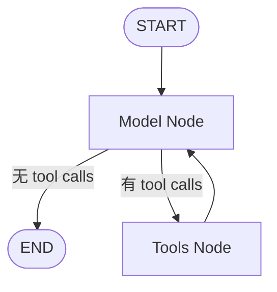

# 06 LangGraph 状态图运行时

## 1. 一句话心智模型

LangGraph 把 Agent 从一个不可恢复的 `while` 循环升级为带类型状态、并行 super-step、reducer、checkpoint、stream、interrupt 和时间旅行能力的状态图运行时。

## 2. StateGraph 与 CompiledStateGraph

概念上的 Agent 图：



DeerFlow 主 Agent 没有显式手写这张图，因为 LangChain `create_agent()` 会生成并编译它。返回对象仍可使用 LangGraph 的：

- state；
- checkpointer；
- store；
- stream mode；
- recursion limit；
- interrupt；
- checkpoint branching。

## 3. State Channel

State 中每个字段是一个 channel。节点返回的更新不会简单覆盖整个 state，而是按 channel 规则合并。

### 为什么 channel 需要 reducer

同一 super-step 可能并行执行多个工具：

```text
Tool A → artifacts=[a]
Tool B → artifacts=[b]
```

没有 reducer 时属于同一 channel 的并发写冲突；有 `merge_artifacts` 后可得到 `[a, b]`。

### Reducer 设计原则

- 决定性；
- 尽量幂等；
- 不原地修改输入；
- 明确并行顺序语义；
- 区分 no update 与 explicit clear；
- 保持容量上限；
- 对安全 invariant 可 fail-closed。

## 4. Pregel Super-step

LangGraph 不是逐行同步执行，而是 Pregel 风格：

1. 确定当前可运行节点；
2. 并行执行；
3. 收集 channel writes；
4. reducer 合并；
5. 产生新 state；
6. checkpoint；
7. 确定下一批节点。

这解释了：

- 为什么工具可以并行；
- 为什么 reducer 是核心；
- 为什么 `recursion_limit` 更接近 super-step 上限，而非简单的 LLM 调用次数。

## 5. Checkpointer

Checkpointer 保存：

- channel values；
- channel versions；
- checkpoint parent；
- pending writes；
- task/interrupt 信息；
- metadata。

它支持：

- 多轮会话；
- 恢复；
- 历史；
- branch；
- regenerate；
- rollback；
- compact；
- interrupt resume。

DeerFlow 支持 memory、SQLite、PostgreSQL checkpointer。

### Thread ID

`configurable.thread_id` 是 checkpointer 的会话主键。即使现代 runtime 数据主要放 `context`，thread/checkpoint 参数仍必须进入 `configurable`。

### Checkpoint ID

从历史 checkpoint 执行新 Run 时，Gateway 会先验证它属于请求 thread，再写入 `configurable.checkpoint_id/checkpoint_ns/checkpoint_map`。

## 6. Store

LangGraph Store 是通用 namespace/key/value 持久层，不等同于 Checkpointer：

- Checkpointer 解决图执行状态；
- Store 解决跨执行的通用 KV。

DeerFlow 还有自己的 RunStore、RunEventStore、ThreadMetaStore，它们都不是 LangGraph Store。

## 7. Runtime 与 Context

LangGraph `Runtime` 向节点、工具和 Middleware 提供：

- `context`；
- `store`；
- 运行内部能力。

Gateway 直接调用 `agent.astream()`，因此 Worker 手工构造 Runtime 并注入 `__pregel_runtime`。

适合放 context 的数据：

- authenticated user；
- run id；
- app config 对象；
- request secret；
- journal；
- trace；
- GitHub/channel 临时 token。

这些通常不应进入 checkpoint state。

官方 Server 自动注入 vs DeerFlow 手工注入的完整时序，以及更多相对原版框架的取舍，见 [22 官方 Server 与嵌入式运行时](22-langgraph-server-vs-embedded-runtime.md)。

## 8. Command

`Command` 可以同时表达状态更新和控制流：

```text
Command(update={...})
Command(goto=...)
Command(resume=...)
```

DeerFlow 例子：

- `present_files` 更新 `artifacts` 和 ToolMessage；
- `tool_search` 更新 `promoted`；
- `task` 回写 Subagent ToolMessage；
- clarification `goto=END`；
- HTTP resume 转 `Command(resume=value)`。

### 为什么工具需要 Command

普通 ToolMessage 只能表达消息结果；Agent 产品能力常需要原子更新多个 state channel。

## 9. Interrupt

真正的 `interrupt()`：

1. 节点调用 interrupt；
2. 图暂停；
3. checkpoint 保存暂停点；
4. state/values 中出现 `__interrupt__`；
5. 后续以 `Command(resume=answer)` 恢复原节点。

DeerFlow 支持 interrupt 序列化和 resume 入口，但 Web clarification 的主方案是 `goto=END + 新 Run hidden HumanMessage`。面试时必须区分。

### 静态节点 interrupt

请求还可指定 `interrupt_before` / `interrupt_after`，Worker 将其挂到 compiled graph，用于节点边界调试或审批。

## 10. Stream Modes

### `values`

每个步骤后的完整 state snapshot。适合 title、todo、goal、artifact 和恢复，但 payload 较大。

### `messages`

模型消息 chunk 与 metadata，适合逐 token 输出。SDK 请求层可能称 `messages-tuple`，Gateway 会映射到 Python `messages`。

### `updates`

节点/中间件写入增量，适合观察哪个节点修改了什么。

### `custom`

工具或 Middleware 主动发送的业务事件，如 task progress、LLM retry。

### `events`

需要 `astream_events()`。当前 DeerFlow Gateway 为保持现有 `astream` 多 mode 管线而跳过该模式；不能仅凭前端 allowlist 认为已支持。

## 11. Branch

新线程分支：

1. 在 checkpoint 历史中定位以目标 assistant message 结尾的版本；
2. 深拷贝 checkpoint；
3. 生成新 checkpoint ID；
4. 写入新 thread；
5. 保存 parent thread/checkpoint/message metadata。

Workspace 不在 checkpoint 中，因此只有从最新 turn 分支时才 best-effort 复制当前 workspace；历史 turn 分支不能复制未来文件。

## 12. Regenerate

Regenerate 不是删除旧答案：

1. 只允许选择可重生成的最新 assistant answer；
2. 找到其前一个 visible HumanMessage；
3. 找到该 HumanMessage 之前的 checkpoint；
4. 从该 checkpoint 重新提交原消息；
5. 新 Run metadata 标记被替代的 Run；
6. 前端将旧 Run 视为 superseded。

这是保留事件事实、改变展示视图的方案。

## 13. Compact

Manual compact 复用自动 Summarization：

- 将旧活跃消息总结到 `summary_text`；
- 保留近期窗口；
- 只更新 `messages` 与 `summary_text` channel version；
- 完整 UI 历史仍来自 RunEventStore；
- 与 Run admission 和 goal 写共享 thread lock。

因此“模型上下文历史”和“用户可见历史”是两个不同投影。

## 14. Rollback

Rollback 使用 Run 前 checkpoint 写一个新的恢复 checkpoint，而不是删除中间 checkpoint。它只能恢复图 state，不能恢复 workspace 文件。

## 15. `recursion_limit`

它限制图 super-step 数，不等于：

- token budget；
- wall-clock timeout；
- 单纯 LLM 调用次数；
- 单纯工具调用数。

Lead Agent 和 Subagent 有不同限制。一次 Lead Agent 的 task tool step 内可执行完整 Subagent 图。

## 16. 与普通 ReAct 的比较

| 能力 | 手写 ReAct | LangGraph |
|---|---|---|
| 状态合并 | 手工 | channel + reducer |
| 并行工具 | 手工 gather | super-step |
| 多轮持久化 | 自建 | checkpointer |
| 中断恢复 | 自建状态机 | interrupt/resume |
| 分支 | 自建快照 | checkpoint ID |
| Streaming | callback/event bus | 多 stream modes |
| 可观测性 | 自建 | callbacks + graph metadata |
| 循环上限 | 自己计数 | recursion limit |

## 17. 面试题

### 1. 为什么 `create_agent()` 仍属于 LangGraph？

它是高层工厂，内部构建并编译状态图，返回 CompiledStateGraph。

### 2. Checkpointer 与 Store 有何区别？

前者保存图执行状态和历史，后者是通用 namespaced KV。

### 3. `values` 与 `messages` 如何选择？

完整状态用 values，token/message 增量用 messages；生产 UI 通常两者并用并去重。

### 4. `Command(goto=END)` 与 `interrupt()` 有何区别？

前者结束当前图；后者暂停并保留可 resume 的执行点。

### 5. 为什么历史分支不能复制当前 workspace？

文件系统不属于 checkpoint，当前文件可能来自目标历史点之后。

## 18. 练习

1. 手写一个包含两个节点和 reducer 的 StateGraph。
2. 使用 InMemorySaver 连续运行两轮并枚举 checkpoint。
3. 从第一轮 checkpoint 分支执行不同输入。
4. 实现真正的 `interrupt()` / `Command(resume=...)`。
5. 比较 `values/messages/custom` 三种消费器。
