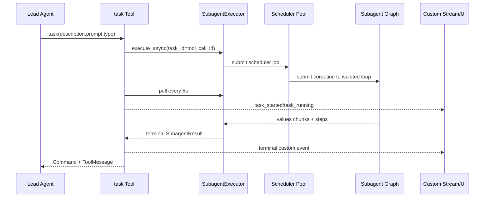

# 10 Subagent 与任务委派

## 1. 协作模型

DeerFlow 使用 Lead Agent 中心协调：

```text
Lead Agent
  ├─ task → general-purpose Subagent
  ├─ task → bash Subagent
  └─ 普通 Tools
```

Subagent 的推理上下文、图、模型和 turn budget 独立，但继承父 Thread 的 sandbox/workspace 与身份上下文。

> 准确表述：上下文隔离、文件空间共享。

## 2. 关键源码

- `backend/packages/harness/deerflow/tools/builtins/task_tool.py`
- `backend/packages/harness/deerflow/subagents/executor.py`
- `backend/packages/harness/deerflow/subagents/registry.py`
- `backend/packages/harness/deerflow/subagents/config.py`
- `backend/packages/harness/deerflow/subagents/step_events.py`
- `backend/packages/harness/deerflow/agents/middlewares/subagent_limit_middleware.py`
- `contracts/subagent_status_contract.json`

## 3. Task 调用时序



## 4. 配置解析

Subagent 可来自：

- built-in `general-purpose`；
- built-in `bash`；
- custom agents；
- per-agent overrides。

配置包括：

- model 或 inherit；
- system prompt；
- tools/tool groups；
- skills allowlist；
- timeout；
- max turns。

父子 Skill 白名单取交集，防子 Agent 扩大父 Agent 权限。

## 5. 为什么禁止递归 Subagent

Subagent 工具集关闭 `task`，形成固定两层：

- 避免指数级并发；
- 易于 token 归集；
- 易于取消；
- 简化 step protocol；
- 防绕过 Lead Agent 并发限制。

代价是所有任务分解都由 Lead Agent 负责。

## 6. 当前执行模型

当前源码使用：

- `_scheduler_pool`，最大 3 worker；
- 一个持久化 isolated asyncio loop，运行在 daemon thread；
- `copy_context()` 传播 ContextVar。

注意：不要沿用旧文档中“双线程池”的描述，当前实现是 scheduler pool 加共享隔离事件循环。

### 真实并发上限

受多层影响：

- `SubagentLimitMiddleware` 限制单个 AIMessage task calls；
- scheduler worker 数；
- isolated loop 是否被同步阻塞；
- LLM provider rate limit；
- Sandbox capacity。

## 7. 状态机

状态：

- `PENDING`；
- `RUNNING`；
- `COMPLETED`；
- `FAILED`；
- `CANCELLED`；
- `TIMED_OUT`；
- `MAX_TURNS_REACHED`。

`try_set_terminal()` 实现 first-terminal-wins，防正常完成、timeout、cancel 和异常相互覆盖。

## 8. Timeout 与 Max Turns

### Timeout

墙钟时间限制由 scheduler 的 future timeout 实现。超时后设置 cancel event、写 terminal status、cancel future。

它是 cooperative cancellation：如果 Subagent 卡在不可取消的同步工具中，可能直到工具返回才停止。

### Max Turns

Subagent `recursion_limit = max_turns`。触发 `GraphRecursionError` 时：

- 状态为 `MAX_TURNS_REACHED`；
- 从最后 streamed state 恢复 partial result；
- 同时保存 result 和 error；
- Lead Agent 可复用成果后缩小范围重试。

## 9. 为什么 task Tool 自己轮询

Task Tool 每 5 秒查询后台结果并持续发 custom event，而不是让 LLM 反复调用 status tool。

优点：

- 减少模型调用；
- 状态机由代码控制；
- Tool call 最终只返回一次 ToolMessage。

代价：一个 task Tool invocation 会挂起到 Subagent 终止。

## 10. 结构化结果协议

`task_id` 直接使用 `tool_call_id`，统一关联：

- Lead AI tool call；
- ToolMessage；
- 前端 SubtaskCard；
- custom events；
- RunEvent metadata；
- step history API。

ToolMessage 同时包含：

- 给模型阅读的自然语言 content；
- 给程序消费的 `subagent_status`；
- error；
- result brief；
- result SHA-256。

跨后端和前端的 status 映射由共享 contract 固定。

## 11. Step Capture

Subagent 使用 `stream_mode=values`，每个 chunk 带完整消息历史。实现不能只读 `messages[-1]`，因为同一 ToolNode super-step 可能一次追加多个 ToolMessages。

正确策略：

- 维护 processed message count；
- 扫描新增尾部；
- 按 message ID 去重；
- 捕获 AIMessage 和 ToolMessage；
- 限制 text 和 args 大小；
- 给每条 step 分配 `message_index`。

## 12. 实时与持久 Step

实时：

- `task_started`；
- `task_running`；
- terminal task event。

持久：

- `subagent.start`；
- `subagent.step`；
- `subagent.end`。

Worker 使用 batch buffer，达到阈值或终态时写 RunEventStore；UI 展开历史卡片时按 `run_id + task_id + after_seq` 分页回填。

这意味着 live SSE 和 durable history 可能短暂不一致，进程崩溃时最后未 flush 小批 steps 可能丢失。

## 13. Token Usage

每个 Subagent 有独立 token collector：

- 按真实模型记录；
- 去重 source LLM run；
- 包含 cache-read tokens；
- 终态后合并到父 RunJournal；
- 父 Run 同时得到 subagent bucket 和 per-model bucket。

取消路径也尽量等待最后 usage snapshot 后再清理。

## 14. 文件并发

Subagents 共享 Thread workspace，因此可能并行修改同一文件。应依赖：

- 任务拆分时避免重叠；
- read-before-write；
- sandbox path lock；
- 文件级业务协议；
- 最终 diff 和测试。

“图上下文独立”不提供文件事务隔离。

## 15. 故障模式

- Scheduler 允许 3 个，但模型一次生成 4 个 task，第四个排队。
- 同步阻塞调用卡住共享 isolated loop。
- Timeout 已返回，但后台阻塞工具短暂继续执行。
- 父 Run 取消时 token usage 未及时回收。
- Step capture 只看最后一条，丢并行 ToolMessages。
- 晚到 running event 覆盖 terminal status；reducer 必须保持终态稳定。
- Subagent 写同一文件互相覆盖。
- 进程重启后内存 `_background_tasks` 无法恢复。

## 16. 面试题

### 1. Subagent 是完全隔离的吗？

推理状态独立，但通常共享父线程 sandbox/workspace 和身份，因此不是资源完全隔离。

### 2. 为什么 max turns 不等于 failed？

它是预算耗尽，可能已有可用 partial result；应支持复用和缩小范围重试。

### 3. Timeout 为什么不是硬取消？

Python async/thread 工具通常只能协作取消，阻塞同步调用不会立即响应 cancel event。

### 4. 为什么用 tool_call_id 作为 task_id？

统一模型协议、UI、事件和持久化关联，减少映射复杂度。

### 5. 为什么 Subagent 不使用父 Checkpointer？

它是一次性隔离任务，使用父 checkpoint 会污染父 Thread graph state。
