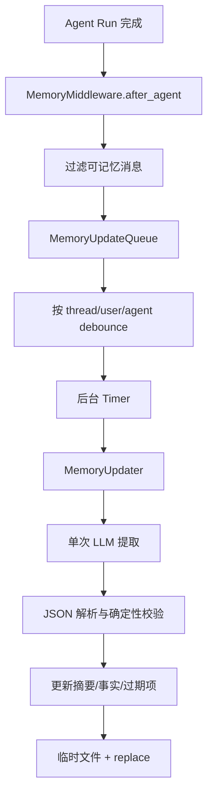

# 11 Memory 与持久化

## 1. 先区分五类数据

| 系统 | 保存什么 | 回答的问题 |
|---|---|---|
| Checkpointer | ThreadState、版本、pending writes | Agent 图现在是什么状态？ |
| LangGraph Store | namespaced KV | 图/应用需要的通用长期 KV 是什么？ |
| RunStore | Run 状态、token、错误、摘要字段 | 这次执行怎么样？ |
| RunEventStore | 消息、工具、Subagent、审计事件 | 执行过程中发生了什么？ |
| MemoryStorage | 用户/Agent 跨线程事实 | 未来会话应记住什么？ |

这五者职责不同，不能用“都能存数据”作为合并理由。

## 2. 长期 Memory 架构

关键路径：

- `backend/packages/harness/deerflow/agents/memory/storage.py`
- `backend/packages/harness/deerflow/agents/memory/updater.py`
- `backend/packages/harness/deerflow/agents/memory/queue.py`
- `backend/packages/harness/deerflow/agents/memory/message_processing.py`
- `backend/packages/harness/deerflow/agents/middlewares/memory_middleware.py`
- `backend/packages/harness/deerflow/agents/middlewares/dynamic_context_middleware.py`

默认结构包括：

- work/personal/top-of-mind context；
- recent/earlier/long-term history；
- facts：内容、类别、置信度、时间、来源。

## 3. Memory 更新时序



## 4. 消息过滤

只保留：

- 真实用户 HumanMessage；
- 无 tool calls 的最终 AIMessage；
- 合法 Human Input response。

过滤：

- ToolMessage；
- tool-call-only AIMessage；
- 日期/Memory/durable context 等 framework hidden messages；
- uploaded files block；
- summary；
- 普通内部控制消息。

这防止 Memory 自我重复提取和工具输出污染。

## 5. Debounce

Queue key：

```text
(thread_id, user_id, agent_name)
```

同 key 新 context 替换旧 context，correction/reinforcement 标志 OR。Timer thread 不继承 ContextVar，因此 enqueue 时显式保存 user、agent 和 trace ID。

Memory 是 best-effort：daemon Timer 可能在进程退出前未 flush，不能用于授权、计费或不可丢业务。

## 6. Memory 写入安全

`FileMemoryStorage` 使用临时文件和原子 replace，可防 torn write，但不能防多进程 lost update：

```text
进程 A 读版本 1
进程 B 读版本 1
A 写版本 2A
B 写版本 2B
→ A 的修改丢失
```

若需要多实例强一致 Memory，应使用带版本/CAS 的数据库 repository 或分布式锁。

## 7. LLM 输出校验

Memory Updater 不直接信任模型：

- 解析结构化 JSON；
- 规范 top-level keys；
- 检查 fact 内容；
- 检查 confidence 是有限数值；
- 去重；
- 限制 max facts；
- 危险部分更新失败时拒绝删除；
- stale deletion 与合法候选取交集；
- 保护类别不可删除；
- 单次删除有上限。

原则：模型判断语义，代码控制删除权限和数量。

## 8. Staleness Review

只将达到 age threshold 且不在 protected categories 的 facts 交给模型评估。应用阶段重新计算候选集合，模型不能删除未到期或受保护事实。

## 9. Memory 注入

Memory 通常在新会话第一次真实用户消息时作为隐藏 HumanMessage 注入，形成 frozen snapshot。

优点：

- prefix cache 稳定；
- 同一会话可重放；
- 后台更新不会突然改变当前 Agent 行为。

代价：

- 同一长线程看不到刚更新的最新 Memory；
- 新 Thread 才使用最新版本。

## 10. Checkpointer

支持 memory、SQLite、Postgres，保存图执行状态。它是 branch/regenerate/rollback/interrupt 的基础。

不要从 RunRow 恢复 ThreadState，因为 RunRow 不包含 channel versions、pending writes 和完整 state。

## 11. LangGraph Store

Store 是通用 KV。DeerFlow 的默认长期 Memory 仍使用独立 FileMemoryStorage，并未自动存入 LangGraph Store。

这是一项可演进选择，不应在概念上混淆。

## 12. Application Repositories

SQLAlchemy 管理：

- runs；
- threads_meta；
- run_events；
- feedback；
- users；
- channel tables；
- scheduled tasks。

这些是产品查询和业务记录，不是图运行时 schema。

## 13. 统一 database 配置不等于同一连接池

### SQLite

Checkpointer、Store、ORM 可指向同一文件，但由不同库/连接管理。WAL、busy timeout 和单 writer 仍限制扩展性。

### PostgreSQL

使用同一 URL，但 checkpointer、Store 和 SQLAlchemy 各自管理连接池与生命周期。

### Legacy override

旧 `checkpointer` 配置可覆盖 Checkpointer 和 Store，但 application repositories 仍由 `database` 决定，可能产生逻辑分裂。

## 14. Alembic Hybrid Bootstrap

三条路径：

```text
空 DB → create_all + stamp head
Legacy DB → 补 baseline tables + stamp baseline + upgrade
Versioned DB → upgrade head
```

为什么 fresh DB 不执行手写 baseline：ORM metadata 是跨 SQLite/Postgres 的 schema 权威。

为什么 legacy 只补 baseline tables：若全量 `create_all` 创建了后续 revision 的新表，revision 再创建会冲突。

LangGraph checkpointer 表由 LangGraph 自己管理，并从 Alembic view 排除。

## 15. RunManager 内存与持久化

活动 Run 需要：

- asyncio Task；
- abort event；
- finalizing；
- worker ownership。

这些无法写入数据库，所以内存记录优先；数据库用于历史和查询。Store-only hydrated Run 可能无法被当前 worker cancel。

Run 创建时先写内存并持久化；持久化失败则回滚内存，避免 API 返回一个数据库不存在的 Run。

## 16. 无跨系统事务

一次 Run 会写：

- checkpoint；
- run row；
- run events；
- thread meta；
- stream；
- workspace；
- tracing；
- memory。

它们没有统一事务。系统采用局部强约束 + best-effort + recovery。

### 典型不一致

- Checkpoint 成功，RunEvent 缺失；
- Run success，Thread title 未同步；
- SSE 已结束，token completion 查询短暂旧；
- live subagent step 已显示，durable buffer 未 flush；
- Memory queue 尚未保存。

## 17. Orphan Recovery

SQLite 单 worker 启动时可把没有本地 task 的 pending/running Run 判定为 orphan 并改为 error。

Postgres 多 worker 不能直接全局修改，因为 Run 可能由其他 worker 执行。完整方案需要：

- owner worker ID；
- lease expiration；
- heartbeat；
- fencing token；
- reaper。

## 18. 面试题

### 1. 原子 replace 解决 Memory 并发吗？

只防半写，不防 lost update；多进程需要 CAS/锁/数据库事务。

### 2. 为什么 Memory 不放 Checkpoint？

Memory 是用户跨线程事实，更新异步且 scope 不同；Checkpoint 是单 Thread 图状态。

### 3. Fresh DB 为什么 create_all + stamp head？

让 ORM metadata 作为跨方言 schema 权威，避免维护重复 baseline。

### 4. 为什么 Postgres 不能启动时把所有 running Run 标 error？

多 worker 下可能仍由其他健康 worker执行，缺少 lease 时无法安全判断 orphan。

### 5. 为什么持久化系统要接受最终一致性？

图状态、实时流、事件、文件和外部 tracing 具有不同事务边界；强行全局事务成本极高，应按关键性分级。
