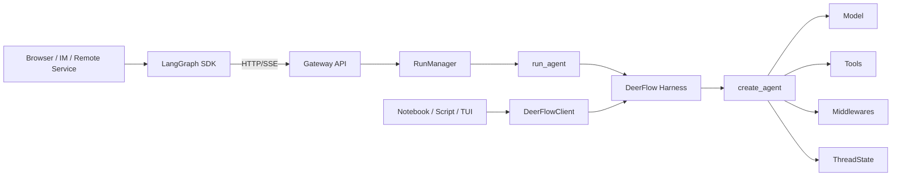

# 17 SDK 设计：远程协议与嵌入式客户端

## 1. 本章核心问题

DeerFlow 中的 “SDK” 不是单一组件，而是两种不同的接入方式：

1. **LangGraph SDK**：通过 HTTP/SSE 调用 Gateway，适合浏览器、IM Channel、远程服务和多进程部署。
2. **`DeerFlowClient`**：在 Python 进程内直接装配并执行 Agent，适合脚本、Notebook、TUI、测试和嵌入式应用。

二者共享 DeerFlow Harness 中的模型、工具、Prompt、Middleware、State 和 Checkpointer 能力，但不共享同一套传输与 Run 控制面。

一句话概括：

> LangGraph SDK 是远程协议客户端，`DeerFlowClient` 是同进程 Agent 门面；它们应保持能力语义一致，但不应为了代码复用而强行合并执行路径。

## 2. 先消除 “SDK” 歧义

| 名称 | 主要位置 | 调用边界 | 典型消费者 |
|---|---|---|---|
| LangGraph SDK | 前端 `@langchain/langgraph-sdk`、后端 `langgraph-sdk` | HTTP + SSE | Web UI、IM Channel、外部服务 |
| DeerFlow Embedded Client | `backend/packages/harness/deerflow/client.py` | Python 进程内函数调用 | Notebook、脚本、TUI、单元测试 |
| DeerFlow REST API | Gateway `/api/*` | HTTP JSON | 产品专属能力调用方 |
| Harness 内核 | `backend/packages/harness/deerflow/` | Python 模块调用 | Gateway Worker、`DeerFlowClient` |

LangGraph SDK 与 DeerFlow REST API 也不是一回事：

- Thread/Run/stream/join/cancel 等图运行能力使用 LangGraph 兼容 API；
- goal、compact、uploads、artifacts、skills、memory 等产品能力由 DeerFlow REST API 提供；
- `DeerFlowClient` 在进程内为其中一部分能力提供对齐的 Python 方法，但它不是 Gateway 全功能的本地镜像。

## 3. 为什么需要两条客户端路径



### 3.1 远程路径解决的问题

Gateway 路径承担的是服务端控制面：

- Run ID、状态和持久记录；
- 并发准入与 multitask strategy；
- cancel、join、disconnect、heartbeat；
- `StreamBridge` 缓冲、重连和多订阅者；
- HTTP 鉴权、CSRF、用户隔离；
- RunEvent、workspace changes、feedback 等产品数据。

### 3.2 嵌入式路径解决的问题

`DeerFlowClient` 的目标是把 Agent 作为普通 Python 能力使用：

- `client.chat()` 像同步函数一样返回最终文本；
- `client.stream()` 用同步迭代器直接产生事件；
- 无需启动 Gateway、Nginx 或前端；
- 无需 JSON/SSE 序列化后再反序列化；
- 可直接注入 Checkpointer、自定义 Middleware 和运行参数。

### 3.3 为什么不能让嵌入式客户端调用 Gateway Worker

`run_agent()` 是异步生产者，依赖 `RunManager + StreamBridge + SSE`；`DeerFlowClient.stream()` 是同步生成器，生产者和消费者位于同一调用栈。

强行复用会引入：

- 额外事件循环线程；
- sync/async 队列桥接；
- 无意义的 JSON 序列化；
- HTTP 断连语义在本地调用中的错误抽象；
- 对 Notebook 和简单脚本不友好的 `async for` 接口。

因此两条路径是**行为对齐、实现并行**，不是一条路径包装另一条路径。

## 4. `DeerFlowClient` 的设计目标

`DeerFlowClient` 可以看作四个角色的组合：

1. **Agent Factory Facade**：隐藏模型、工具、Prompt、Middleware 和 State 的装配细节。
2. **Conversation Facade**：提供 `stream()` 与 `chat()`。
3. **Thread/Checkpoint Facade**：提供 goal、thread list 和 checkpoint history 查询。
4. **Local Capability Facade**：提供 models、MCP、skills、memory、uploads、artifacts 等本地管理方法。

它不应该变成：

- 第二套 Gateway；
- 本地 `RunManager`；
- HTTP API 的机械逐端点复制；
- 绕过 Harness 安全中间件的“轻量 Agent”；
- 默认拥有网络服务生命周期的后台守护进程。

## 5. 初始化契约

构造函数的主要配置可分为五组：

| 分组 | 参数 | 作用 |
|---|---|---|
| 配置来源 | `config_path` | 指定 `config.yaml` |
| 持久会话 | `checkpointer` | 保存跨调用 ThreadState |
| 运行默认值 | `model_name`、`thinking_enabled`、`subagent_enabled`、`plan_mode` | 为每次 turn 提供默认配置 |
| Agent 定制 | `agent_name`、`available_skills`、`middlewares` | 选择自定义 Agent、技能白名单和扩展中间件 |
| 可观测性 | `environment` | 写入 Langfuse 环境标签 |

### 5.1 懒加载

构造函数只读取配置，不立即创建 Agent。第一次 `stream()` / `chat()` 时，`_ensure_agent()` 才执行装配。

收益：

- 配置查询方法不需要付出模型和工具初始化成本；
- MCP、Skills 等能力可在首次对话前更新；
- 测试可以构造 Client 后替换依赖；
- 无用 Client 不触发昂贵副作用。

### 5.2 Agent 缓存键

Client 按会影响图结构、Prompt 或 Middleware 的配置生成缓存键，包括：

- model；
- thinking；
- plan mode；
- subagent switch；
- subagent concurrency/total limits；
- agent name；
- skill allowlist。

相同键复用 Agent；键变化则重建。`reset_agent()` 用于外部配置、Memory、Skill 或 Tool 变化后强制失效。

设计原则：

> 只有影响 Agent 装配的字段应进入缓存键；纯 turn 数据应进入 state、runtime context 或 metadata，而不是导致重建。

## 6. Agent 装配如何与 Gateway 对齐

`_ensure_agent()` 复用与 Lead Agent 相同的核心构件：

```text
RunnableConfig
→ get_available_tools()
→ assemble_deferred_tools()
→ build_mcp_routing_middleware()
→ build_skill_search_setup()
→ create_chat_model(attach_tracing=False)
→ build_middlewares()
→ apply_prompt_template()
→ create_agent(state_schema=ThreadState, checkpointer=...)
```

关键不变式：

- 使用同一个 `ThreadState`；
- 使用同一套 `build_middlewares()`；
- Tool Search、MCP Routing 和 deferred skill discovery 不能只在 Gateway 生效；
- tracing callback 挂在图调用根部，模型创建时使用 `attach_tracing=False`，避免重复 span；
- 自定义 Middleware 由标准 builder 插入，不能绕过 terminal/safety/clarification 尾部顺序约束。

这解释了“共享内核”真正应该发生的位置：共享 Agent 构件与安全策略，而不是共享 HTTP Worker。

## 7. `RunnableConfig`、State 与 Runtime Context

每次 `stream()` 会建立三类输入：

### 7.1 State

```text
messages = [HumanMessage(content=message, additional_kwargs={run_id})]
```

State 进入 LangGraph reducer/checkpoint，是可持久会话事实。

### 7.2 `configurable`

包含：

- `thread_id`；
- `model_name`；
- `thinking_enabled`；
- `is_plan_mode`；
- `subagent_enabled`。

它控制当前图执行，并为 Checkpointer 提供 Thread identity。

### 7.3 Runtime Context

包含：

- `thread_id`；
- 每次调用生成的 `run_id`；
- 可选 `agent_name`；
- 可选 request trace ID。

这些值供 Middleware、Tracing 和 per-run 限制使用，但不应因为“方便”而全部复制进 ThreadState。

## 8. Thread、Run 与 Checkpointer 语义

### 8.1 `thread_id` 不等于持久会话

如果没有可用 Checkpointer，重复使用同一个 `thread_id` 只保证文件隔离路径等 identity 一致，不保证前一次消息会在下一次调用恢复。

多轮对话成立需要：

```text
相同 thread_id + 可用 checkpointer + 成功写入 checkpoint
```

### 8.2 嵌入式 `run_id` 的边界

`DeerFlowClient` 每次 `stream()` 都生成唯一 `run_id`，用于：

- 标记本轮 HumanMessage；
- runtime context；
- tracing；
- per-run Middleware 预算和 Subagent ledger 边界。

但这个 ID 不代表 Gateway 中由 `RunManager` 管理的完整 RunRecord。嵌入式 Client 没有天然提供：

- 远程 join；
- SSE reconnect；
- 多 worker ownership；
- Run status REST 查询；
- Gateway cancel/finalization 生命周期。

### 8.3 Thread 查询的事实来源

`list_threads()` 与 `get_thread()` 直接读取 Checkpointer：

- `list_threads()` 聚合 checkpoint，并按时间整理 title/latest checkpoint；
- `get_thread()` 返回 checkpoint history、parent、metadata、values 和 pending writes。

它们不等价于 Gateway 的 `threads_meta + RunStore + RunEventStore` 产品视图。尤其是完整可见聊天历史可能存在 RunEventStore，而不再完整存在已压缩 checkpoint 中。

## 9. 流式事件契约

`StreamEvent.type` 当前包括：

| 类型 | 含义 | 主要数据 |
|---|---|---|
| `values` | 节点完成后的状态快照 | title、messages、artifacts |
| `messages-tuple` | AI delta、tool call 或 tool result | message type、content、id、metadata |
| `custom` | 应用自定义事件 | Subagent progress 等 |
| `end` | 本轮完成 | 累计 token usage |

底层订阅的是 LangGraph Graph API：

```text
stream_mode = ["values", "messages", "custom"]
```

对外将 Graph 层的 `messages` 命名为 `messages-tuple`，与 LangGraph HTTP 客户端的消费概念对齐。这里不能盲目共享字符串常量，因为 Graph 层与 HTTP wire 层使用不同名称。

## 10. Delta、快照与去重

`messages` 产生 token delta，`values` 产生完整 State 快照。同一个 AIMessage 可能先以多个 delta 出现，稍后又完整出现在快照中。

Client 使用三个集合维护不同不变式：

| 集合 | 不变式 |
|---|---|
| `seen_ids` | 同一 message 不被多个 `values` 快照重复合成 |
| `streamed_ids` | 已通过 `messages` 发出的 message 不再从 `values` 重发全文 |
| `counted_usage_ids` | 同一 message 的 usage 不在 chunk 和 snapshot 中重复累计 |

此外，`sent_additional_kwargs_by_id` 只发送新增或变化的 metadata，避免同一 attribution 在多个 chunk 中反复出现。

这些集合不能合并成一个 “processed IDs”，因为加入时机不同：看到文本、看到快照、看到 usage 是三个独立事件。

### 已知边界

稳定 message ID 是跨 mode 去重的基础。如果 provider 的流式 chunk 没有 ID，而最终快照补上了 ID，Client 无法证明二者是同一逻辑消息，可能发出重复文本。消费者应优先选择能提供稳定 message ID 的 Provider；修改该行为时必须增加协议级回归测试。

## 11. `chat()` 为什么只是 `stream()` 的便利层

`chat()` 不建立第二条执行路径，而是消费 `stream()`：

1. 只处理 `messages-tuple` 中的 AI 文本；
2. 按 message ID 收集 delta；
3. 返回最后一个产生文本的 AIMessage；
4. 使用 `list[str] + join()`，避免长文本反复拼接造成近似 \(O(n^2)\) 拷贝。

因此：

- 只要最终文本时用 `chat()`；
- 需要工具、Subagent 进度、Token 或中间状态时用 `stream()`；
- 不要通过解析 `chat()` 文本推断工具状态或错误协议。

## 12. 配置修改与缓存失效

Client 既读取运行配置，也能修改部分本地配置：

- `update_mcp_config()` 原子写入 `extensions_config.json`，reload 后失效 Agent；
- `update_skill()` 按 Public/Custom skill 的存储边界更新状态并失效 Prompt/Agent cache；
- `reset_agent()` 只影响当前 Client 的 Agent 缓存，不等于清除全局所有配置缓存；
- 构造时传 `config_path` 会触发 AppConfig reload。

配置写入采用临时文件 + replace，避免进程在半份 JSON 上读取。但原子文件替换不等于跨进程业务事务：多个 writer 并发更新同一个配置文件仍需要更高层协调。

## 13. 本地能力 API 的边界

`DeerFlowClient` 提供的主要能力包括：

| 能力 | 代表方法 |
|---|---|
| Conversation | `stream()`、`chat()` |
| Thread/Goal | `list_threads()`、`get_thread()`、`get_goal()`、`set_goal()`、`clear_goal()` |
| Model | `list_models()`、`get_model()` |
| MCP | `get_mcp_config()`、`update_mcp_config()` |
| Skill | `list_skills()`、`get_skill()`、`update_skill()`、`install_skill()` |
| Memory | `get_memory()`、`reload_memory()`、CRUD/export/import |
| File | `upload_files()`、`list_uploads()`、`delete_upload()`、`get_artifact()` |

设计上应区分三类一致性：

1. **返回 Schema 一致**：同类 Gateway 响应与 Client dict 能被同一 Pydantic model 解析。
2. **业务语义一致**：例如 Skill enable 后两条路径都正确失效缓存。
3. **部署能力一致**：不要求一致；嵌入式路径天然没有 HTTP auth、SSE reconnect 和多 worker ownership。

## 14. Gateway Conformance 测试

`backend/tests/test_client.py` 使用 Gateway Pydantic Response Model 解析 Client 返回值，锁定以下契约：

```text
Client method result
→ Gateway response model validation
→ required fields/types match
```

这类测试能发现：

- Gateway 新增 required field，Client 忘记补；
- 字段命名漂移；
- category/enum 序列化不一致；
- uploads、memory、skills 等返回 envelope 不一致。

但它不能证明：

- 两条路径有相同鉴权；
- 两条路径有相同并发语义；
- 两条路径有相同持久化副作用；
- 真实模型流式时序一致。

因此仍需 streaming、checkpointer、config invalidation 和 live integration 测试。

## 15. Tracing 与 ContextVar

嵌入式路径在图调用根部安装 tracing callbacks，并注入：

- `langfuse_session_id = thread_id`；
- `langfuse_user_id`；
- agent trace name；
- model/environment tags；
- 可选 `deerflow_trace_id`。

当 trace correlation 开启时，`stream()` 不能在整个 generator 生命周期中一直绑定 ContextVar。同步 generator 会在每次 `yield` 时把控制权交回调用者，如果绑定跨越 `yield`：

- trace ID 会泄漏到调用者上下文；
- generator 在不同 Context 中被回收时可能 reset 失败。

当前设计在每次 `next(inner)` 前 set，返回事件前 reset，并在 `finally` 中 close inner generator。这个模式适用于所有“同步生成器内部需要临时 ContextVar”的 SDK 设计。

## 16. 同步 API 与异步环境

`DeerFlowClient` 的公开 API 以同步调用为主。一些 goal/checkpointer helper 是 async，Client 通过同步桥执行：

- 当前线程没有运行中的 event loop：直接 `asyncio.run()`；
- 已有 event loop：在单独线程中运行 coroutine，避免嵌套 `asyncio.run()`。

这让 Notebook 更易用，但有代价：

- 线程切换成本；
- 异步资源可能有 loop affinity；
- 不应把它扩展成高并发服务端请求处理模式。

如果应用本身是高并发 async server，优先调用 Gateway HTTP API，或设计原生 async embedded facade，而不是在线程中高频包装同步 Client。

## 17. 选型决策

### 选择 `DeerFlowClient`

适合：

- 单进程 Python 应用；
- Notebook/数据分析；
- 本地 CLI/TUI；
- Agent 单元与集成测试；
- 希望直接注入 Checkpointer/Middleware；
- 不需要断线重连与远程 Run 管理。

### 选择 LangGraph SDK + Gateway

适合：

- 浏览器或非 Python 客户端；
- 多用户鉴权与隔离；
- 长任务、cancel/join/reconnect；
- 多 worker 部署；
- 需要 RunEvent、feedback、console、workspace changes；
- Agent 与调用方跨进程或跨主机。

### 选择 DeerFlow REST API

当能力属于产品控制面而不是图执行协议时使用，例如 goal、compact、uploads、artifacts、skills 和 memory 管理。实际应用经常同时使用 LangGraph SDK 与 DeerFlow REST API。

## 18. 扩展 SDK 的设计检查表

新增 Client 方法前回答：

1. 它是本地 Harness 能力，还是必须依赖 Gateway 数据面？
2. 返回值是否需要与 Gateway Response Model 对齐？
3. 是否需要 user/agent/thread 隔离？
4. 是否修改配置？写入是否原子？缓存如何失效？
5. 是否会触发阻塞 I/O？同步 API 在 event loop 中如何表现？
6. 是否需要 Checkpointer？没有 Checkpointer 时如何失败或降级？
7. 是否引入新的 stream event？旧消费者能否忽略？
8. message ID、delta、usage 和 metadata 的幂等规则是什么？
9. 错误应抛异常，还是返回结构化结果？是否与 Gateway 语义一致？
10. 哪些能力明确不做，例如 auth、reconnect、Run ownership？
11. 是否需要 `reset_agent()` 或全局 cache invalidation？
12. 是否补充 conformance、protocol、integration 和文档测试？

## 19. 常见错误设计

### 错误一：把 `thread_id` 当数据库

没有 Checkpointer 时，`thread_id` 不是多轮记忆。它只是 identity。

### 错误二：把嵌入式 `run_id` 当 Gateway RunRecord

它缺少 `RunManager` 的状态机、持久化、cancel 和 ownership 语义。

### 错误三：只订阅 `values`，再声称支持 token streaming

`values` 是节点级快照；逐 token 必须订阅 Graph `messages`。

### 错误四：把 delta 当累计文本

消费者必须按 message ID 累加；`chat()` 已代为处理。

### 错误五：用一个集合处理所有去重

message delivery、snapshot synthesis 和 usage accounting 是三种幂等性。

### 错误六：修改 Skill/MCP 后只写文件

Agent、Prompt、Extensions Config 等缓存可能仍保存旧能力集。

### 错误七：为了 DRY 让本地 Client 走 HTTP/SSE

共享传输管线会牺牲嵌入式调用的简单性。应该共享 Harness 内核和协议测试。

### 错误八：认为 Schema 一致就是行为一致

Conformance test 只能锁返回形状，不能锁并发、认证、持久化和时序。

## 20. 源码阅读顺序

建议按以下顺序阅读：

1. `backend/packages/harness/deerflow/client.py::DeerFlowClient.__init__`
2. `client.py::_get_runnable_config`
3. `client.py::_ensure_agent`
4. `agents/lead_agent/agent.py::build_middlewares`
5. `tools/tools.py::get_available_tools`
6. `client.py::stream`
7. `client.py::_stream_without_trace_context`
8. `client.py::chat`
9. `runtime/runs/worker.py::run_agent`
10. `runtime/serialization.py`
11. `runtime/stream_bridge/`
12. `backend/docs/STREAMING.md`
13. `backend/tests/test_client.py`
14. `backend/tests/test_client_langfuse_metadata.py`
15. `backend/tests/test_client_live.py`

阅读目标：画出两条路径在 `create_agent()` 汇合、在执行和传输层分叉的结构图。

## 21. 实践实验

### 实验一：验证 Checkpointer 边界

1. 构造无 Checkpointer 的 Client；
2. 对相同 `thread_id` 连续提问；
3. 再注入 Checkpointer 重复实验；
4. 比较第二轮模型输入和 `get_thread()` 结果。

验收：能解释 identity 与 persistence 的区别。

### 实验二：记录事件时序

消费一次包含 Tool call 的 `stream()`，记录：

```text
index, event.type, message id, content length, tool_call_id, usage
```

验收：能指出 delta、tool result、values snapshot 和 end 的顺序，并验证 usage 未重复。

### 实验三：设计一个 SDK 方法

选择一个 Gateway 能力，先判断它是否适合嵌入式实现，然后写设计说明：

- 数据来源；
- 返回 schema；
- 用户隔离；
- 异常；
- 缓存失效；
- conformance test；
- 明确不支持的远程语义。

## 22. 面试题

### 1. `DeerFlowClient` 为什么不直接复用 Gateway `run_agent()`？

因为两者消费者和并发模型不同：Gateway 是 async + RunManager + Queue + SSE，Client 是同步生成器 + 原生 Python 数据。复用会引入线程、事件循环和序列化开销。正确复用点是 Agent 构件与契约测试。

### 2. 为什么 `thread_id` 相同仍可能没有多轮上下文？

Thread identity 不保存状态；只有配置可用 Checkpointer 并成功写入 checkpoint 后，下一轮才能恢复 ThreadState。

### 3. 为什么同时需要 `messages` 与 `values`？

`messages` 提供 token 级增量和工具消息，`values` 提供 reducer 合并后的完整状态快照。前者优化实时体验，后者提供状态恢复与校准。

### 4. 三个 ID 集合分别保护什么？

`seen_ids` 防快照重复合成，`streamed_ids` 防跨 mode 重发文本，`counted_usage_ids` 防 usage 双算。它们的加入时机不同，不能合并。

### 5. Gateway Conformance 测试有什么价值和局限？

价值是锁定本地 Client 与 Gateway 的返回 schema；局限是不能验证认证、并发、持久化副作用和流式时序一致。

### 6. 什么时候不应该使用嵌入式 Client？

需要多用户鉴权、远程 cancel/join/reconnect、多 worker ownership、RunEvent 产品历史或跨进程调用时，应使用 Gateway。

## 23. 本章自测

不看文档，尝试回答：

- 两种 SDK 分别跨越什么边界？
- 两条执行路径在哪里共享、在哪里分叉？
- `chat()` 如何从 delta 得到最终文本？
- 没有 Checkpointer 时 `thread_id` 还负责什么？
- 为什么嵌入式 `run_id` 不是 Gateway Run？
- Agent 缓存键应包含什么，不应包含什么？
- Skill/MCP 更新后有哪些缓存需要失效？
- `messages` 与 `messages-tuple` 为什么不能当成同一层字符串？
- 如何测试 SDK 的 schema、协议、持久化和真实集成？
- 如何为一个 async-first 服务选择远程或嵌入式接入方式？
