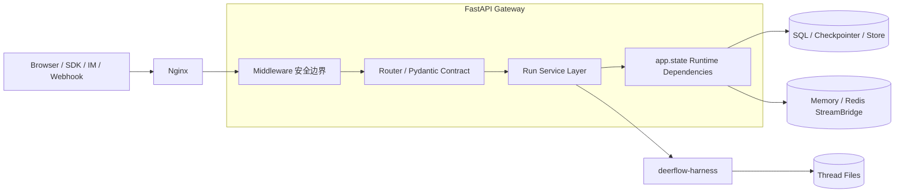
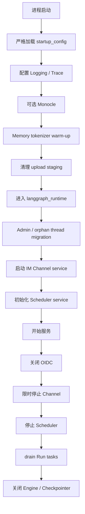

# 18 Gateway 设计：API 边界、运行控制面与生命周期

## 1. 本章核心问题

DeerFlow Gateway 不是一个只做转发的反向代理，也不是官方 LangGraph Server。它是 DeerFlow 的 **FastAPI 应用边界与 Run 控制面**：

- 对外暴露 LangGraph 兼容 API 和 DeerFlow 产品 REST API；
- 负责身份认证、CSRF、CORS、授权和用户归属；
- 将 HTTP 请求转换成 LangChain Message、`RunnableConfig` 和 runtime context；
- 管理 Run 准入、状态、取消、等待、流式订阅和恢复；
- 在进程生命周期内装配 Checkpointer、Store、Repository、StreamBridge 和 RunManager；
- 调用 Harness 中的 `run_agent()`，但不在 `app.*` 中重新实现 Agent 内核。

一句话心智模型：

> Nginx 负责统一入口，Gateway 负责可信请求边界和 Run 控制面，Harness 负责 Agent 执行语义。

本章与其他章节的分工：

- `01-system-architecture.md`：Gateway 在全局架构中的位置；
- `02-request-lifecycle.md`：一条消息的端到端动态时序；
- 本章：Gateway 自身如何组织、启动、保护、调度和关闭。

## 2. Gateway 的职责边界



### Gateway 应该负责

- HTTP request/response 与 Pydantic schema；
- session/internal auth 与权限检查；
- 请求来源和资源 owner 校验；
- Run API 协议兼容；
- Agent 执行前的准入和输入标准化；
- SSE 格式、断连策略和重连游标；
- 应用基础设施的启动与关闭；
- 产品控制面 API。

### Gateway 不应该负责

- Lead Agent Prompt 的领域逻辑；
- Middleware 的 Agent 执行语义；
- Tool、Skill、MCP、Sandbox 的核心实现；
- Subagent 执行器；
- LangGraph reducer 和 ThreadState 定义；
- 嵌入式 Client 的同步调用模型。

依赖规则仍然是：

```text
app.gateway.* → deerflow.*      允许

deerflow.* → app.gateway.*      禁止
```

`backend/tests/test_harness_boundary.py` 用于锁定这一方向。

## 3. 代码结构

Gateway 主要位于 `backend/app/gateway/`：

```text
app/gateway/
├── app.py                  FastAPI 工厂、Middleware、Router、lifespan
├── config.py               host、port、docs 开关
├── deps.py                 app.state 基础设施装配与依赖 getter
├── services.py             Run 创建、SSE、wait 等共享业务层
├── auth_middleware.py      全局认证门
├── csrf_middleware.py      Double Submit Cookie 与 Origin 检查
├── trace_middleware.py     请求 trace correlation
├── authz.py                细粒度 permission / owner 检查
├── internal_auth.py        进程内部调用身份
├── langgraph_auth.py       LangGraph 兼容鉴权适配
├── auth/                   用户、JWT、OIDC、密码与 Provider
├── github/                 GitHub Webhook 分发策略
└── routers/                按 API 领域拆分的路由
```

建议把 Gateway 代码分成四层理解：

```text
ASGI Middleware
→ Router Contract
→ Gateway Service
→ Harness Runtime / Repository
```

不是每个普通 CRUD Router 都需要单独 Service；但跨 `thread_runs` 和 `runs` 共用的 Run 生命周期必须集中在 `services.py`，否则 stream/wait/stateless/thread-scoped 行为容易漂移。

## 4. FastAPI 应用装配

入口是：

```text
backend/app/gateway/app.py::create_app()
```

它完成：

1. 读取 `GatewayConfig`；
2. 根据 `GATEWAY_ENABLE_DOCS` 决定是否挂载 Swagger、ReDoc 和 OpenAPI；
3. 创建带 `lifespan` 的 FastAPI 实例；
4. 注册 Auth、CSRF、可选 CORS、Trace Middleware；
5. 挂载所有 Router；
6. 按配置决定是否挂载 GitHub Webhook Router；
7. 提供 `/health`；
8. 导出模块级 `app` 给 Uvicorn。

### 为什么使用应用工厂

`create_app()` 的价值包括：

- 测试可构造隔离应用；
- docs、CORS、Trace 等装配规则集中；
- 条件 Router 可以在启动前确定；
- import 与真正 lifespan startup 分离。

### import 不等于 startup

模块底部会执行 `app = create_app()`，但连接池、Checkpointer 和 RunManager 等基础设施在 lifespan 中初始化。应用构造阶段应避免必须依赖完整运行环境的重副作用。

例如 Trace 开关在构造阶段读取失败时可暂时关闭，但 lifespan 随后会严格加载配置；没有有效 `config.yaml` 时 Gateway 不会开始服务。

## 5. Middleware 安全边界

Gateway 的全局 Middleware 包括：

| Middleware | 作用 |
|---|---|
| `AuthMiddleware` | 对非公开路径执行 fail-closed 身份认证 |
| `CSRFMiddleware` | 保护 Cookie session 下的状态修改请求 |
| `CORSMiddleware` | 仅允许显式配置的 split-origin 浏览器来源 |
| `TraceMiddleware` | 绑定请求 trace ID 并写响应 Header |

注意 FastAPI/Starlette 的 Middleware 是包装栈，**注册顺序与实际进入/退出顺序不能凭列表直觉判断**。修改顺序时应通过请求测试验证：

- 谁最先拒绝请求；
- 被拒绝响应是否仍带 CORS/Trace Header；
- ContextVar 在异常和 streaming response 中是否被清理。

### 5.1 AuthMiddleware

公开路径主要包括：

- `/health`；
- 可选文档；
- 登录、初始化和 Provider 发现等少数 Auth endpoint；
- `/api/webhooks/*`。

其余请求必须满足以下一种身份来源：

1. 有效内部认证 Token；
2. 有效 session access token Cookie；
3. 明确启用 auth-disabled 本地模式。

认证成功后会同时写入：

- `request.state.user`；
- `request.state.auth_source`；
- `request.state.auth`；
- `deerflow.runtime.user_context` ContextVar。

这样 Router 可以显式检查权限，Repository 和文件路径也能通过当前用户上下文自动执行 owner scope。

### 5.2 认证不等于授权

全局 Auth 只证明“调用者是谁”。资源级访问还需要：

- permission；
- owner check；
- thread ownership；
- admin role；
- internal caller 标记。

例如猜到另一个用户的 `thread_id` 不能因此读取其 Run。安全设计必须同时具备全局认证和资源授权。

### 5.3 内部认证

IM Channel、Scheduler 等进程内服务需要以受信调用方访问 Gateway。内部认证可携带真实 owner user ID，使：

- Run user identity；
- Memory；
- Custom Skill；
- Workspace 文件目录；

都落到 owner bucket，而不是内部系统账号或默认用户。

内部调用不是“跳过所有安全检查”：只有通过内部 Token 验证后，内部 Header 和 internal-only context key 才可信。

### 5.4 CSRF

Gateway 使用 Double Submit Cookie：

```text
csrf_token Cookie
== constant-time compare ==
X-CSRF-Token Header
```

主要规则：

- `POST/PUT/DELETE/PATCH` 需要检查；
- safe methods 不检查；
- auth-disabled 模式不检查；
- Webhook 使用 Provider 签名，不使用 session CSRF；
- 首次登录/注册没有 CSRF Cookie，因此使用 Origin allowlist 防 login CSRF。

CORS 与 CSRF 共同读取 `GATEWAY_CORS_ORIGINS`，避免“浏览器被 CORS 允许但被 Auth Origin 拒绝”的配置漂移。

### 5.5 Webhook 是独立信任边界

GitHub Webhook 对 session auth 和 CSRF 豁免，但使用 `X-Hub-Signature-256` HMAC 验证。

Router 默认 fail-closed：

- 设置 `GITHUB_WEBHOOK_SECRET` 才挂载；
- 或显式设置开发用未验证开关；
- 两者都没有时 URL 返回 404，而不是挂载一个运行时再决定放行的无保护 Handler。

## 6. Lifespan：Gateway 的启动状态机

`app.py::lifespan()` 是 Gateway 基础设施的真正入口。



### 6.1 启动失败分级

配置和核心运行时初始化失败必须终止启动。可观测性 warm-up、staging cleanup、Channel 等辅助能力通常记录错误后继续，具体取决于它们是否属于核心服务前提。

判断原则：

- 没有 Checkpointer/RunManager，Run API 不可用，应 fail startup；
- Monocle 初始化失败不应让 Agent 完全不可用；
- 没配置 Channel 不应影响 Web UI；
- 核心配置无效时继续启动只会造成更隐蔽的 500。

### 6.2 为什么 shutdown 要有顺序

必须先 drain 仍在执行的 Run，再关闭 Checkpointer 和数据库连接池。否则 Agent task 可能在关闭后的连接池上继续写 checkpoint，产生 `PoolClosed` 或部分 finalization。

`RunManager.shutdown()` 有边界时间，并使用 shield 处理 shutdown coroutine 自身被取消的情况。顺序比“每个资源最终都 close”更重要。

## 7. `langgraph_runtime()` 与 `app.state`

`backend/app/gateway/deps.py::langgraph_runtime()` 使用 `AsyncExitStack` 创建并托管基础设施。

典型 `app.state` 对象包括：

| 属性 | 用途 |
|---|---|
| `stream_bridge` | Run 实时事件发布和订阅 |
| `checkpointer` | LangGraph ThreadState checkpoint |
| `store` | LangGraph Store，可选 |
| `run_store` | RunRecord 长期存储 |
| `thread_store` | ThreadMeta 查询投影 |
| `run_event_store` | 消息、审计、Subagent step 历史 |
| `feedback_repo` | 用户反馈 |
| `run_manager` | 活动 Run task、状态与并发控制 |
| `scheduled_task_repo` | 计划任务定义 |
| `scheduled_task_run_repo` | 调度执行记录 |
| `scheduled_task_service` | 后台调度循环 |

### 为什么基础设施放 `app.state`

这些对象：

- 生命周期与 Gateway 进程一致；
- 持有连接、队列、后台 task 或 cache；
- 不适合每个请求重新创建；
- 需要在 shutdown 集中释放。

Router 不直接到处读取属性，而是通过 `deps.py` 的 getter：

- 依赖存在则返回；
- 核心依赖缺失时统一返回 503；
- 可选 Store 可以返回 `None`；
- `get_run_context()` 将基础设施组合成 Harness `RunContext`。

### `app.state` 不是业务状态

不要把以下内容放进 `app.state`：

- 当前 thread ID；
- 当前 user；
- 当前 request secrets；
- 每个 Run 的临时输入；
- 应被 Checkpointer reducer 管理的 ThreadState。

请求身份使用 `request.state` 和 ContextVar；Run 临时信息使用 runtime context；会话事实进入 Checkpointer。

## 8. 配置：热更新与重启边界

Gateway 同时存在两类配置读取：

### 启动快照

`startup_config` 用于创建长生命周期基础设施，例如：

- database；
- checkpointer；
- run events backend；
- stream bridge；
- scheduler；
- channels；
- logging；
- run ownership。

修改这些字段后需要重启，因为已有连接和后台 task 不会自动迁移到新 backend。

### 请求时配置

Router 和 Run path 调用 `deps.get_config()`，后者再调用 `get_app_config()`。因此模型、Prompt、token limit、summarization 等 per-run 配置可在下一次请求读取新值。

### 为什么不把 AppConfig 放进 `app.state`

如果 lifespan 保存 `app.state.config = startup_config`，Router 可能永远读取旧模型配置，而其他 Harness 路径读取热更新配置，形成进程内 split-brain。

正确模型是：

```text
基础设施对象 → 绑定 startup snapshot
每次 Run 的动态行为 → 读取 fresh AppConfig
```

`RunContext` 也必须避免把 fresh `run_events` 配置与旧 event store backend 混用，因此 event store 与对应 config snapshot 成对冻结。

## 9. API 的四个平面

### 9.1 健康与发现平面

包括：

- `/health`；
- models；
- features；
- assistants compatibility；
- 可选 OpenAPI docs。

它们用于服务探活和客户端能力发现，不执行完整 Agent Run。

### 9.2 LangGraph 兼容运行平面

主要 Router：

- `routers/thread_runs.py`：Thread-scoped Run；
- `routers/runs.py`：stateless Run；
- `routers/assistants_compat.py`：最小 Assistant 兼容信息。

能力包括：

- create/stream/wait；
- list/get；
- cancel/join；
- messages/events；
- checkpoint 参数；
- regenerate prepare；
- token usage。

“兼容”意味着满足 DeerFlow 当前客户端所需协议，不代表完整复刻 LangGraph Platform。

### 9.3 DeerFlow 产品控制平面

包括：

- goals、compact、branch；
- uploads、artifacts、workspace changes；
- skills、MCP、memory；
- custom agents；
- feedback、console；
- scheduled tasks；
- input polish、suggestions；
- channel connections。

这些能力不应为追求“协议统一”而强塞进 LangGraph runs API。

### 9.4 外部事件平面

GitHub Webhook 等外部事件通过自己的真实性验证进入 Gateway，再转换为 Channel `InboundMessage` 和标准 Run 路径。Scheduler 同样只决定何时启动，不建立第二套 Agent 执行栈。

## 10. Router、Service 与 Harness 的分工

以 Run 创建为例：

```text
thread_runs.py / runs.py
→ services.start_run()
→ RunManager.create_or_reject()
→ asyncio.create_task(run_agent())
```

### Router

负责：

- URL/path/query/body；
- Pydantic request/response；
- permission declaration；
- HTTP status/header；
- `StreamingResponse`。

### `services.py`

负责 Gateway 级共享逻辑：

- 输入标准化；
- context 白名单；
- authenticated user 注入；
- checkpoint ownership 验证；
- Thread Run admission；
- Run task 创建；
- SSE frame 和 consumer；
- wait/disconnect 行为。

### Harness Runtime

负责：

- `RunManager` 状态机；
- `run_agent()`；
- StreamBridge 抽象；
- RunJournal；
- Agent factory；
- graph execution 和 finalization。

一个实用判断：

> 逻辑是否依赖 HTTP 的可信边界？是则通常属于 Gateway；逻辑是否应被 Embedded Client/TUI 复用？是则通常属于 Harness。

## 11. 输入标准化

LangGraph SDK 发送的是 JSON message dict；Agent 需要 LangChain `BaseMessage`。

`services.normalize_input()` 使用 `convert_to_messages()` 转换，保留：

- role/type；
- message ID；
- name；
- `additional_kwargs`；
- ToolMessage fields；
- 非纯字符串 content blocks。

不应手写只复制 `content` 的转换器，否则附件 metadata、Tool role 和 provider 字段会静默丢失。

### 边界错误

非法 message 应返回 400，并指明 `input.messages[index]`，而不是让转换异常冒泡成 500。

### Server-owned metadata

`original_user_content` 等 provenance 字段是服务端所有。外部调用者即使放入 `additional_kwargs` 也必须被剥离；只有可信内部 Channel 路径可以携带它捕获的原始文本。

原则：

> 可扩展 metadata 不等于所有 metadata 都由客户端授权写入。

## 12. Run Config 与 Context 白名单

Gateway 不能把 `body.context` 或 `body.config` 原样交给 Agent。当前设计把字段分成三类。

### 12.1 可进入 configurable 和 runtime context

例如：

- model；
- mode；
- thinking；
- reasoning effort；
- plan mode；
- subagent switch/limits；
- agent name；
- bootstrap flag。

这些字段同时服务旧 configurable consumer 和新 `ToolRuntime.context` consumer。

### 12.2 只允许内部调用者

例如 `non_interactive`。它会移除 `ask_clarification`，如果任意 HTTP 客户端都能设置，就可以改变 Agent 的人机确认语义。

只在 merge helper 做白名单还不够，因为调用者可能把字段藏进 `body.config.context` 或 `body.config.configurable`。配置构建后还必须执行第二次 scrub。

### 12.3 只进入 runtime context

例如短期 GitHub Token、clarification runtime flag、channel user ID。

这些值不应进入 `configurable`，因为 configurable 可能持久化进 Checkpoint。Secret 必须留在请求级 runtime context。

### 12.4 认证用户优先

服务端认证得到的 user identity 必须覆盖或阻止客户端伪造的 `user_id`。客户端 context 是参数，不是身份凭据。

## 13. Run 准入与 Thread 串行化

`start_run()` 是 Gateway Run 创建的核心边界。

典型步骤：

1. 读取当前 AppConfig；
2. 获取 StreamBridge、RunManager、RunContext；
3. 校验 model/assistant；
4. 解析可信 owner；
5. 校验 Thread owner；
6. 标准化 input/command；
7. 构造并清洗 Run config/context；
8. 校验 checkpoint 属于目标 Thread；
9. 在 Thread lock 下执行 `create_or_reject()`；
10. 创建或更新 ThreadMeta；
11. 创建 `run_agent()` 后台 task；
12. 将 task 绑定到 RunRecord。

### 为什么准入必须原子

错误写法：

```text
检查没有活动 Run
→ await 其他 I/O
→ 创建 Run
```

两个请求可能同时通过检查。正确做法是让检查、策略判断和 RunRecord 创建共享同一并发临界区。

### Multitask strategy

| 策略 | 行为 |
|---|---|
| `reject` | 有活动 Run 时返回冲突 |
| `interrupt` | 终止旧 Run，保留已经提交的图状态 |
| `rollback` | 终止旧 Run，并恢复到运行前 checkpoint |
| `enqueue` | 接口表面可能接受，但当前执行层未实现 |

### `finalizing` 也是活动状态

Agent graph 结束不代表 Run 已安全释放 Thread。旧 Run 仍可能：

- flush Journal；
- 写状态；
- 更新 title；
- 写 ThreadMeta；
- 发布 END。

新 Run 必须避免与这些晚到写入竞态。

## 14. 为什么 Run 在后台 Task 中执行

Router 不直接：

```python
await run_agent(...)
```

而是创建后台 task。原因是：

- stream endpoint 需要 producer 与 HTTP consumer 并行；
- `/join` 可以订阅已有 Run；
- `/wait` 与 `/stream` 共用同一个执行；
- disconnect 可以选择 cancel 或 continue；
- RunManager 需要保存活动 `asyncio.Task` 以执行本地取消。

后台 task 不等于 fire-and-forget。它必须被 RunRecord 持有，并在 Gateway shutdown 时 drain。

## 15. SSE 与 StreamBridge

Gateway 的实时路径是：

```text
run_agent producer
→ StreamBridge.publish
→ services.sse_consumer
→ StreamingResponse
→ LangGraph SDK
```

### SSE frame

`format_sse()` 输出：

```text
event: <event-name>
data: <json>
id: <optional-event-id>

```

字段顺序和事件命名需要符合 SDK decoder 预期，不能把它当任意文本流。

### StreamBridge 的职责

- producer/consumer 解耦；
- Memory 或 Redis backend；
- event ID；
- retained replay；
- heartbeat；
- END sentinel；
- 延迟 cleanup；
- 多订阅者或跨进程可见性。

### StreamBridge 不负责

- 长期消息历史；
- Checkpoint 恢复；
- Run task ownership；
- Thread admission；
- 完整分布式调度。

### `/wait` 为什么也消费 StreamBridge

如果只 `await record.task`，服务端可能无法及时感知 HTTP 客户端断开，也无法统一执行 `on_disconnect=cancel|continue`。通过同一流消费路径等待，stream 和 wait 的断连语义更一致。

## 16. Run 查询、取消与 Store-only Run

RunManager 同时面对两种 Run：

1. **本地活动 Run**：内存中有 task、abort event 和 finalization 状态；
2. **Store-only Run**：从持久 RunStore hydrate，只能读取历史数据。

同一 `run_id` 同时存在时，本地记录优先，因为 SQL 无法保存 `asyncio.Task`。

### Cancel 的结果不是布尔值

取消可能返回：

- 本地成功取消；
- Run 已终态；
- 未找到；
- 当前 Worker 不拥有；
- 另一个 Worker lease 仍有效；
- owner lease 过期，当前 Worker takeover 并标记 error。

Router 需要把这些结果映射到正确的 404、409、成功响应和 `Retry-After`，不能把所有失败都吞成幂等成功。

## 17. 启动恢复

Gateway 启动时，RunStore 可能仍有 `pending/running`，但当前进程没有对应 task。

`RunManager.reconcile_orphaned_inflight_runs()`：

- 单 Worker/无 heartbeat：可把残留 inflight Run 视为 orphan；
- 多 Worker：只能回收 lease 已过期的 Run；
- 不能把其他活 Worker 正在执行的 Run 错标为 error。

恢复后还需要：

- 标记 Run error；
- 必要时更新最新 Thread 状态；
- 给仍保留的 stream 发布 END；
- 安排 stream cleanup。

否则前端 reconnect 可能一直等待一个永远不会再产生事件的 Run。

## 18. 持久化平面

Gateway 会同时操作多个事实平面：

| 平面 | Gateway 用途 |
|---|---|
| Checkpointer | state、resume、branch、compact、goal |
| LangGraph Store | thread metadata/Store API 等 |
| RunStore | Run 状态、token、error、ownership lease |
| ThreadMetaStore | sidebar、title、status、owner |
| RunEventStore | 历史消息、审计、Subagent step、workspace change |
| Feedback Repository | 用户评价 |
| Filesystem/Sandbox | uploads、workspace、outputs、artifacts |
| StreamBridge | 临时实时事件 |

它们不处于同一个事务。Gateway 设计必须明确：

- 哪一个是当前操作的权威来源；
- 哪些是查询投影；
- 哪些失败应改变 Run 终态；
- 哪些失败只记录日志并允许核心 Run 成功。

例如 title 同步失败通常不应把已完成的 Agent 回答变成 error，但 Checkpointer 核心写入失败则可能破坏可恢复性。

## 19. Thread 产品操作

`routers/threads.py` 包含的不只是删除，还包括与 checkpoint 强相关的产品操作。

### Goal

- 读取、设置、清除 ThreadState goal；
- 与 Run admission 共享 thread serialization gate；
- 防止设置/清除目标与新 Run 同时写 checkpoint。

### Compact

- 调用共享 summarization 能力；
- 在没有活动 Run 时写新 checkpoint；
- 保留完整可见历史在 RunEventStore；
- 只改变 active context，不删除历史聊天记录。

### Branch

- 从指定 assistant turn 对应 checkpoint 创建新 Thread；
- 记录 lineage；
- 只有从最新 turn 分支时才 best-effort 复制当前 workspace；
- 历史 turn 不复制 workspace，避免继承未来时间线的文件。

这些操作说明 Gateway 是产品状态协调器，不只是 Runs endpoint 集合。

## 20. Stateless Run 的真实含义

`/api/runs/stream` 和 `/api/runs/wait` 为调用方生成临时 Thread identity，再复用标准 Run lifecycle。

“Stateless” 主要表示调用方不预先管理 Thread，不代表执行期间完全没有：

- thread ID；
- Checkpoint；
- RunRecord；
- StreamBridge；
- 用户归属。

否则 Tool、Sandbox、RunJournal 和文件隔离将失去统一 identity。

## 21. 错误模型

Gateway 应区分以下错误类别：

| HTTP 状态 | 典型含义 |
|---|---|
| 400 | message/config/checkpoint 请求格式非法 |
| 401 | 未认证或 Token 无效 |
| 403 | CSRF、权限、owner 或 admin 检查失败 |
| 404 | Thread/Run/资源不存在，或条件 Router 未挂载 |
| 409 | Thread busy、Run 不可取消、其他 Worker 持有 lease |
| 422 | Pydantic 或业务范围验证失败 |
| 503 | 基础设施不可用、可重试外部分发失败 |
| 500 | 未预期内部错误，对外返回泛化信息 |

安全原则：

- 对客户端提供可行动但不过度泄露内部细节的信息；
- 完整异常写服务端日志；
- 不把所有异常都包装成 200；
- 不把永久配置错误错误标记为可重试；
- GitHub Webhook 等外部系统应按对方重试协议区分 200 skip 与 503 retry。

## 22. 多 Worker 设计

Gateway 启动时会检查：

```text
GATEWAY_WORKERS > 1
→ database.backend 必须为 postgres
→ run_ownership.heartbeat_enabled 必须为 true
```

原因：

- SQLite 不适合多进程并发写；
- 没有 heartbeat/lease 就无法判断 Run owner 是否仍存活；
- Rolling restart 时新 Worker 可能错误回收旧 Worker 的活 Run。

即使满足这些条件，仍要分别理解：

- Redis StreamBridge 解决事件跨进程可见；
- Postgres RunStore 保存 ownership lease；
- 本地 task 仍只存在 owner Worker；
- cancel 需要 lease 判断或 takeover；
- Thread lock 若非分布式，仍需要评估跨 Worker Run admission。

“可以启动多个 Worker”不等于所有内存控制语义自动变成强分布式一致。

## 23. Gateway 与 IM、Scheduler 的关系

### IM Channel

Channel Manager 通过 Gateway 的 LangGraph 兼容 API 创建 Thread 和 Run，而不是直接调用 Agent 内核。这样 Web、IM 共享：

- Run admission；
- user ownership；
- Checkpointer；
- Streaming；
- token 与历史；
- finalization。

### Scheduler

Scheduler 决定“何时运行”，但调用 `launch_scheduled_thread_run()` 进入同一 Run path。内部认证允许它设置 `non_interactive=true`，从工具集中移除 `ask_clarification`，避免后台计划任务停在等待用户输入。

原则：

> 新入口应复用 Gateway Run lifecycle，而不是再建立一套 `agent.astream()` 调度器。

## 24. 可观测性

Gateway 的证据分布在：

- HTTP status 和响应 detail；
- `X-Trace-Id`；
- Gateway 日志；
- RunStore status/error/token；
- RunEventStore；
- StreamBridge retained events；
- Checkpointer；
- ThreadMeta；
- Langfuse/LangSmith/Monocle；
- Console API。

排障顺序建议：

1. 请求是否通过 Auth/CSRF/owner；
2. RunRecord 是否创建；
3. Run 是否 pending/running/finalizing/terminal；
4. owner Worker 和 lease 是否有效；
5. Checkpoint 是否推进；
6. Stream 是否发布并被消费；
7. Journal 是否 flush；
8. title/thread meta 等投影是否晚到或失败。

不要只看 SSE 断开就断言 Agent 失败；也不要只看 Run success 就断言历史、标题和 workspace changes 都已完整持久化。

## 25. 测试策略

### 应用装配测试

验证：

- docs 开关；
- Router 是否挂载；
- OpenAPI operation ID；
- 条件 Webhook Router；
- `/health`。

### 安全测试

验证：

- 无 Cookie fail-closed；
- junk/expired JWT；
- internal auth；
- owner isolation；
- CSRF missing/mismatch；
- allowed Origin；
- Webhook HMAC。

### Run Service 测试

验证：

- input message 转换；
- server-owned metadata scrub；
- context 白名单；
- checkpoint ownership；
- multitask strategy；
- disconnect mode；
- SSE frame 与 Last-Event-ID；
- wait 复用 StreamBridge；
- cancel outcome 和 lease。

### Lifespan 与 Persistence 测试

验证：

- 初始化和 teardown 顺序；
- orphan recovery；
- stream END recovery；
- multi-worker safety gate；
- startup-only/hot-reload 边界；
- shutdown drain 后才关闭 pool。

### Blocking I/O 测试

Gateway 是 asyncio 服务，同步文件、SQLite path、Skill scan、upload 和 Sandbox I/O 不能直接阻塞 event loop。除静态扫描外，`backend/tests/blocking_io/` 使用运行时 gate 锁定关键 offload 路径。

## 26. 新增 Gateway API 的检查表

1. 它属于兼容运行平面还是 DeerFlow 产品平面？
2. Router prefix、tag、response model 和 operation ID 是否稳定？
3. 是否需要 session auth、internal auth、admin 或 owner check？
4. 状态修改是否受 CSRF 保护？Webhook 是否有独立真实性验证？
5. 输入是否包含 server-owned metadata 或 secret？
6. 字段进入 state、configurable、runtime context 还是 metadata？
7. 是否会写 Checkpoint、RunStore、RunEvent 或 ThreadMeta？谁是权威？
8. 是否需要与 Thread Run admission 使用同一串行化 gate？
9. 是否包含同步 I/O？如何 offload？
10. 错误应返回 400、403、404、409、422 还是 503？
11. 基础设施字段能否热更新，还是必须重启？
12. 多 Worker 下谁拥有 task，如何 cancel/recover？
13. 是否需要 SSE/reconnect/heartbeat？
14. 是否能复用现有 `services.py` 或 Harness API？
15. 是否补充 Router、安全、Service、Persistence 和 OpenAPI 测试？
16. 是否需要更新 `README.md`、`AGENTS.md` 和本学习章？

## 27. 常见错误设计

### 错误一：在 Router 中直接运行 Agent

会绕过统一 Run admission、RunManager、StreamBridge、history 和 finalization。

### 错误二：把客户端 `context` 当可信身份

`user_id`、internal-only flag 和 server provenance 必须由认证边界控制。

### 错误三：把所有配置放 `app.state`

会破坏 per-request hot reload，并可能与 Harness 读取到的配置不一致。

### 错误四：修改基础设施配置后期待热切换

已有连接池、StreamBridge 和 Repository 不会自动迁移 backend。

### 错误五：Webhook 只因为免 session auth 就公开

免 Cookie 认证必须由 HMAC 等独立真实性验证替代，并最好条件挂载。

### 错误六：用 RunStore 代替内存 RunRecord

数据库不能持有 `asyncio.Task`、abort event 和本地 finalization 状态。

### 错误七：把 Redis 当完整分布式调度器

Redis StreamBridge 主要传输事件，不自动解决 task ownership 和 Thread admission。

### 错误八：先关闭数据库再等待 Run

仍在执行的 graph 会向已关闭 Checkpointer 写入。

### 错误九：认为 `stateless` Run 没有 Thread

内部仍需要临时 Thread identity 来统一 Checkpoint、文件和事件归属。

### 错误十：为新入口复制一套 Agent lifecycle

IM、Scheduler、Webhook 应最终汇入标准 Run path。

## 28. 源码阅读顺序

建议依次阅读：

1. `backend/app/gateway/app.py::create_app`
2. `backend/app/gateway/app.py::lifespan`
3. `backend/app/gateway/deps.py::langgraph_runtime`
4. `backend/app/gateway/deps.py` 中的 getters 和 `get_run_context`
5. `backend/app/gateway/auth_middleware.py`
6. `backend/app/gateway/csrf_middleware.py`
7. `backend/app/gateway/authz.py`
8. `backend/app/gateway/internal_auth.py`
9. `backend/app/gateway/routers/thread_runs.py`
10. `backend/app/gateway/routers/runs.py`
11. `backend/app/gateway/services.py::normalize_input`
12. `backend/app/gateway/services.py::build_run_config`
13. `backend/app/gateway/services.py::start_run`
14. `backend/app/gateway/services.py::sse_consumer`
15. `backend/app/gateway/routers/threads.py`
16. `backend/packages/harness/deerflow/runtime/runs/manager.py`
17. `backend/packages/harness/deerflow/runtime/runs/worker.py`
18. `backend/packages/harness/deerflow/runtime/stream_bridge/`
19. 对应 `backend/tests/test_*gateway*`、`test_*router*` 和 `test_run_*`

阅读时画三张图：

- 应用启动/关闭图；
- HTTP 安全与 Router 分层图；
- Run admission、worker、stream、persistence 图。

## 29. 实践实验

### 实验一：观察应用生命周期

在测试环境替换 StreamBridge、RunManager 和 Checkpointer，记录 init/yield/shutdown 顺序。

验收：证明 Run drain 发生在连接池关闭之前。

### 实验二：验证 Context 信任边界

构造外部请求，尝试在：

```text
body.context
body.config.context
body.config.configurable
message.additional_kwargs
```

注入 internal-only flag、user ID 和 server provenance。

验收：外部请求不能改变服务端身份和内部运行策略。

### 实验三：比较 stream 与 wait

对同一模拟 Run 分别调用 stream 和 wait，主动断开客户端。

验收：解释 `on_disconnect=cancel|continue`，并证明两者通过 StreamBridge 共享完成判断。

### 实验四：模拟 Gateway 重启

在 RunStore 写入 inflight Run，但不创建本地 task，然后启动 runtime reconciliation。

验收：Run 被正确标记、stream 收到 END；有有效外部 lease 时不能误回收。

## 30. 面试题

### 1. Gateway 与 Nginx 有什么区别？

Nginx 处理统一域名、路径改写和代理；Gateway 处理认证、API schema、Run 生命周期、持久化协调与 Agent 调用。

### 2. Gateway 为什么不是官方 LangGraph Server？

它只实现 DeerFlow 客户端需要的兼容表面，RunManager、存储、调度和产品 API 都是 DeerFlow 自己的控制面，并不承诺完整 Platform 语义。

### 3. 为什么 `app.state` 保存 RunManager，却不保存当前用户和 AppConfig？

RunManager 是进程级长生命周期基础设施；当前用户是请求级上下文；AppConfig 的动态字段需要每次请求热读取，不能固定成 startup snapshot。

### 4. 为什么认证后仍要 owner check？

认证只确认调用者身份，不证明其有权访问 URL 中指定的 Thread、Run 或文件资源。

### 5. 为什么 `body.context` 需要白名单和二次 scrub？

调用者可能通过多个嵌套入口注入 internal-only 字段。只限制一种 merge 路径无法形成可信边界。

### 6. 为什么 Run 要后台执行但又不能真正 fire-and-forget？

SSE consumer 必须与 producer 并行，但 RunManager 仍要持有 task 以支持 cancel、状态跟踪和 shutdown drain。

### 7. 为什么 `/wait` 也要消费 StreamBridge？

这样可以统一完成、断连和取消语义，而不是仅等待 task 后失去 HTTP disconnect 感知。

### 8. 多 Worker 为什么需要 Postgres 和 heartbeat？

Postgres 提供多进程持久化基础；heartbeat/lease 区分活 owner 与 orphan，避免新 Worker 错误回收其他 Worker 的 Run。

### 9. 为什么 startup config 与 request config 要分开？

连接池、Store 和 StreamBridge 无法在请求间透明切换 backend；模型、Prompt 等 per-run 行为可以在下次请求重建或读取新配置。

### 10. Gateway shutdown 最关键的顺序约束是什么？

先停止新工作并 drain 活动 Run，再关闭 Checkpointer 和数据库连接，否则 graph finalization 会写入已关闭资源。

## 31. 本章自测

不看文档，回答：

- Gateway 与 Nginx、Harness、LangGraph Server 的边界分别是什么？
- `create_app()` 与 `lifespan()` 分别做什么？
- 哪些对象放 `app.state`，哪些绝不能放？
- Auth、permission、owner 和 CSRF 各保护什么？
- Webhook 为什么可以免 session auth，但不能免真实性验证？
- 启动配置和请求时配置为何分离？
- Router、`services.py`、RunManager、`run_agent()` 如何分工？
- 外部 context 中哪些字段可进入 configurable，哪些只能进入 runtime？
- Run admission 为什么必须原子？
- StreamBridge、RunEventStore 和 Checkpointer 各保存什么？
- Store-only Run 为什么不能像本地 Run 一样直接取消？
- Gateway 重启如何终止 orphan stream？
- 多 Worker 的 Postgres、Redis 和 heartbeat 分别解决什么问题？
- 为什么 Scheduler 和 IM 必须复用标准 Run lifecycle？
- 新增 Gateway API 时需要哪些安全、并发、持久化和测试检查？
