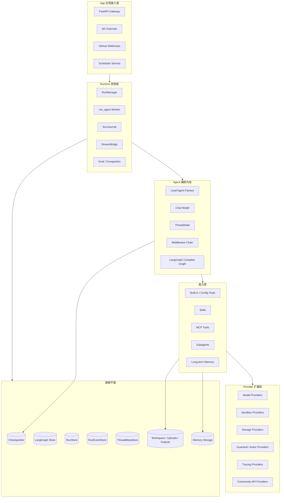
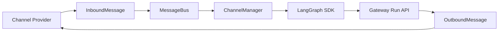
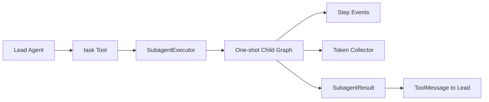
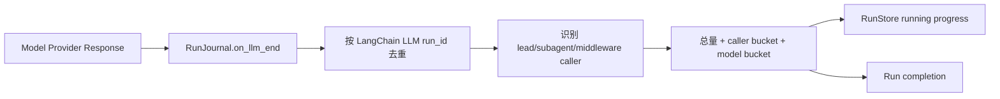
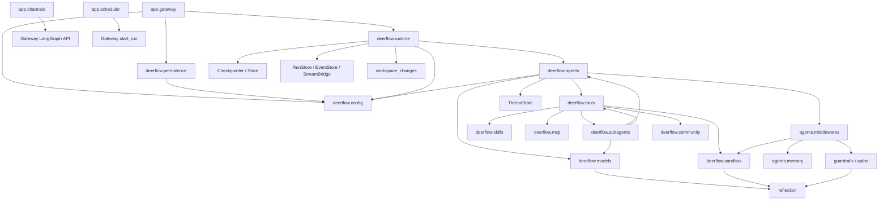
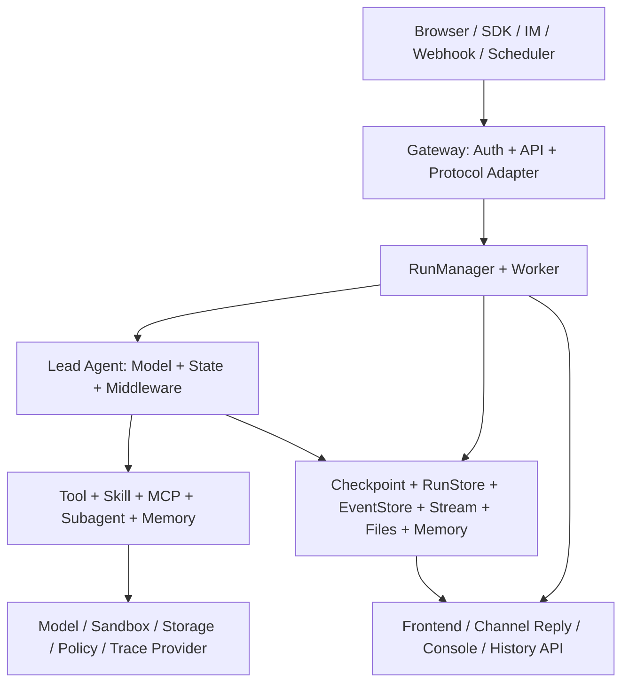

# 19 DeerFlow 完整后端模块架构

## 1. 本章目标与心智模型

本章是一份按**代码所有权**组织的后端架构参考，覆盖：

- `backend/app/`：Gateway、认证、HTTP API、Channels、Scheduler；
- `backend/packages/harness/deerflow/`：Agent、Runtime、Provider、Capability、Persistence；
- 配置、状态、事件、Usage、Tracing、安全与测试等横切模块。

它不重复每个专题的全部实现细节，而是回答四个问题：

1. 后端有哪些模块？
2. 每个模块负责什么、不负责什么？
3. 模块如何依赖和交换数据？
4. 新需求应该放在哪里？

> DeerFlow 后端不是“Model + Tools + Memory”三个模块，而是一个由产品接入层、运行控制层、Agent 内核、能力层、Provider 层、数据层和横切治理层共同组成的 Agent Runtime 平台。

完整心智模型可以写成：

\[
Backend = AppAdapters + RuntimeControl + AgentCore + Capabilities + Providers + DataPlanes + Governance
\]

其中：

- **App Adapters**：把 HTTP、IM、Webhook、Scheduler 请求转换为 Run；
- **Runtime Control**：管理 Run 创建、执行、取消、流式、恢复和结束；
- **Agent Core**：组装 Model、State、Tools、Prompt 与 Middleware；
- **Capabilities**：提供 Tool、Skill、MCP、Subagent 等可用能力；
- **Providers**：为模型、沙箱、存储、策略和追踪提供可替换实现；
- **Data Planes**：分别保存图状态、Run、事件、线程元数据、文件和记忆；
- **Governance**：负责安全、预算、Usage、Tracing、配置与测试。

延伸阅读：

- 宏观服务拓扑：[01 系统架构](01-system-architecture.md)
- 动态调用链：[02 一次请求的生命周期](02-request-lifecycle.md)
- Gateway 深入设计：[18 Gateway 设计](18-gateway-design.md)
- 按任务阅读源码：[16 源码阅读地图](16-source-reading-map.md)

---

## 2. 后端总分层



最重要的依赖边界是：

```text
app.* → deerflow.*       允许
deerflow.* → app.*       禁止
```

对应物理目录：

```text
backend/
├── app/                              # 产品应用层，import: app.*
│   ├── gateway/                      # FastAPI、认证、routers、运行时装配
│   ├── channels/                     # IM 平台适配与消息总线
│   └── scheduler/                    # 计划任务轮询与调度
├── packages/harness/deerflow/        # 可复用 Harness，import: deerflow.*
│   ├── agents/                       # Agent 与 Middleware
│   ├── runtime/                      # Run、Event、Stream、Checkpoint
│   ├── models/                       # 模型工厂与 Provider Adapter
│   ├── tools/                        # Tool 装配与内置工具
│   ├── skills/                       # Skill 包、存储、扫描、评审
│   ├── mcp/                          # MCP 客户端、会话、OAuth、缓存
│   ├── sandbox/                      # Sandbox 接口、本地实现、工具
│   ├── subagents/                    # 子 Agent 执行系统
│   ├── persistence/                  # DeerFlow SQL 模型、Repository、Migration
│   ├── config/                       # 配置模型、加载、热更新、路径
│   ├── guardrails/                   # 工具调用时策略拦截
│   ├── authz/                        # 资源授权与能力过滤
│   ├── tracing/                      # LangSmith、Langfuse、Monocle
│   ├── community/                    # 可选外部能力与 Sandbox Provider
│   ├── workspace_changes/            # Run 前后文件变化
│   ├── uploads/                      # 可复用上传文件操作
│   ├── scheduler/                    # Schedule 计算原语
│   ├── tui/                          # 嵌入式终端 UI
│   ├── reflection/                   # 配置驱动动态加载
│   ├── utils/                        # 文件、消息、LLM 文本等工具
│   ├── client.py                     # DeerFlowClient 嵌入式入口
│   └── trace_context.py              # 请求 Trace Context
├── tests/                            # 后端测试
├── scripts/                          # 迁移、录制回放、基准等脚本
├── docs/                             # 后端专题文档
└── langgraph.json                    # LangGraph Studio 兼容入口
```

---

## 3. 如何理解 Provider

### 3.1 Provider 不是一个单独模块

`Provider` 是一种架构角色：它在稳定接口后面提供可替换实现。DeerFlow 中不存在一个包罗万象的 `providers/` 目录，因为不同 Provider 分属于不同领域。

| Provider 类别 | 稳定接口/工厂 | 典型实现 | 主要配置 |
|---|---|---|---|
| Model Provider | `create_chat_model()`、`BaseChatModel` | OpenAI 兼容、Claude、Codex、vLLM、MindIE | `models[]` |
| Sandbox Provider | `SandboxProvider`、`Sandbox` | Local、AIO、BoxLite、E2B | `sandbox` |
| Checkpointer Provider | LangGraph Checkpointer | Memory、SQLite、PostgreSQL | `database` / `checkpointer` |
| Store Provider | LangGraph `BaseStore` | Memory、SQLite、PostgreSQL | `database` / `checkpointer` |
| RunStore Provider | `RunStore` | Memory、SQL `RunRepository` | `database` |
| RunEventStore Provider | `RunEventStore` | Memory、JSONL、DB | `run_events` |
| StreamBridge Provider | `StreamBridge` | Memory、Redis | `stream_bridge` |
| SkillStorage Provider | `SkillStorage` | Local、UserScoped | `skills` + user context |
| Memory Backend | Memory Manager contract | Noop、DeerMem | `memory` |
| Guardrail Provider | `GuardrailProvider` | Allowlist、自定义/OAP | `guardrails` |
| Authorization Provider | `AuthorizationProvider` | 自定义策略实现 | `authorization` |
| Tracing Provider | Callback 或进程级 OTel | LangSmith、Langfuse、Monocle | 环境变量 + `logging` |
| Community Provider | Tool 或 Client Adapter | Tavily、Jina、Firecrawl、Brave 等 | `tools[]` |
| Channel Provider | `Channel` | Feishu、Telegram、Slack 等 | `channels` |

### 3.2 Provider 的共同结构

典型 Provider 模块通常包含：

```text
Interface / Protocol
    ↓
Config Model
    ↓
Factory / Resolver
    ↓
Concrete Implementation
    ↓
Lifecycle / Cache / Health Check
    ↓
Normalized Result / Error Contract
```

判断一个模块是否是 Provider，不能只看名字，而要看它是否具备：

- 一个稳定抽象；
- 多个可替换实现；
- 配置驱动选择；
- 统一输入输出协议；
- 明确生命周期；
- 对上层隐藏实现差异。

### 3.3 Adapter 与 Provider 的区别

两者经常重叠，但关注点不同：

- **Provider** 强调“同一接口的可替换实现”；
- **Adapter** 强调“把外部协议转换为内部协议”。

例如：

- `VllmChatModel` 同时是 Model Provider 实现和 vLLM 协议 Adapter；
- Telegram `Channel` 是外部消息平台 Adapter，也是 Channel Provider 实现；
- `DbRunEventStore` 是存储 Provider，不负责外部协议转换。

---

## 4. App 应用层

## 4.1 Gateway 组合根

| 项目 | 内容 |
|---|---|
| 路径 | `backend/app/gateway/app.py` |
| 核心入口 | `create_app()`、`lifespan()`、模块级 `app` |
| 职责 | 构造 FastAPI、安装 HTTP Middleware、挂载 Router、启动/停止运行基础设施 |
| 依赖 | `app.gateway.deps`、routers、Channels、Scheduler、Harness Config/Tracing |
| 生命周期 | Process-scoped |
| 不负责 | Agent 推理、Tool 执行、ThreadState reducer |

启动过程大致为：

```text
加载启动配置
→ 配置日志和 Monocle
→ 清理残留上传临时文件
→ 初始化数据库、Checkpointer、Store、RunManager、StreamBridge
→ 恢复孤儿 Run
→ 启动 Channels
→ 启动 Scheduler
→ 对外服务
```

关闭时必须先停止接入和调度，再等待活动 Run 排空，最后关闭 Checkpointer、Redis 和数据库资源。

## 4.2 Gateway 依赖容器

| 项目 | 内容 |
|---|---|
| 路径 | `backend/app/gateway/deps.py` |
| 核心入口 | `langgraph_runtime()` 与各类 `get_*()` dependency |
| 职责 | 创建并保管进程级 Runtime 对象，将其暴露给 Router |
| 主要对象 | Checkpointer、Store、StreamBridge、RunStore、RunEventStore、RunManager、Repository |
| 数据所有权 | 只持有对象引用；持久数据由各 Store/Repository 所有 |
| 热更新边界 | `AppConfig` 每请求重新解析；基础设施配置需要重启 |

`app.state` 保存的是运行对象，不应保存会随请求热更新的完整 `AppConfig`。

## 4.3 Gateway Service 层

| 项目 | 内容 |
|---|---|
| 路径 | `backend/app/gateway/services.py` |
| 核心入口 | `normalize_input()`、`build_run_config()`、`start_run()`、`sse_consumer()`、`wait_for_run_completion()` |
| 职责 | 复用 thread-scoped/stateless Run 的应用逻辑 |
| 关键边界 | 清洗外部输入、注入认证用户、剥离内部 context key、持久化前脱敏 |
| 下游 | `RunManager`、`run_agent()`、`StreamBridge` |

它是 HTTP Router 和 Harness Runtime 之间的主要 Adapter：

```text
RunCreateRequest
→ LangChain Message / Command
→ RunnableConfig + Runtime Context
→ RunRecord
→ Harness run_agent()
```

## 4.4 HTTP Middleware 与认证

### Auth Middleware

路径：`backend/app/gateway/auth_middleware.py`

负责：

- 公共路径放行；
- 内部 token 校验；
- Cookie/JWT 校验；
- auth-disabled 本地用户；
- 写入 `request.state.user`；
- 绑定 Harness 的 current-user `ContextVar`。

### CSRF Middleware

路径：`backend/app/gateway/csrf_middleware.py`

负责浏览器状态变更请求的 double-submit-cookie 校验，并与 CORS/可信 Origin 配置保持一致。

### Resource Authorization

路径：`backend/app/gateway/authz.py`

负责 Router 级资源权限与 Thread owner 校验。它不同于 Agent Tool 调用时的 `deerflow.authz` 和 `deerflow.guardrails`。

### Internal Auth

路径：`backend/app/gateway/internal_auth.py`

用于 Channels 和 Scheduler 等可信进程内调用。Owner header 只有在内部 token 已验证后才可信。

### Trace Middleware

路径：`backend/app/gateway/trace_middleware.py`

负责建立 HTTP request trace ID，并将它传播到响应头、日志和 Harness trace context。

## 4.5 Router 模块族

| Router | 主要职责 | 核心下游 |
|---|---|---|
| `threads.py` | Thread CRUD、State、Branch、Goal、Compact | Checkpointer、ThreadMetaStore、Goal Runtime |
| `thread_runs.py` | Thread Run create/stream/wait/list/cancel/join/history/usage | Service、RunManager、EventStore |
| `runs.py` | Stateless run 与 run-id 查询 | 同一 `start_run()` 路径 |
| `assistants_compat.py` | LangGraph SDK 最小 Assistant 兼容接口 | Agent 配置投影 |
| `models.py` | 模型列表和能力 | `AppConfig.models` |
| `features.py` | 前端功能开关 | 热更新配置 |
| `console.py` | 跨线程 Run/Usage/Cost 报表 | SQL `RunRow`、`ThreadMetaRow` |
| `mcp.py` | MCP 配置管理 | Extensions Config、MCP Cache |
| `skills.py` | Skill 列表、启停、安装、自定义 Skill | SkillStorage、SkillScan |
| `memory.py` | Memory 数据、状态、配置、reload | Memory Manager |
| `agents.py` | 用户自定义 Agent 文件 CRUD | `Paths`、Agent config/SOUL |
| `uploads.py` | 上传、列出、删除、转换 | Upload Manager、Sandbox |
| `artifacts.py` | 安全输出文件下载 | 路径解析、Filesystem |
| `feedback.py` | Run feedback CRUD/统计 | FeedbackRepository |
| `suggestions.py` | 非图式 follow-up 建议 | One-shot LLM |
| `input_polish.py` | 非图式输入润色 | One-shot LLM |
| `channels.py` | Channel Service 状态/重启 | ChannelService |
| `channel_connections.py` | 用户连接、一次性连接码、运行凭据 | Channel Repository/Runtime Store |
| `scheduled_tasks.py` | 计划任务 CRUD、暂停、触发、历史 | Scheduler Service/Repository |
| `github_webhooks.py` | GitHub 签名校验与事件入口 | GitHub Dispatcher |

Router 原则：

> Router 拥有 HTTP schema、权限和协议转换；可复用的 Agent、Runtime、存储和领域逻辑应下沉到 Harness。

## 4.6 Console、Usage 与 Cost

`backend/app/gateway/routers/console.py` 是应用层 Reporting 模块：

- 直接查询 SQL 中的 `RunRow` 和 `ThreadMetaRow`；
- 按当前用户过滤；
- 将 token bucket 与 `models[*].pricing` 结合；
- 支持 cache-hit input token 的不同价格；
- 未配置价格时返回 `cost: null`；
- memory database 模式下返回 503。

这一设计说明：

```text
Harness 负责 Usage 事实
App Console 负责 Cost 报表投影
Provider 账单仍是最终财务事实
```

---

## 5. Channels 模块

## 5.1 统一抽象

| 项目 | 内容 |
|---|---|
| 路径 | `backend/app/channels/` |
| 抽象 | `Channel`、`InboundMessage`、`OutboundMessage`、`ChannelRunPolicy` |
| Provider | Feishu、Telegram、Slack、Discord、DingTalk、WeChat、WeCom、GitHub |
| 核心编排 | `ChannelManager` |
| 生命周期 | `ChannelService` |
| 通信方式 | 通过 LangGraph SDK 调 Gateway，不直接调用 Agent graph |



## 5.2 关键子模块

| 模块 | 职责 |
|---|---|
| `base.py` | Provider 生命周期与发送/接收抽象 |
| `message_bus.py` | 入站单消费者队列和出站广播 |
| `manager.py` | Thread 映射、命令、附件、Run 调用、流式聚合 |
| `service.py` | Provider 延迟加载、启动、停止、重启 |
| `run_policy.py` | blocking/streaming/fire-and-forget/non-interactive 策略 |
| `store.py` | 旧式 Channel conversation → Thread JSON 映射 |
| `runtime_config_store.py` | 浏览器配置的 Channel runtime credential |
| `connection_identity.py` | 用户绑定和平台身份规范化 |
| `commands.py` | `/new`、`/goal`、`/memory`、连接码等命令 |

Channel Provider 的差异主要体现在：

- 长轮询、WebSocket 或 webhook；
- 是否支持流式编辑原消息；
- 附件上传下载；
- 平台 thread/topic 标识；
- 消息长度和频率限制；
- 是否 fire-and-forget。

## 5.3 GitHub Event-driven Agent

路径：`backend/app/gateway/github/` 与 `github_webhooks.py`。

模块拆分：

- `dispatcher.py`：一个 delivery 扇出到匹配 Agent；
- `registry.py`：加载自定义 Agent 的 GitHub binding；
- `triggers.py`：事件/action/author/mention 策略；
- `prompts.py`：Webhook payload → Agent prompt；
- `identity.py`：确定目标 issue/PR 与稳定 Thread ID；
- `app_auth.py`：GitHub App JWT 和 installation token；
- `run_policy.py`：non-interactive、fire-and-forget 与临时 token。

---

## 6. Scheduler 模块

Scheduler 分成 App 调度层和 Harness 领域/持久层：

```text
app/scheduler/service.py
    负责轮询、租约、并发、重叠策略、分发和完成回写
        ↓
deerflow.scheduler
    负责 cron / once 时间计算
        ↓
deerflow.persistence.scheduled_tasks
    负责任务定义持久化
        ↓
deerflow.persistence.scheduled_task_runs
    负责执行关联与历史
```

关键原则：

> Scheduler 只决定“何时运行”，实际执行必须复用 `start_run() → RunManager → run_agent()`，不能创建第二套 Agent Runtime。

Scheduled Run 使用内部可信的 `context.non_interactive=true`，Agent toolset 会排除 `ask_clarification`，避免后台任务停在人机交互上。

---

## 7. Agent 编排内核

## 7.1 Agent Factory

主要入口：

- `backend/packages/harness/deerflow/agents/lead_agent/agent.py::make_lead_agent`
- `backend/packages/harness/deerflow/agents/lead_agent/agent.py::build_middlewares`
- `backend/packages/harness/deerflow/agents/factory.py::create_deerflow_agent`

两类工厂：

| 工厂 | 定位 |
|---|---|
| `make_lead_agent()` | 完整配置驱动，供 Gateway/LangGraph 使用 |
| `create_deerflow_agent()` | 更低层 SDK 装配，调用者显式传入 Model/Tool/Feature |

完整装配链：

```text
Runtime Config
→ Model resolution
→ Skill / Agent config
→ Tool assembly
→ Authz filtering
→ Middleware chain
→ Prompt
→ ThreadState schema
→ create_agent()
→ CompiledStateGraph
```

详见 [03 Agent 核心设计](03-agent-core.md)。

## 7.2 ThreadState

路径：`backend/packages/harness/deerflow/agents/thread_state.py`。

| 字段 | 所属能力 | 合并语义概要 |
|---|---|---|
| `messages` | 对话和 Tool 协议 | LangGraph message reducer |
| `sandbox` | Sandbox 引用 | 只接受幂等同 ID 更新 |
| `thread_data` | Thread 文件上下文 | Thread 级数据 |
| `title` | 线程标题 | 最新值 |
| `artifacts` | 展示文件 | 保序去重 |
| `todos` | Plan Mode | 保留/替换列表 |
| `goal` | 自治目标 | 普通 `None` 不清除 |
| `uploaded_files` | 上传上下文 | 当前线程文件 |
| `viewed_images` | Vision | 合并，空对象显式清除 |
| `promoted` | Deferred MCP | 按 catalog hash 隔离 |
| `delegations` | Subagent Ledger | 同 ID 最新值、终态不降级、容量限制 |
| `skill_context` | 已加载 Skill 引用 | 路径去重、容量限制，不存正文 |
| `summary_text` | 压缩上下文 | LastValue |

State 只保存需要恢复/继续执行的事实，不应存入 request secret、数据库连接、HTTP Request 或活跃 `asyncio.Task`。

详见 [07 状态与上下文工程](07-state-and-context-engineering.md)。

## 7.3 Middleware 作为横切装配总线

物理路径：`backend/packages/harness/deerflow/agents/middlewares/`。

按职责分类：

| 类别 | 代表 Middleware |
|---|---|
| 输入与上下文 | InputSanitization、DynamicContext、ThreadData、Uploads、DurableContext |
| 模型可靠性 | DanglingToolCall、LLMErrorHandling、TerminalResponse、SystemMessageCoalescing |
| Tool 安全 | ToolResultSanitization、SandboxAudit、ReadBeforeWrite、ToolErrorHandling |
| 预算和循环 | ToolOutputBudget、TokenBudget、ToolProgress、LoopDetection |
| 能力激活 | SkillActivation、McpRouting、DeferredToolFilter、SubagentLimit |
| 产品状态 | TodoList、Title、Memory、ViewImage、Clarification |
| Usage | TokenUsageMiddleware |
| Provider safety | SafetyFinishReasonMiddleware 与 detectors |

必须区分：

- Middleware 中的 `TokenUsageMiddleware` 主要为消息步骤增加展示归因；
- `RunJournal` 才是 Run 总 Usage 的权威累计者。

完整顺序与 wrapper 语义详见 [04 Middleware 设计](04-middleware.md)。

## 7.4 Prompt 与动态上下文

路径：`agents/lead_agent/prompt.py` 及多个 Middleware。

DeerFlow 将上下文分为：

- 静态 system prompt；
- 当前日期等动态 reminder；
- Skill 激活正文；
- Memory 注入；
- `summary_text`；
- delegation ledger；
- skill context 引用；
- 当前消息和 Tool results。

静态 authority 与不可信数据应分角色注入，避免 Summary、Tool 结果或外部网页内容升级为系统指令。

---

## 8. Model 与 Model Provider

## 8.1 Model Factory

路径：`backend/packages/harness/deerflow/models/factory.py`。

`create_chat_model()` 负责：

- 按名称解析 `ModelConfig`；
- 通过 Reflection 加载 `use` 指定的类；
- 合并 thinking enabled/disabled override；
- 处理 OpenAI-compatible 参数；
- 设置 streaming chunk timeout；
- 根据调用路径决定是否挂模型级 tracing callback；
- 在实例化前删除 `pricing` 等非 Provider 参数。

## 8.2 Provider Adapter

| 模块 | 主要用途 |
|---|---|
| `claude_provider.py` | Claude Code credential/provider 集成 |
| `openai_codex_provider.py` | Codex/OpenAI 响应与 Usage 规范化 |
| `vllm_provider.py` | vLLM OpenAI-compatible reasoning 保留 |
| `mindie_provider.py` | MindIE 消息修复和工具调用解析 |
| `patched_openai.py` | OpenAI provider 差异修复 |
| `patched_deepseek.py` | DeepSeek reasoning/stream 差异修复 |
| `patched_minimax.py` | MiniMax provider 差异修复 |
| `patched_mimo.py` | MiMo provider 差异修复 |
| `patched_stepfun.py` | StepFun provider 差异修复 |
| `credential_loader.py` | 加载 Claude/Codex CLI 本地凭据 |
| `assistant_payload_replay.py` | 后续 Tool turn 所需 assistant payload 重放 |

Provider Adapter 最重要的输出契约是稳定的 LangChain Message，尤其包括：

- `AIMessage.content`；
- `tool_calls`；
- `response_metadata`；
- `usage_metadata`；
- reasoning 信息；
- streaming chunk 合并语义。

## 8.3 ModelConfig 与 Pricing

典型配置关注点：

- Provider class：`use`；
- Provider model ID：`model`；
- thinking/reasoning；
- vision；
- Responses API；
- output version；
- provider-specific extra fields；
- `pricing`。

`pricing` 是 Reporting metadata，不应传给模型 SDK。模型工厂将其删除，Console 再读取它估算成本。

---

## 9. Tool 系统

## 9.1 Tool Assembly

路径：`backend/packages/harness/deerflow/tools/tools.py`。

`get_available_tools()` 汇总：

1. `config.yaml` 定义的 Tool；
2. Built-in Tool；
3. Sandbox Tool；
4. 可选 Subagent `task` Tool；
5. 可选 Vision Tool；
6. MCP Tool；
7. ACP Agent Tool；
8. Memory Tool 模式下的 Memory Tool。

装配过程中还会处理：

- 模型能力；
- local sandbox 安全策略；
- Tool group；
- custom agent allowlist；
- Skill allowed-tools；
- Authz assembly-time filtering；
- Deferred MCP；
- Tool name 去重；
- sync/async wrapper。

## 9.2 Built-in Tools

| Tool 模块 | 作用 |
|---|---|
| `present_file_tool.py` | 将 outputs 文件作为 artifact 呈现 |
| `clarification_tool.py` | 发起结构化人工澄清请求 |
| `view_image_tool.py` | 验证并读取图像供 Vision 模型使用 |
| `task_tool.py` | 委派 Subagent 并返回结构化结果 |
| `tool_search.py` | 搜索/提升 Deferred MCP schemas |
| `review_skill_package_tool.py` | 只读 Skill 包质量评审 |
| `setup_agent_tool.py` | Bootstrap 创建自定义 Agent |
| `update_agent_tool.py` | 当前自定义 Agent 自更新 |
| `invoke_acp_agent_tool.py` | 调用外部 ACP-compatible Agent |

Tool 是模型面向的能力接口；实际执行可能由 Sandbox、MCP Server、HTTP Provider 或 Subagent 完成。

## 9.3 Tool Result 协议

`tool_result_meta.py` 将结果规范为结构化元数据，包括：

- status；
- error type；
- 是否模型可恢复；
- 推荐下一步；
- source。

这样 ToolProgress、UI、Journal 和模型不必通过解析自然语言错误判断状态。

---

## 10. Skill 系统

物理路径：`backend/packages/harness/deerflow/skills/`。

## 10.1 核心模型

| 模块 | 职责 |
|---|---|
| `types.py` | `Skill`、`SkillCategory`、`SecretRequirement` |
| `frontmatter.py` | YAML frontmatter 提取 |
| `parser.py` | 解析名称、描述、allowed-tools、required-secrets |
| `validation.py` | Skill 包和元数据校验 |
| `package_paths.py` | 包路径和 eval fixture 识别 |

## 10.2 SkillStorage Provider

接口：`skills/storage/skill_storage.py::SkillStorage`。

实现：

- `LocalSkillStorage`：共享文件系统 Skill；
- `UserScopedSkillStorage`：共享 public + 用户私有 custom Skill。

负责：

- 发现；
- 读取；
- 写入/删除 custom Skill；
- 安装 `.skill` archive；
- 容器路径映射；
- mutation history。

Skill enabled 状态保存在 `extensions_config.json`，不属于 Skill 文件本体。

## 10.3 Discovery 与 Activation

| 模块 | 职责 |
|---|---|
| `catalog.py` | 不可变 SkillCatalog 和查询 |
| `describe.py` | Deferred discovery 的 `describe_skill` Tool |
| `slash.py` | 严格 `/skill-name task` 解析 |
| `permissions.py` | Skill 类别/操作权限 |
| `tool_policy.py` | 根据 `allowed-tools` 过滤 Tool |

Slash activation 和 autonomous in-context activation 都必须重新解析真实 registry Skill，不能信任调用者伪造的 skill metadata。

## 10.4 SkillScan 与 Review

`skills/skillscan/`：

- 离线确定性扫描；
- 输出结构化 finding；
- 阻断 CRITICAL；
- 不执行目标脚本。

`skills/review/`：

- 只读 package snapshot；
- deterministic facts；
- resource/eval 分析；
- digest 和 report；
- CLI。

二者边界：Scan 偏安全准入，Review 偏完整性和质量评估。

## 10.5 Request-scoped Secrets

链路：

```text
SKILL.md required-secrets
→ Run request context.secrets
→ SkillActivationMiddleware 授权绑定
→ Runtime private context
→ bash Tool extra_env
→ Sandbox execute_command(env=...)
```

Secret 不应进入：

- Prompt；
- Tool argument；
- command string；
- Checkpoint；
- Run persisted kwargs；
- Trace；
- Tool stdout。

详见 [08 Tools、Skills 与 MCP](08-tools-skills-mcp.md) 和 [09 Sandbox 与安全](09-sandbox-and-security.md)。

---

## 11. MCP 模块

路径：`backend/packages/harness/deerflow/mcp/`。

| 模块 | 职责 |
|---|---|
| `client.py` | `McpServerConfig` → adapter server params |
| `tools.py` | 加载 Tool、绑定 source/routing metadata、文件路径迁移 |
| `cache.py` | 基于配置路径和内容签名缓存/失效 |
| `session_pool.py` | 按 server + user/thread scope 管理持久 Session |
| `oauth.py` | client credential/refresh token 和 Authorization 注入 |

支持 transport：

- stdio；
- SSE；
- HTTP。

Stdio 特殊处理：

- subprocess cwd 固定在线程 workspace；
- temp 目录位于 workspace；
- Session 按用户/线程隔离；
- 返回的合法本地路径转换为 `/mnt/user-data/...`。

MCP Routing 由两部分构成：

- 配置中的 routing hint；
- Deferred Tool catalog + Middleware promotion。

路由只是偏好/Schema 暴露策略，不等于直接执行 Tool。

---

## 12. Sandbox 与 Sandbox Provider

## 12.1 核心抽象

| 抽象 | 路径 | 职责 |
|---|---|---|
| `Sandbox` | `sandbox/sandbox.py` | command/file/directory 操作接口 |
| `SandboxProvider` | `sandbox/sandbox_provider.py` | acquire/get/release/shutdown 生命周期 |
| `SandboxMiddleware` | `sandbox/middleware.py` | Run 中获取 Sandbox 并将 ID 写入 State |
| Sandbox Tools | `sandbox/tools.py` | 模型可见的 bash/ls/read/write/replace/search |

## 12.2 Provider 实现

| Provider | 位置 | 特点 |
|---|---|---|
| Local | `sandbox/local/` | 主机进程执行、路径映射、每线程实例、LRU |
| AIO | `community/aio_sandbox/` | Docker/远程容器、健康检查、warm pool |
| BoxLite | `community/boxlite/` | Micro-VM、专用 event loop thread、warm pool |
| E2B | `community/e2b_sandbox/` | 托管 Code Interpreter Adapter |

AIO 还拆分：

- Local backend：本机 Docker；
- Remote backend：Provisioner；
- SandboxInfo：实例元数据；
- Provider：发现、创建、复用和回收。

## 12.3 Virtual Path 与安全

Agent 看到：

```text
/mnt/user-data/workspace
/mnt/user-data/uploads
/mnt/user-data/outputs
/mnt/skills
/mnt/acp-workspace
```

安全模块：

| 模块 | 作用 |
|---|---|
| `env_policy.py` | 清除 host credential 环境变量 |
| `security.py` | local sandbox 模式与 host bash 策略 |
| `path_patterns.py` | 路径屏蔽模式 |
| `file_operation_lock.py` | `(sandbox.id, path)` 写操作锁 |
| `search.py` | 有界文件搜索 |
| `ReadBeforeWriteMiddleware` | 基于内容 hash 的读后写 gate |
| `SandboxAuditMiddleware` | command/file 操作审计 |

Sandbox 不是单一安全边界。完整安全来自 Tool schema、Authz、Guardrail、Middleware、路径校验、环境清洗、进程隔离、超时和审计的组合。

---

## 13. Subagent 模块

路径：`backend/packages/harness/deerflow/subagents/`。

| 模块 | 职责 |
|---|---|
| `config.py` | SubagentConfig 与 effective model |
| `registry.py` | built-in/custom Subagent 注册与查找 |
| `builtins/` | general-purpose、bash Agent |
| `executor.py` | 后台调度、独立 Graph、超时、结果和取消 |
| `token_collector.py` | 子 Agent LLM Usage 去重采集 |
| `step_events.py` | AI/Tool step 捕获、截断、去重和事件化 |
| `status_contract.py` | status、stop_reason、result metadata 跨语言协议 |

执行链：



关键隔离与共享：

- 子 Agent 使用独立消息上下文；
- `checkpointer=False`，不继承父图 Checkpointer；
- 可共享父线程 workspace；
- 继承经过选择的 runtime context；
- request-scoped Skill secret 不自动继承；
- 自己有 max turns、token budget、loop detection 和 summarization。

限制维度：

- 每次模型响应的并发 task 数；
- 每个 Run 的总 delegation 数；
- wall-clock timeout；
- recursion/max turns；
- token budget；
- loop cap。

详见 [10 Subagent 与任务委派](10-subagents.md)。

---

## 14. Memory 模块

路径：`backend/packages/harness/deerflow/agents/memory/`。

## 14.1 Memory Manager 与 Backend

| 模块 | 职责 |
|---|---|
| `manager.py` | Memory Backend 选择和生命周期 |
| `tools.py` | Tool mode 的 search/add/update/delete |
| `summarization_hook.py` | 压缩前将旧消息提交给 Memory |
| `backends/noop/` | No-op Provider |
| `backends/deermem/` | DeerMem Adapter、Storage、Updater、Queue、Prompt |

两种模式：

- `middleware`：被动提取用户和最终回答；
- `tool`：模型主动搜索和修改记忆。

## 14.2 DeerMem 内部模块

| 子模块 | 职责 |
|---|---|
| `storage.py` | 每用户/每 Agent memory.json、cache、原子写 |
| `updater.py` | 应用 LLM 提取的上下文和 fact 更新 |
| `queue.py` | 按 Thread debounce 与批处理 |
| `prompt.py` | 提取、staleness、consolidation prompt 与 token budget |
| `llm.py` | Memory 专用模型调用 |
| `message_processing.py` | 对话筛选和规范化 |
| `paths.py` | Memory 文件路径 |

必须区分：

| 概念 | 数据范围 | 权威存储 |
|---|---|---|
| Messages | 当前 Thread | Checkpoint/Event history |
| Summary | 当前 Thread 的压缩模型上下文 | `ThreadState.summary_text` |
| Memory | 跨 Thread 的用户/Agent 长期事实 | Memory backend |
| ThreadMeta | 线程列表投影 | ThreadMetaStore |

详见 [11 Memory 与持久化](11-memory-and-persistence.md)。

---

## 15. Runtime 控制层

路径：`backend/packages/harness/deerflow/runtime/`。

## 15.1 RunManager

路径：`runtime/runs/manager.py`。

负责：

- 活跃 Run 的进程内 registry；
- Thread → Runs 二级索引；
- 同 Thread Run admission；
- multitask strategy；
- `asyncio.Task` 与 abort event；
- status/finalization；
- RunStore hydrate；
- multi-worker ownership lease/heartbeat；
- 过期 owner takeover；
- 持久化重试。

`RunRecord` 同时包含：

- 可持久字段：ID、status、model、metadata、usage；
- 仅进程内字段：task、abort event、finalizing 标志。

因此数据库中的 Run 行不能完整替代活动 `RunRecord`。

## 15.2 Worker

路径：`runtime/runs/worker.py`，核心入口 `run_agent()`。

职责：

1. 安装 user/secret/runtime context；
2. 创建并绑定 `RunJournal`；
3. 获取 Run 前 workspace snapshot；
4. 构造 Agent graph；
5. 调用 `agent.astream()`；
6. 将 messages/values/custom 推给 StreamBridge；
7. 缓冲 Subagent events；
8. 处理 cancel、timeout、rollback 和错误；
9. 执行 Goal evaluation/continuation；
10. 记录 workspace changes；
11. 持久化 Usage、消息摘要和最终状态；
12. title fallback 和 finalization；
13. 发布 stream end。

## 15.3 RunJournal

路径：`runtime/journal.py`。

它是 LangChain Callback Handler，负责：

- root Run lifecycle event；
- Human/AI/Tool event；
- batch flush；
- callback 去重；
- clarification reconciliation；
- Usage 累计；
- 运行中 progress snapshot；
- completion convenience fields。

## 15.4 Goal、Compaction 与 Runtime Context

| 模块 | 职责 |
|---|---|
| `runtime/goal.py` | 目标读写锁、评估、续跑和 no-progress breaker |
| `runtime/context_compaction.py` | 手动压缩编排 |
| `runtime/context_keys.py` | 公有/私有 runtime key 常量 |
| `runtime/secret_context.py` | `context.secrets` 提取和验证 |
| `runtime/user_context.py` | 当前用户 ContextVar、`AUTO` 与默认用户 |
| `runtime/serialization.py` | Run 请求/记录安全序列化和脱敏 |
| `runtime/converters.py` | Message/Checkpoint/协议转换 |

Runtime Context 适合保存：

- authenticated user；
- run ID；
- request secret；
- Journal；
- 临时 GitHub token；
- channel user ID；
- trace context。

这些数据通常不能进入 `ThreadState`。

---

## 16. Streaming 与 Event 模块

## 16.1 StreamBridge Provider

接口：`runtime/stream_bridge/base.py::StreamBridge`。

| 实现 | 特点 |
|---|---|
| Memory | 进程内 queue、bounded retained state |
| Redis | 跨进程可订阅、Last-Event-ID、rolling TTL |

主要协议：

- `publish()`；
- `publish_end()`；
- `subscribe()`；
- `cleanup()`；
- heartbeat sentinel；
- end sentinel。

StreamBridge 是短期传输层，不是长期历史。

## 16.2 RunEventStore Provider

接口：`runtime/events/store/base.py::RunEventStore`。

| 实现 | 位置 | 用途 |
|---|---|---|
| Memory | `memory.py` | 测试/开发 |
| JSONL | `jsonl.py` | 文件持久化 |
| DB | `db.py` | SQL 生产存储 |

关键 invariant：

- Thread-global 单调 `seq`；
- message 与其他 event 分类；
- Thread/Run 分页；
- task-scoped Subagent event 查询；
- user-aware 访问控制。

## 16.3 Stream、Event 与 Checkpoint 的区别

| 对象 | 目的 | 生命周期 | 是否完整恢复图 |
|---|---|---|---|
| StreamEvent | 实时 SSE 传输 | 短期 | 否 |
| RunEvent | 历史、审计、查询、step | 长期 | 否 |
| Checkpoint | 图状态恢复、分支、resume | 长期 | 是 |

---

## 17. Persistence 与所有 Storage Provider

## 17.1 Storage Provider 总矩阵

| 存储 | 接口所有者 | 保存内容 | 实现 |
|---|---|---|---|
| Checkpointer | LangGraph | channel values/version/writes/blob | Memory/SQLite/Postgres |
| LangGraph Store | LangGraph | namespaced KV | Memory/SQLite/Postgres |
| RunStore | DeerFlow Runtime | Run 状态、owner、usage、error | Memory/SQL |
| RunEventStore | DeerFlow Runtime | 有序消息、事件、审计 | Memory/JSONL/DB |
| ThreadMetaStore | DeerFlow Persistence | title、owner、status、metadata | Store-backed memory/SQL |
| FeedbackRepository | DeerFlow Persistence | 用户反馈 | SQL |
| ChannelConnectionRepository | DeerFlow Persistence | 绑定、凭据、状态、会话映射 | SQL |
| ScheduledTaskRepository | DeerFlow Persistence | 计划任务定义 | SQL |
| SkillStorage | DeerFlow Skills | Skill package/history | Filesystem |
| Memory Storage | Memory Backend | 长期用户事实 | Filesystem/Backend-specific |
| StreamBridge | DeerFlow Runtime | 临时 SSE retained events | Memory/Redis |

## 17.2 SQL Persistence

路径：`backend/packages/harness/deerflow/persistence/`。

| 模块 | 职责 |
|---|---|
| `base.py` | SQLAlchemy Base 和通用模型辅助 |
| `engine.py` | Async Engine、Session Factory、SQLite/Postgres 初始化 |
| `bootstrap.py` | empty/legacy/versioned 三分支 bootstrap |
| `json_compat.py` | SQLite/Postgres JSON 兼容 |
| `run/model.py` | `RunRow` |
| `run/sql.py` | SQL `RunStore` 实现 |
| `models/run_event.py` | `RunEventRow` schema |
| `thread_meta/` | ThreadMeta interface/model/memory/sql |
| `feedback/` | Feedback model/repository |
| `user/` | User model |
| `channel_connections/` | Connection、Credential、OAuth State、Conversation |
| `scheduled_tasks/` | Task definition |
| `scheduled_task_runs/` | Task execution association/history |

## 17.3 Migration

路径：`persistence/migrations/`。

原则：

- DeerFlow ORM schema 由 Alembic 管理；
- LangGraph Checkpointer 表排除在 Alembic 外；
- Gateway 启动自动 upgrade；
- 新 ORM column/table/index 必须有 revision；
- legacy DB 使用 baseline bootstrap；
- Postgres 使用 advisory lock；
- SQLite 在进程内串行，跨进程为 best-effort。

## 17.4 Checkpointer 与 Store Provider

路径：

- `runtime/checkpointer/provider.py`：同步嵌入式生命周期；
- `runtime/checkpointer/async_provider.py`：Gateway async 生命周期；
- `runtime/store/provider.py`；
- `runtime/store/async_provider.py`。

选择优先级：

1. deprecated explicit `checkpointer`；
2. unified `database`；
3. memory fallback。

但注意：deprecated `checkpointer` 只覆盖 LangGraph Checkpointer/Store，不改变 DeerFlow SQL Repository 的 `database` 选择。

---

## 18. Usage、Token 与 Cost 全链路

`Usage` 不是单一目录，而是一条跨 Model Provider、Callback、Middleware、Subagent、RunStore 和 Console 的数据链。

## 18.1 Usage 数据来源

模型 Provider 应将原生响应规范化为：

```text
AIMessage.usage_metadata
├── input_tokens
├── output_tokens
├── total_tokens
└── input_token_details.cache_read   # Provider 支持时
```

同时通过 `response_metadata` 保留实际模型名称等信息。

## 18.2 Lead/Middleware Usage 累计



`RunJournal` 维护：

- input/output/total tokens；
- LLM call count；
- lead/subagent/middleware caller bucket；
- per-model bucket；
- cache-read tokens；
- convenience message fields。

## 18.3 TokenUsageMiddleware 的定位

`agents/middlewares/token_usage_middleware.py` 主要负责将 Usage 归因到可展示步骤，例如：

- final answer；
- tool batch；
- search；
- todo；
- clarification；
- subagent dispatch。

它会把已完成 Subagent totals 合并到 dispatch AIMessage，但不是 Run 总量的唯一权威源。

## 18.4 Subagent Usage

```text
Child LLM callback
→ SubagentTokenCollector
→ 按 source LLM run ID 去重
→ SubagentResult.token_usage_records
→ task_running cumulative snapshot
→ terminal ToolMessage metadata
→ Parent RunJournal external usage records
→ Parent Run total/model/caller buckets
```

Subagent Usage 必须同时满足：

- UI 可在执行中显示累计值；
- terminal history 重载后仍可恢复；
- Parent Run total 不重复计数；
- 能按实际模型归类。

## 18.5 持久化

完成时：

```text
RunJournal.get_completion_data()
→ worker.py
→ RunManager.update_run_completion()
→ RunStore.update_run_completion()
→ RunRow
```

持久字段包括：

- 总 input/output/total；
- LLM call count；
- lead/subagent/middleware totals；
- `token_usage_by_model`；
- message count；
- first human message；
- last lead AI message。

## 18.6 Cost 估算

```text
RunRow.token_usage_by_model
+ AppConfig.models[*].pricing
→ Console reporting
→ cache-aware estimated cost
```

Cost 边界：

- Token 是运行事实；
- Pricing 是运营配置；
- Console Cost 是估算投影；
- Provider Invoice 是最终财务事实。

常见误区：

1. `total_tokens × 单价` 足够。错误，多模型和 input/output 单价不同。
2. cache hit 与普通 input 同价。未必，DeerFlow 支持单独配置。
3. Provider 不返回 Usage 时可以安全推断为 0。错误，缺失不等于零。
4. TokenUsageMiddleware 就是总计账本。错误，权威累计在 RunJournal。
5. Subagent token 只属于子任务，不算父 Run。错误，父 Run 会汇总 external usage。

---

## 19. Guardrail、Authorization 与安全治理

## 19.1 Guardrail Provider

路径：`deerflow/guardrails/`。

| 模块 | 职责 |
|---|---|
| `provider.py` | `GuardrailRequest/Decision/Reason` 与 Provider Protocol |
| `builtin.py` | `AllowlistProvider` |
| `middleware.py` | Tool 调用前执行策略，deny 转结构化 ToolMessage |

Guardrail 是**执行时** Tool call 拦截。

## 19.2 Authorization Provider

路径：`deerflow/authz/`。

包含：

- `Principal`；
- `AuthzRequest`；
- `AuthzDecision`；
- `AuthorizationProvider`；
- `GuardrailAuthorizationAdapter`。

两阶段授权：

1. Assembly-time filtering：Tool、Model、Skill、MCP schema 在绑定模型前被移除；
2. Execution-time check：依赖具体参数/资源的调用通过 Adapter 使用 Guardrail plumbing 再检查。

## 19.3 三种 Authorization 不应混淆

| 层级 | 模块 | 保护对象 |
|---|---|---|
| HTTP Resource Authz | `app.gateway.authz` | Thread、Run、Router endpoint |
| Capability Authz | `deerflow.authz` | Tool、Model、Skill、MCP、Sandbox 等能力 |
| Tool Guardrail | `deerflow.guardrails` | 一次具体 Tool call |

## 19.4 其他安全模块

- Input sanitization：用户输入；
- Tool result sanitization：远程网页/搜索内容；
- Sandbox env scrub：平台 secrets；
- Read-before-write：防止盲写和 stale write；
- Tool output budget：防止上下文耗尽；
- Tool progress/loop detection：防止无效循环；
- Safety finish reason：Provider 安全终止后禁止 Tool；
- CSRF/CORS/Auth：HTTP 边界；
- path validation：Filesystem 边界；
- SkillScan：Skill 安装边界；
- request secret redaction：持久化和输出边界。

---

## 20. Tracing 与 Observability Provider

## 20.1 Trace Context

路径：`deerflow/trace_context.py`。

这是 Provider-neutral 的请求关联 ID：

- HTTP Gateway 由 TraceMiddleware 绑定；
- Embedded Client 在每次 generator advancement 周围绑定；
- 可写入日志和 Langfuse metadata；
- 它不是 Run ID，也不是 Langfuse native trace ID。

## 20.2 LangSmith 与 Langfuse

路径：`deerflow/tracing/factory.py`。

`build_tracing_callbacks()` 返回 LangChain Callback Handler。

Graph 路径应将 callback 挂在 invocation root，从而让：

- Agent graph；
- Model；
- Tool；
- Subagent child calls

形成同一根 Trace 下的子 span。Standalone one-shot/model 调用可在模型层挂 callback。

## 20.3 Langfuse Metadata

路径：`deerflow/tracing/metadata.py`。

映射：

| Langfuse 字段 | DeerFlow 来源 |
|---|---|
| session ID | Thread ID |
| user ID | effective user ID |
| trace name | lead/custom/subagent name |
| tags | environment + model |
| DeerFlow trace ID | request trace context |

## 20.4 Monocle

路径：`deerflow/tracing/monocle.py`。

Monocle 与前两者不同：

- 不是 LangChain callback；
- 安装进程级 OpenTelemetry Provider 与自动 instrumentation；
- Gateway lifespan 自动初始化；
- Embedded Client/TUI 不自动初始化；
- 一次性、进程级 side effect。

## 20.5 Observability 数据面

| 信号 | 模块 | 用途 |
|---|---|---|
| Logs | logging + trace context | 运行诊断 |
| Traces | LangSmith/Langfuse/Monocle | 调用树和 LLM/Tool span |
| Run Events | RunJournal + RunEventStore | 历史、审计、UI |
| Stream Events | StreamBridge | 实时 UI |
| Usage | RunJournal + RunStore | token/调用统计 |
| Cost | Console | 运营估算 |
| Workspace Changes | workspace_changes | 文件副作用审查 |
| Subagent Steps | step_events | 子任务过程可视化 |

详见 [13 可观测性与测试](13-observability-and-testing.md)。

---

## 21. Config 与 Reflection

## 21.1 AppConfig

路径：`deerflow/config/app_config.py`。

负责：

- YAML 加载和 Pydantic 校验；
- `$ENV_VAR` 解析；
- config version 检查；
- 路径 + metadata + content digest 缓存；
- 文件变化热加载；
- 各配置 section 的统一入口。

主要配置域：

```text
models / tools / tool_groups
sandbox / skills / skill_scan / skill_evolution
mcp extensions / tool_search / tool_progress
read_before_write / tool_output
summarization / memory / title
token_usage / token_budget / loop_detection
subagents / guardrails / authorization
database / checkpointer / run_events / stream_bridge / run_ownership
auth / channels / channel_connections / scheduler
logging / tracing / suggestions / input_polish / agents_api / acp
```

## 21.2 ExtensionsConfig

路径：`deerflow/config/extensions_config.py`。

负责：

- `extensions_config.json`；
- MCP Server transport/OAuth/routing/tool override；
- Skill enabled 状态；
- 环境变量替换；
- 兼容旧配置文件。

## 21.3 热更新与重启边界

热更新适合：

- Model 参数；
- Prompt；
- Tool enablement；
- Skills/MCP；
- summarization/title/memory；
- per-run Agent behavior。

重启必需的基础设施字段由 `config/reload_boundary.py` 维护，例如：

- database；
- checkpointer；
- run events；
- stream bridge；
- sandbox；
- logging；
- channels；
- scheduler；
- run ownership。

## 21.4 Paths

路径：`deerflow/config/paths.py` 与 `runtime_paths.py`。

负责：

- runtime home/project root；
- 每用户 memory/agents/skills；
- 每 Thread workspace/uploads/outputs；
- ACP workspace；
- user ID 安全规范化；
- legacy layout 迁移兼容；
- host/container 路径契约。

## 21.5 Reflection

路径：`deerflow/reflection/`。

核心入口：

- `resolve_variable()`；
- `resolve_class()`。

用于从配置动态加载：

- Model class；
- Tool callable；
- Sandbox Provider；
- Guardrail/Authorization Provider；
- 自定义 Middleware。

Reflection 是插件装配基础设施，不拥有任何领域状态。

---

## 22. Community Provider

路径：`deerflow/community/`。

它不是单一接口，而是可选 Provider/Adapter 集合：

- Search/Fetch：Tavily、Jina、Brave、DDG、Exa、Serper、SearXNG；
- Crawl/Scrape：Firecrawl、Crawl4AI、Browserless、FastCRW；
- 其他搜索：InfoQuest、GroundRoute；
- Image Search；
- Sandbox：AIO、BoxLite、E2B；
- 公共基础设施：URL safety、warm pool lifecycle。

典型外部 Tool Provider 的职责：

```text
Config/env credential
→ Provider Client
→ Network call
→ Normalize result
→ Bound result size
→ Return Tool content
→ ToolResultSanitizationMiddleware
```

外部 Provider 不能依靠 Prompt 防止 SSRF 或恶意网页注入，应使用 URL validation、network policy 和结果清洗。

---

## 23. Workspace、Uploads 与 Filesystem

## 23.1 Upload Manager

路径：`deerflow/uploads/manager.py`。

负责可复用文件操作：

- uploads dir；
- safe filename；
- duplicate name；
- list/metadata；
- safe delete；
- virtual path；
- artifact/upload URL。

Gateway `uploads.py` 额外拥有 HTTP multipart、staging、size validation、document conversion 和 remote sandbox sync。

## 23.2 Workspace Changes

路径：`deerflow/workspace_changes/`。

| 模块 | 职责 |
|---|---|
| `types.py` | Snapshot/change/result 类型与限制 |
| `scanner.py` | Run 前后文件扫描、hash、敏感/二进制识别 |
| `diff.py` | created/modified/deleted 与 bounded diff |
| `recorder.py` | offload scan、写入 Run Event、清理 temp cache |
| `api.py` | 从事件生成 API response |

扫描范围：

- workspace；
- outputs；
- 不包含 uploads。

Filesystem 是文件事实的权威来源，WorkspaceChange event 只是副作用投影。

---

## 24. Embedded Client 与 TUI

## 24.1 DeerFlowClient

路径：`deerflow/client.py`。

它直接在进程内复用：

- Model factory；
- Tool assembly；
- Agent/Middleware；
- Checkpointer；
- Goal；
- Skills/MCP；
- Tracing。

但默认不包含 Gateway 的：

- RunManager；
- RunStore；
- RunEventStore；
- HTTP/SSE；
- auth/CSRF；
- Channel/Scheduler 生命周期。

因此 Embedded Client 与 Gateway 共享 Agent 内核，但不是同一条控制路径。

## 24.2 TUI

路径：`deerflow/tui/`。

| 模块 | 职责 |
|---|---|
| `view_state.py` | 纯 ViewState + reducer |
| `runtime.py` | StreamEvent → UI Action |
| `message_format.py` | Tool/Message 格式化 |
| `command_registry.py` | Slash command |
| `input_history.py` | Composer 历史 |
| `render.py` / `theme.py` | Rich 显示 |
| `app.py` | Textual App 与 worker thread |
| `session.py` | DeerFlowClient + Checkpointer Session |
| `persistence.py` | 写 ThreadMeta，使会话出现在 Web UI |
| `cli.py` | TTY/headless 启动决策 |

详见 [17 SDK 设计](17-sdk-design.md)。

---

## 25. Utils 与支撑模块

`deerflow/utils/` 不是一个领域模块，而是一组低层辅助：

| 模块 | 职责 |
|---|---|
| `messages.py` | 混合内容转文本、真实用户消息、隐藏消息判断 |
| `llm_text.py` | think block、code fence 等模型输出清理 |
| `oneshot_llm.py` | 非图式短 LLM 调用的共享路径 |
| `file_io.py` | ContextVar-preserving 专用文件 I/O executor |
| `file_conversion.py` | PDF/Office 等文档转换 |
| `network.py` | Port allocation |
| `readability.py` | 网页正文提取 |
| `time.py` | UTC、lease expiry、datetime 规范化 |

规则：只有真正跨领域、无独立所有权的逻辑才适合进入 `utils`。有状态、有协议或有 Provider 生命周期的代码应拥有专门包。

---

## 26. 生命周期与状态范围矩阵

| 对象 | Scope | 持久化 | 所有者 |
|---|---|---|---|
| FastAPI app/runtime resources | Process | 否 | Gateway lifespan/deps |
| Model/Sandbox/Skill/MCP cache | Process | 否 | 各 Factory/Provider |
| Monocle OTel setup | Process | 否 | Tracing |
| HTTP request/user/trace | Request | 否 | Gateway middleware/ContextVar |
| Request secrets/temp token | Run request | 否 | Runtime context |
| RunRecord task/abort/finalizing | Active Run | 否 | RunManager |
| RunRow status/usage/error | Run | 是 | RunStore |
| RunEvent | Run + Thread seq | 是 | RunEventStore |
| Stream retained event | Run | 短期 | StreamBridge |
| SubagentResult | Child task | 进程内 + 终态投影 | SubagentExecutor/ToolMessage/Event |
| ThreadState | Thread checkpoint | 是 | Checkpointer |
| ThreadMeta | Thread | 是 | ThreadMetaStore |
| Workspace/uploads/outputs | User + Thread | 是 | Filesystem/Sandbox |
| Goal | ThreadState | 是 | Checkpointer |
| Summary | ThreadState | 是 | Checkpointer |
| Memory facts | User + optional Agent | 是 | Memory Backend |
| Custom Agent | User | 是 | Filesystem |
| Custom Skill | User | 是 | SkillStorage |
| Scheduled Task | User | 是 | ScheduledTaskRepository |
| Channel connection | User + Provider identity | 是 | ChannelConnectionRepository |

---

## 27. 主要模块依赖图



推荐内部依赖方向：

```text
低层 Types / Config / Protocol
        ↓
Provider Implementations / Repositories
        ↓
Domain Services / Middleware / Runtime
        ↓
App Adapters / Routers / UI
```

避免低层 state/type 模块导入重型 Agent factory 或 executor。`agents` 和 `subagents` package root 使用 lazy export 正是为了减少这种耦合。

---

## 28. 按需求定位修改模块

| 需求 | 主要落点 | 可能联动 |
|---|---|---|
| 新模型 Provider | `models/` + `ModelConfig` | Provider tests、Usage normalization、文档 |
| 新 thinking/vision 能力 | Model adapter/factory | Agent toolset、ViewImage Middleware |
| 新 Tool | `tools/` 或 `community/<provider>/` | Tool assembly、Middleware、tests |
| 新领域流程说明 | `skills/` package 或 Skill 文件 | allowed-tools、secret、SkillScan |
| 新 MCP transport/认证 | `mcp/` | ExtensionsConfig、SessionPool、cache |
| 新 Sandbox | 实现 `Sandbox` + `SandboxProvider` | Config、Middleware、路径、安全、lifecycle tests |
| 修改文件执行安全 | `sandbox/` + Tool safety Middleware | blocking-I/O、安全测试 |
| 新 Subagent 类型 | `subagents/config/registry/builtins` | task contract、limit、UI status |
| 修改 Agent State | `ThreadState` + reducer | checkpoint/serialization/frontend |
| 修改每次模型上下文 | Middleware/Prompt | summarization、security、provider compatibility |
| 新长期 Memory backend | `agents/memory/backends` | manager/config/tools/middleware |
| 新 Guardrail | `guardrails` Provider | config、Tool middleware tests |
| 新资源授权策略 | `authz` Provider | assembly filter、Guardrail adapter |
| 新 Run 状态/取消语义 | `runtime/runs` | RunStore、Router、frontend、migration |
| 新历史事件 | RunJournal/worker/EventStore | API、Frontend、event tests |
| 新 stream backend | `runtime/stream_bridge` | config、Gateway lifecycle、reconnect tests |
| 新数据库 backend | config + engine + Store providers | Bootstrap、migration、all repositories |
| 新 SQL 字段/表 | `persistence` ORM + Alembic revision | Repository/API/tests |
| 新 HTTP API | `app/gateway/routers` | authz、schema、Harness service |
| 可复用运行逻辑 | Harness service/runtime | Router 只做 Adapter |
| 新 IM Provider | `app/channels` | ChannelService registry、RunPolicy、connections |
| 新 Webhook Agent | Gateway webhook/dispatcher | Channel bus、auth、RunPolicy |
| 新计划类型 | `deerflow.scheduler` | App Scheduler、Repository、Router |
| 新 Usage bucket | Model/Journal/RunStore | Migration、Console、Frontend |
| 新 Cost 规则 | Console reporting | pricing schema/docs/tests |
| 新 Tracing Provider | `tracing/` | lifecycle、metadata、config、coexistence tests |
| 新配置字段 | 对应 config model + `AppConfig` | reload boundary、example config、docs |
| 新跨语言协议字段 | `contracts/` + backend/frontend | contract tests、兼容策略 |

---

## 29. 模块到测试的映射

| 模块 | 代表测试 |
|---|---|
| Harness/App 边界 | `backend/tests/test_harness_boundary.py` |
| Agent factory/state | `test_agent_factory.py`、`test_thread_state.py` |
| Middleware | `test_*_middleware.py`、graph integration tests |
| Model Provider | `test_model_factory.py`、`test_*_provider.py`、`test_patched_*.py` |
| Tools | `test_tools.py`、各 built-in tool tests |
| Skills | parser/loader/installer/skillscan/review/user-scoped tests |
| MCP | client/cache/session/oauth/routing tests |
| Sandbox | provider/middleware/path/timeout/security tests |
| Subagent | executor/status/token/step/checkpointer isolation tests |
| Memory | storage/updater/prompt/consolidation/user isolation tests |
| Run Runtime | `test_run_manager.py`、`test_runtime_lifecycle_e2e.py` |
| Journal/Usage | `test_run_journal.py`、`test_token_usage*.py` |
| Events | `test_run_event_store*.py`、`test_run_events_endpoint.py` |
| Streaming | `test_stream_bridge.py`、disconnect/reconnect tests |
| Persistence | bootstrap/repository/migration/concurrency tests |
| Gateway | services/router/lifespan/recovery tests |
| Auth/Security | auth/CSRF/internal auth/authz tests |
| Channels | manager/provider/connections/runtime config tests |
| GitHub | webhook/dispatcher/registry/token tests |
| Scheduler | service/router/claims/lifecycle/schedules tests |
| Console | `test_console_router.py` |
| Blocking I/O | `backend/tests/blocking_io/` |
| TUI/Client | `test_client*.py`、`test_tui_*.py` |

测试层次：

1. Pure unit：reducer、parser、schedule、format；
2. Protocol/contract：status、schema、serialization；
3. Provider adapter：外部响应规范化；
4. Runtime integration：Agent/Run/Checkpoint/Stream；
5. Repository：SQLite/Postgres 行为；
6. Security regression：auth、path、secret、injection；
7. Blocking-I/O gate：异步路径不能同步阻塞；
8. Gateway/E2E：真实应用生命周期和协议。

---

## 30. 常见模块归属错误

### 1. 把所有外部实现都放到 `tools/`

错误。Tool 是模型接口；Provider Client、Sandbox、MCP Session 和 Channel Adapter 有独立生命周期和协议。

### 2. 把所有保存信息的模块都叫 Memory

错误。Checkpoint、RunStore、EventStore、ThreadMeta、Filesystem 和 Long-term Memory 解决完全不同的问题。

### 3. 在 Router 中实现 Agent 领域逻辑

错误。Router 应负责 HTTP 协议、认证和权限，可复用逻辑应进入 Harness。

### 4. 让 Harness 导入 `app.*`

错误。这会破坏 Embedded Client/TUI 和可发布包边界，并被边界测试阻止。

### 5. 将 Redis 当作完整分布式 Runtime

错误。Redis StreamBridge 解决跨进程流传输，不自动解决 Run task ownership、Thread admission 和 distributed finalization。

### 6. 将 Provider 参数与 Reporting metadata 混合

错误。例如 `pricing` 不能传给模型 SDK，应由模型工厂剥离后供 Console 使用。

### 7. 把 TokenUsageMiddleware 当权威计费账本

错误。它偏步骤展示归因；RunJournal 才负责 callback 去重和 Run 总计。

### 8. 只在 Prompt 中写安全要求

错误。授权、secret、路径、预算和循环必须有确定性代码约束。

### 9. 把 StreamEvent 当长期历史

错误。Stream 可过期，历史查询使用 RunEventStore，图恢复使用 Checkpointer。

### 10. 将 Workspace 回滚等同于 Checkpoint 回滚

错误。Workspace 文件系统不在 LangGraph checkpoint 内。

### 11. 为 Scheduler 或 Channel 创建另一套执行栈

错误。它们都必须通过标准 Gateway Run lifecycle 执行。

### 12. 在低层 types/state 模块导入 package root 重型入口

错误。可能触发 graph、executor 和可选依赖的 eager import，应导入具体轻量子模块。

---

## 31. 一张图复述完整后端



可以用下面七句话检查自己是否真正理解：

1. Gateway 负责让外部请求安全地进入系统。
2. Run Runtime 负责一次执行的生命周期。
3. Agent Core 负责模型、状态、能力和 Middleware 的装配循环。
4. Capability 负责 Agent 能做什么。
5. Provider 负责同一种能力的可替换实现与外部协议适配。
6. Data Planes 分别保存不同生命周期和查询模式的事实。
7. Usage、安全、Tracing、配置和测试横穿上述所有层。

---

## 32. 自测问题

1. 为什么 `Provider` 不适合统一放进一个 `providers/` 目录？
2. Model Provider 至少需要规范化哪些 Message 和 Usage 字段？
3. `TokenUsageMiddleware` 与 `RunJournal` 的职责有什么不同？
4. Subagent Usage 如何合并进 Parent Run 且避免重复计数？
5. 为什么 `pricing` 不应传给模型 Provider constructor？
6. Checkpointer、Store、RunStore、RunEventStore、StreamBridge 分别保存什么？
7. `RunRecord` 中哪些状态不能持久化到 SQL？
8. 为什么 Scheduler 和 Channels 不能直接调用 Agent graph？
9. Guardrail Provider、Authorization Provider 和 Gateway resource authz 有何区别？
10. SkillStorage、Memory Backend 和 Sandbox Provider 的生命周期有何差异？
11. 什么配置可以热更新，什么配置必须重启？
12. 为什么 Redis StreamBridge 不等于多 worker RunManager？
13. 一次模型响应的 token 如何最终成为 Console 中的 cost？
14. 新增一个自定义 Model Provider 应改哪些模块和测试？
15. 新增一个 SQL 字段为什么必须同时创建 Alembic revision？
16. 为什么 Workspace changes event 不是文件事实的权威来源？
17. Embedded `DeerFlowClient` 与 Gateway 共享什么，又缺少什么？
18. 如何判断一段新逻辑应放 Router、Runtime、Middleware、Tool 还是 Provider？

如果你能够不查看源码回答这些问题，并画出第 2、18、27、31 节中的关系图，就达到了本章的验收目标。
