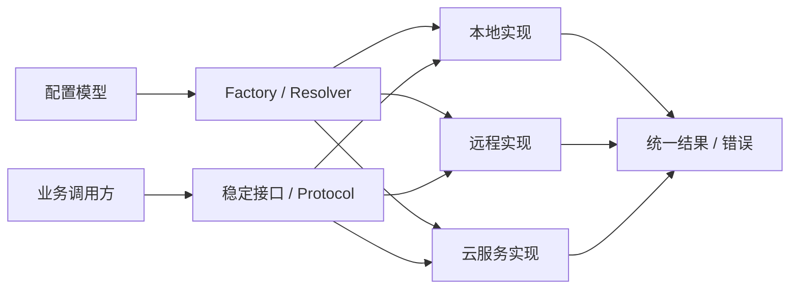
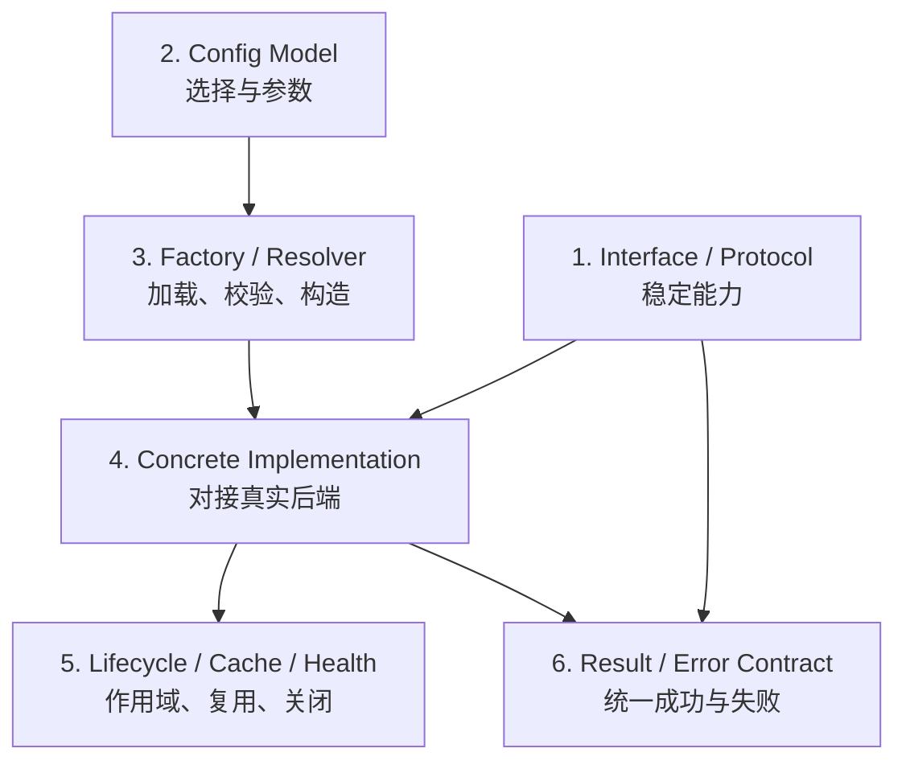
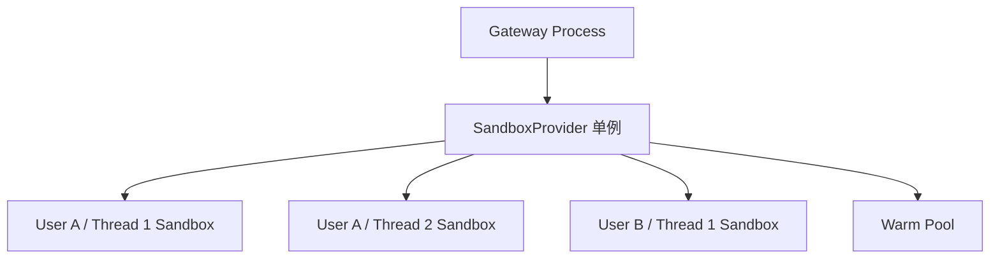
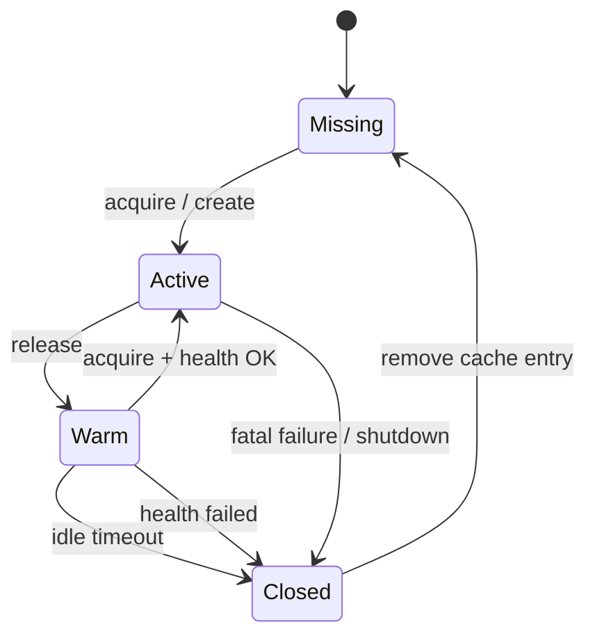

# 21 Provider 设计模式：可替换能力与生命周期治理

## 1. 本章目标与核心问题

本章深入解释 DeerFlow 后端广泛使用的 Provider 设计。完成本章后，你应当能够：

1. 准确定义 Provider，而不是把所有第三方 SDK 封装都叫 Provider；
2. 解释 Interface、Config、Factory、Implementation、Lifecycle 和 Contract 六层职责；
3. 从 `config.yaml` 追踪到一个具体 Provider 实例及其运行时资源；
4. 区分 Provider、Adapter、Strategy、Factory、Repository、Plugin 和 Facade；
5. 评审 Provider 的并发初始化、缓存、健康检查、释放和关闭语义；
6. 设计一个不会把供应方类型与异常泄漏到上层的新 Provider；
7. 用 DeerFlow Sandbox、Model 和 Auth 源码说明不同成熟度的 Provider 形态。

本章回答的核心问题是：

> 当同一种系统能力可以由本地代码、容器、云服务或第三方 SDK 提供时，怎样让上层稳定使用它，同时把选择、兼容、生命周期和故障差异控制在边界内部？

一句话心智模型：

> Provider 是一个可配置、可替换、可治理的能力供应边界；接口保证上层稳定，Factory 负责选择实现，生命周期层负责资源，结果与错误契约负责隐藏差异。

延伸阅读：

- Provider 在完整后端中的位置：[19 完整后端模块架构](19-backend-module-architecture.md)
- Sandbox 的安全边界：[09 Sandbox 与安全](09-sandbox-and-security.md)
- 模型怎样进入 Agent：[03 Agent 核心设计](03-agent-core.md)
- 配置、测试与观测：[13 可观测性与测试](13-observability-and-testing.md)

---

## 2. 先定义 Provider

Provider 不是“名字中包含 Provider 的类”，也不只是“调用外部服务的 Client”。

Provider 需要在调用方与具体实现之间建立稳定边界：



调用方应该知道：

- 能调用哪些方法；
- 应传入什么领域参数；
- 会得到什么领域结果；
- 可能遇到什么统一错误；
- 何时需要申请或释放资源。

调用方不应该知道：

- 供应方 SDK 的 Client 类型；
- HTTP endpoint、容器名称或 VM 地址；
- 某个供应方独有的响应字段；
- 某个 SDK 抛出的专属异常；
- Provider 内部怎样缓存连接或执行健康检查。

可以用下面的公式初步判断：

```text
Provider
= 稳定能力契约
+ 可替换实现
+ 集中选择与构造
+ 生命周期治理
+ 结果和错误归一化
```

缺少其中一项不代表代码一定错误，但它可能只是 Adapter、Client Wrapper、Factory，
或者为未来预留的 Provider 扩展点，而不是成熟的 Provider 子系统。

---

## 3. Provider 的六层共同结构

典型 Provider 由六类职责协作完成：



这六层是职责模型，不是强制目录结构：

- 小模块可以把 Resolver、单例缓存和 shutdown 放在一个文件中；
- 大模块可以拆成 Registry、Client Factory、Resource Pool、Health Checker；
- Config 实际输入 Factory，不是继承 Interface；
- Lifecycle 可能由 Provider、应用 lifespan 和 Middleware 共同完成；
- Result Contract 可以是领域对象、基础类型和异常族，不一定要有一个 `Result[T]` 类。

判断质量时要看职责是否完整、依赖方向是否稳定，不要机械检查是否存在六个文件。

---

## 4. Interface / Protocol：定义稳定能力

### 4.1 ABC 与 Protocol

Python 中最常见的两种接口表达方式是：

| 形式 | 特点 | 适用场景 |
|---|---|---|
| `ABC` + `@abstractmethod` | 实现显式继承，运行时容易做 `issubclass` 校验 | 插件边界、严格动态加载 |
| `Protocol` | 结构化类型，只要方法形状一致即可 | 依赖注入、测试替身、轻量策略 |
| 外部标准基类 | 复用框架已经定义的协议 | LangChain Model、LangGraph Store |

DeerFlow 不要求所有 Provider 都重新定义自己的 ABC。例如 Model Provider 复用
LangChain 的 `BaseChatModel`；Sandbox 则定义 DeerFlow 自己的 `SandboxProvider`。

### 4.2 资源管理与资源使用应分层

Sandbox 是理解接口拆分最好的例子：

```text
SandboxProvider                    Sandbox
-----------------------------      --------------------------
acquire / acquire_async            execute_command
get                                read_file / download_file
release                            write_file
reset                              list_dir / glob / grep
```

两者分别回答：

- `SandboxProvider`：资源从哪里来、按什么身份分配、怎样复用？
- `Sandbox`：获得资源以后，可以执行什么统一操作？

对应源码：

- `backend/packages/harness/deerflow/sandbox/sandbox_provider.py::SandboxProvider`
- `backend/packages/harness/deerflow/sandbox/sandbox.py::Sandbox`

如果把两组职责混在同一个接口中，调用方会同时接触资源池管理和文件/命令业务，接口
很快膨胀，测试也难以区分“分配失败”和“操作失败”。

### 4.3 接口需要定义行为，不只是类型

下面两个签名虽然类型相同，语义可能完全不同：

```python
def release(resource_id: str) -> None: ...
```

`release` 可能表示：

- 立即物理销毁资源；
- 结束调用方租约并放回 warm pool；
- 只减少引用计数；
- 本地实现中什么都不做，等待 LRU 淘汰。

因此稳定接口还必须说明：

- 是否幂等；
- 对不存在 ID 的行为；
- 同步和异步是否等价；
- 超时与取消如何传播；
- 返回 `None` 与抛出异常的边界；
- 调用方和 Provider 谁拥有资源。

---

## 5. Config Model：把部署决策变成声明

Provider 的实现选择不应散落在业务代码中。DeerFlow Sandbox 使用类似配置：

```yaml
sandbox:
  use: deerflow.sandbox.local:LocalSandboxProvider
  replicas: 3
  idle_timeout: 600
```

`SandboxConfig` 使用 Pydantic 定义和验证：

- `use`：具体 Provider 类路径；
- `image`、`port`、`replicas`：构造或容量参数；
- `idle_timeout`、`health_check_skip_seconds`：生命周期策略；
- `mounts`、`environment`：运行环境；
- Tool 输出和命令超时：跨调用治理参数。

源码入口：

- `backend/packages/harness/deerflow/config/sandbox_config.py::SandboxConfig`
- `backend/packages/harness/deerflow/config/model_config.py::ModelConfig`
- `backend/packages/harness/deerflow/config/app_config.py::AppConfig`

### 5.1 配置字段的四种性质

阅读 Provider 配置时，先给字段分类：

| 类型 | 示例 | 应流向哪里 |
|---|---|---|
| 实现选择 | `use` | Resolver，不传给 Provider SDK |
| 构造参数 | `image`、`base_url` | Concrete Provider constructor |
| 能力元数据 | `supports_vision`、`pricing` | Agent/UI/Reporting，不传给 SDK |
| 运行时数据 | `thread_id`、`user_id` | 每次调用，不进入静态 Config |

Model Factory 会显式剥离 `display_name`、`supports_thinking`、`pricing` 等展示或能力
字段，避免第三方模型 Client 把未知参数继续发送给模型服务。这说明 Config Model 与
Provider constructor 并不是简单的一一映射。

### 5.2 `extra="allow"` 的取舍

DeerFlow 的 Sandbox 和 Model 配置允许实现专属扩展字段，收益是新增 Provider 时不必
立刻扩展所有中央 Schema；代价是：

- 拼写错误可能不被公共模型拒绝；
- 哪些字段被哪个实现消费不够直观；
- Factory 或 Provider 必须主动处理未知参数；
- 文档和实现测试变得更重要。

设计新配置时，要在“插件开放性”和“严格启动校验”之间做明确取舍。

---

## 6. Factory / Resolver：配置与对象之间的翻译层

### 6.1 Sandbox 的解析过程

`get_sandbox_provider()` 的冷启动核心流程是：

```python
config = get_app_config()
cls = resolve_class(config.sandbox.use, SandboxProvider)
provider = cls()
```

`resolve_class()` 不只是动态 import，还会验证：

1. 配置路径可以解析为 Python 对象；
2. 解析结果确实是类；
3. 该类是预期基类的子类。

源码入口：

- `backend/packages/harness/deerflow/reflection/resolvers.py::resolve_variable`
- `backend/packages/harness/deerflow/reflection/resolvers.py::resolve_class`
- `backend/packages/harness/deerflow/sandbox/sandbox_provider.py::get_sandbox_provider`

这样可以让错误在 Provider 边界尽早失败，而不是等到工具调用时才出现缺少方法的
`AttributeError`。

### 6.2 Model Factory 为什么更复杂

`create_chat_model()` 除了创建对象，还负责：

- 根据逻辑名称查找 `ModelConfig`；
- 校验实现继承 `BaseChatModel`；
- 过滤展示和能力元数据；
- 合并 thinking 开关配置；
- 规范化 `api_base` / `base_url`；
- 对 OpenAI 兼容实现设置 stream timeout 和 usage；
- 对 Codex、MindIE 等实现做受控兼容；
- 安装 tracing callbacks。

源码入口：`backend/packages/harness/deerflow/models/factory.py::create_chat_model`。

Factory 因此不是一层无意义转发。它是两套语义之间的翻译层：

```text
DeerFlow 配置语义
        ↓
能力判断、默认值、兼容规则
        ↓
第三方 Provider constructor 语义
```

### 6.3 Factory 的三条边界

一个健康的 Factory 应该：

1. 集中选择、校验和构造，不承载每次业务调用；
2. 处理跨实现的构造兼容，不吞掉运行时领域错误；
3. 返回稳定接口，而不是迫使调用方立即向下转型。

---

## 7. Concrete Implementation：把外部世界适配进来

DeerFlow Sandbox 当前有多种实现：

| 实现 | 底层资源 | 主要差异 |
|---|---|---|
| `LocalSandboxProvider` | Gateway 本地目录与进程 | 轻量，但不是强隔离边界 |
| `AioSandboxProvider` | Docker 或 Provisioner | 容器创建、warm pool、健康检查 |
| `E2BSandboxProvider` | E2B 云沙箱 | 远程 SDK、云资源生命周期 |
| `BoxliteProvider` | BoxLite 微虚拟机 | VM 池、回收前健康检查 |

Concrete Provider 通常同时承担 Adapter 职责：

```text
DeerFlow acquire(thread_id, user_id)
        ↓
供应方 create / connect / resume
        ↓
供应方对象、状态和异常
        ↓
DeerFlow sandbox_id、Sandbox、统一异常
```

实现可以拥有私有方法和专属优化，但通用调用方不应依赖这些细节。如果上层频繁写：

```python
if isinstance(provider, AioSandboxProvider):
    ...
```

需要判断三种可能：

1. 该能力其实是所有 Provider 都应该实现的核心能力，应提升到接口；
2. 该能力只有部分实现支持，应拆成显式 Capability；
3. 这只是实现细节，应完全留在 Concrete Provider 内部。

---

## 8. Lifecycle：Provider 最容易被低估的部分

### 8.1 两级生命周期

DeerFlow Sandbox 至少有两级生命周期：



- Provider 本身通常是 process-scoped；
- Sandbox 按用户与线程分配；
- `release` 结束一次租约，但资源可能继续留在缓存或 warm pool；
- 应用退出时 `shutdown` 才负责完整清理。

### 8.2 单例初始化的并发问题

下面的写法不安全：

```python
if _provider is None:
    _provider = Provider()
return _provider
```

两个线程可能同时看到 `None` 并各自创建一个实例。如果 constructor 启动后台线程、
创建连接池或远程资源，失败竞争者也会泄漏。

DeerFlow 的处理方式是：

1. 加锁读取当前单例；
2. 在锁外动态 import 并构造插件对象，避免慢调用或重入死锁；
3. 重新加锁，只允许一个对象成为 winner；
4. 对竞争失败的对象调用 `shutdown()`；
5. Provider callback 始终在全局锁外执行。

这里体现了一个重要原则：

> 锁只保护共享引用和状态转换，不应包住不可控的插件代码、网络 I/O 或慢 teardown。

### 8.3 `release`、`reset` 与 `shutdown`

| 操作 | 语义 | 常见调用场景 |
|---|---|---|
| `release(id)` | 结束当前租约，资源可以缓存或回池 | 一次 Agent/Tool 使用结束 |
| `reset()` | 清除缓存状态，让配置或测试状态失效 | 配置重载、单元测试 |
| `shutdown()` | 关闭后台线程、连接和全部受管资源 | 应用 lifespan 结束 |

`reset` 如果不 shutdown 可能遗留活动资源；`shutdown` 如果不清除全局引用，后续调用
可能拿到已经关闭的实例。两者不能只靠名称猜测，必须在契约和测试中锁定语义。

### 8.4 资源状态机

远程沙箱常见状态可以简化为：



本地实现可能没有物理启动和关闭成本，因此 `release()` 可以保留缓存；远程实现则可能
回到 warm pool。统一接口允许不同资源策略存在，但调用方看到的租约语义必须一致。

---

## 9. Cache 与 Health Check：复用不等于永远可信

### 9.1 缓存键首先是隔离设计

Sandbox 不能只按 `thread_id` 缓存。如果不同用户可以选择相同 Thread ID，就可能跨
租户复用资源。DeerFlow 本地 Provider 使用用户与线程组合键，并把活跃访问移动到
LRU 尾部。

设计缓存键时应回答：

- 租户身份是什么？
- Thread、Run、Request 哪一层可以复用？
- 配置版本是否影响对象有效性？
- 凭据是部署级还是用户级？
- 相同逻辑名称是否可能对应不同实际 endpoint？

### 9.2 Health Check 的正确位置

对远程资源，缓存命中不代表资源仍存在。常见复用流程是：

```text
查找缓存
  → 找到候选资源
  → 健康检查
      ├── 成功：转为 Active 并返回
      ├── 明确失败：移除、销毁、重建
      └── 检查自身失败：按策略保守处理
```

Health Check 不一定是公开 `health()` API。BoxLite 在 warm VM 回收时执行简单命令；
AIO Provider 会检查已跟踪 Sandbox 是否存活并清除不健康缓存。

### 9.3 TOCTOU 仍然存在

资源通过健康检查后，仍可能在实际请求前失效。因此：

- Health Check 只能降低坏缓存概率，不能提供成功保证；
- 正常调用仍要处理断连、超时和资源不存在；
- 健康检查后删除缓存时，应确认缓存项仍是被检查的那个对象；
- 不应让过期检查结果删除并发替换后的健康资源。

---

## 10. Result / Error Contract：隐藏供应方差异

### 10.1 统一结果不等于统一成一个类

DeerFlow Sandbox 接口使用多种稳定结果：

```python
str
bytes
Sandbox | None
tuple[list[GrepMatch], bool]
```

例如 `download_file()` 统一返回 `bytes`。本地实现不能返回 `Path`，远程实现也不能
把 SDK Response 直接暴露给上层。

结果契约必须说明：

- 空列表和未找到是否相同；
- `None` 是正常缺失还是失败；
- 截断结果如何标记；
- ID 是否稳定、是否包含租户含义；
- 流式 chunk 是否允许为空；
- usage 和 metadata 在哪个字段中。

### 10.2 统一异常族

Sandbox 异常层次为：

```text
SandboxError
├── SandboxNotFoundError
├── SandboxRuntimeError
├── SandboxCommandError
└── SandboxFileError
    ├── SandboxPermissionError
    └── SandboxFileNotFoundError
```

源码入口：`backend/packages/harness/deerflow/sandbox/exceptions.py`。

Provider 边界应把 Docker、HTTP Client、E2B 或 BoxLite 异常转换为上层能理解的领域
错误。一个可操作的错误契约至少应帮助上层判断：

- 是否可重试；
- 是否需要重新认证或修改配置；
- 是否需要重建资源；
- 是否可以降级；
- 哪些信息可以返回用户；
- 哪些底层详情只能进入受控日志或 trace。

### 10.3 Model Provider 的额外归一化

模型 Provider 除异常外，还需统一：

- assistant message 与 streaming chunk；
- tool call ID、名称和参数；
- finish reason；
- reasoning content；
- input/output/cache token usage；
- 模型名称与供应方 metadata。

LangChain 提供了主要消息协议，但不同兼容网关仍会把字段放在不同位置，因此 DeerFlow
还需要 patched model、middleware 和 usage collector 处理差异。

---

## 11. 从配置到工具调用的完整链路

以一次 Sandbox Tool 调用为例：

```mermaid
sequenceDiagram
    participant YAML as config.yaml
    participant Config as AppConfig
    participant Resolver as resolve_class
    participant Provider as SandboxProvider
    participant MW as SandboxMiddleware
    participant State as ThreadState
    participant Tool as Sandbox Tool
    participant Box as Sandbox

    YAML->>Config: sandbox.use + options
    MW->>Provider: get_sandbox_provider()
    Provider->>Config: get_app_config()
    Provider->>Resolver: resolve_class(use, SandboxProvider)
    Resolver-->>Provider: validated provider class
    Provider->>Provider: construct and install singleton
    MW->>Provider: acquire_async(thread_id, user_id)
    Provider-->>MW: sandbox_id
    MW->>State: persist sandbox.sandbox_id
    Tool->>Provider: get(sandbox_id)
    Provider-->>Tool: Sandbox
    Tool->>Box: execute/read/write
    Box-->>Tool: normalized result or error
    MW->>Provider: release(sandbox_id)
```

这条链路中各层的边界是：

- Config 描述部署选择；
- Resolver 校验动态插件；
- Provider 管理资源；
- Middleware 把资源生命周期接入 Agent 流程；
- ThreadState 只保存稳定 ID，不保存 SDK Client；
- Tool 使用统一 Sandbox，不理解底层实现；
- Concrete Sandbox 归一化实际操作。

如果把 SDK Client 保存进 ThreadState，会破坏序列化、Checkpoint、多进程恢复和安全
边界；如果让 Tool 自己创建容器，则会绕过 Provider 的缓存、隔离和关闭策略。

---

## 12. Provider 与相近模式的区别

Provider 往往由多个基础模式组合而成：

| 模式 | 核心问题 | 与 Provider 的关系 |
|---|---|---|
| Adapter | 如何把外部接口转换为内部接口？ | Concrete Provider 经常同时是 Adapter |
| Strategy | 如何在多种行为之间切换？ | Provider 的可替换实现具有 Strategy 特征 |
| Factory | 怎样隐藏对象创建过程？ | 根据配置创建 Provider |
| Repository | 怎样隔离领域层与数据存储？ | Repository 可以是一类数据 Provider |
| Plugin | 怎样让外部模块扩展系统？ | Provider 可通过 Registry 或动态类路径加载 |
| Facade | 怎样为复杂子系统提供简单入口？ | Provider 接口可同时充当 Facade |

### 12.1 Adapter 不等于 Provider

一个类只负责把 `vendor_response.foo` 转成 `DomainResult.bar`，它是 Adapter。只有当
系统进一步具备稳定抽象、多个实现、选择机制和生命周期治理时，才形成 Provider。

### 12.2 Repository 不一定是可配置 Provider

Repository 主要表达领域数据访问边界。即使当前只有 SQLite 实现，它依然可以是有
价值的 Repository；但若没有配置选择和可替换实现，不必强称为完整 Provider 系统。

### 12.3 Plugin 解决加载，Provider 解决语义

动态 import 只能证明系统能加载代码，不能证明插件拥有统一输入输出、错误和生命周期。
Plugin 是扩展机制，Provider 是能力契约与治理模式。

---

## 13. DeerFlow 中 Provider 的不同成熟度

### 13.1 Sandbox：完整 Provider 子系统

Sandbox 具备：

- DeerFlow 自有稳定接口；
- Local、AIO、E2B、BoxLite 多种实现；
- `SandboxConfig.use` 动态选择；
- `resolve_class` 类型校验；
- 单例、LRU、warm pool、idle reaper、health check；
- 统一 Sandbox 操作与异常族。

因此它是最适合学习完整 Provider 结构的模块。

### 13.2 Model：复用外部标准接口的 Provider Factory

Model 模块不重新发明接口，而是复用 LangChain `BaseChatModel`。DeerFlow 主要控制：

- 配置与动态类选择；
- thinking、vision 与 reasoning 能力元数据；
- 构造参数归一化；
- patched provider compatibility；
- tracing 和 usage。

这是 Provider 架构，但稳定抽象由外部框架拥有。

### 13.3 Auth：Provider 扩展点

`app.gateway.auth.providers.AuthProvider` 定义 `authenticate()` 和 `get_user()`，当前
`LocalAuthProvider` 主要委托 `UserRepository`。它有稳定接口，但暂时缺少与 Sandbox
同等程度的多实现选择和资源生命周期治理。

更准确的表述是：它是 Provider 扩展点，而不是已经充分发展的 Provider 子系统。

### 13.4 字符串中的 provider 不代表架构角色

Channel 消息里的 `provider="slack"`、OAuth identity 中的 provider ID，可能只是数据
维度或供应方标识。判断架构角色必须沿调用依赖、构造和生命周期分析，不能做文本搜索
后按名字分类。

---

## 14. 常见反模式与故障模式

### 14.1 只有 Provider 类名，没有稳定抽象

所有调用方都直接 import `OpenAIProvider`，不存在替换接口。这只是普通 Service/Client。

### 14.2 业务层遍布供应方条件分支

```python
if provider_name == "e2b":
    ...
elif provider_name == "local":
    ...
```

启动期集中选择可以接受；运行期到处分支说明差异已经泄漏，应移动到 Factory、Concrete
Provider 或单独 Capability。

### 14.3 公共接口成为所有实现能力的并集

为了支持一个供应方而不断给接口加专属方法，会迫使其他实现提供空方法或
`NotImplementedError`。应拆分核心接口和可选 Capability。

### 14.4 第三方类型与异常穿透

一旦上层依赖 SDK Response 或专属 Exception，替换实现就需要修改所有调用方，Provider
边界事实上已经失效。

### 14.5 单例重复初始化或泄漏 loser

并发 check-then-create 会启动多个线程、连接池或容器管理器。即使最终只保存一个引用，
竞争失败对象仍必须 shutdown。

### 14.6 在全局锁内运行插件代码

动态 import、constructor、health check 和 shutdown 可能缓慢或重入。在非重入锁内执行
可能阻塞所有调用，甚至自死锁。

### 14.7 `release` 语义含糊

调用方以为资源已销毁，实际只是回到池中，会引起数据残留、容量和成本误判。租约结束、
清空状态、物理销毁需要分别定义。

### 14.8 永久信任缓存中的远程资源

容器或 VM 可能被外部删除、超时或网络隔离。缓存命中必须配合健康检查和实际调用错误
处理。

### 14.9 把 Health Check 当成成功保证

健康检查与实际调用之间仍有竞态。代码必须处理“刚检查健康，下一秒就失效”。

### 14.10 把运行时对象写入持久状态

SDK Client、锁、线程和连接不可序列化，也不适合跨进程恢复。ThreadState 应保存稳定
identity 和领域状态，运行对象由 Provider 重新解析。

---

## 15. 如何评审一个 Provider 模块

### 15.1 六项基本判断

| 检查项 | 健康信号 | 风险信号 |
|---|---|---|
| 稳定抽象 | 调用方只导入接口 | 调用方导入多个具体实现 |
| 可替换实现 | 至少两种实现通过同一 contract test | 每个实现都有独立调用路径 |
| 配置选择 | Factory/Registry 集中解析 | 业务代码硬编码实现名称 |
| 输入输出 | 返回领域类型 | 返回第三方 SDK 对象 |
| 生命周期 | 作用域、缓存、关闭路径明确 | 全局对象随意创建且从不关闭 |
| 隐藏差异 | 上层不关心供应方 | 上层捕获供应方异常和字段 |

### 15.2 生命周期追问

评审时继续追问：

1. 谁创建 Provider，作用域是什么？
2. 谁拥有受管资源，缓存键包含租户吗？
3. 并发 acquire 是否创建重复资源？
4. `release` 是否幂等，是否清理请求级 secret？
5. 配置变化后旧实例怎样失效？
6. shutdown 在应用生命周期中是否一定执行？
7. health check 超时或自身失败时是 fail-open 还是 fail-closed？
8. 进程崩溃后遗留资源怎样发现和回收？

### 15.3 协议追问

1. 未找到是 `None`、空结果还是异常？
2. 供应方的错误是否转换成领域错误？
3. retry 在 SDK、Provider 还是 Middleware，是否会重复叠加？
4. timeout 是连接、单次操作还是整轮墙钟时间？
5. 取消能否传播到底层，还是只停止等待？
6. metadata 和 usage 是否跨实现保持同一语义？
7. 日志是否泄漏密钥、命令环境或供应方原始响应？

---

## 16. 设计一个新 Provider 的步骤

### 第一步：从调用方提炼契约

不要复制某个 SDK 的方法列表。先写出上层真正需要的最小领域操作、返回值和错误。

### 第二步：定义资源和身份边界

明确 Provider scope、资源 scope、租户键、Thread/Run/Request 复用范围和凭据作用域。

### 第三步：定义 Config Model

区分实现选择、构造参数、能力元数据和运行时数据；敏感信息通过环境变量或 Secret
Resolver 注入。

### 第四步：选择解析机制

- 实现集合固定且很少：静态 Factory；
- 内置插件集合：Registry；
- 允许外部包：动态类路径；
- 对象图和 scope 复杂：依赖注入容器。

### 第五步：实现 Adapter 与错误转换

供应方 request/response/exception 都在 Concrete Provider 内转换，不向业务层穿透。

### 第六步：定义 Lifecycle

写清 acquire、get、release、reset、shutdown、health、idle timeout 和 crash recovery。

### 第七步：使用第二个实现验证抽象

第一个实现很容易把自己的特性误认为领域共性。第二个实现会暴露接口是否真正稳定。

### 第八步：用 Contract Tests 固定共同语义

所有实现运行相同契约测试；实现专属测试只验证 SDK Adapter 和资源策略。

### 第九步：接入应用生命周期与观测

明确启动、配置重载、shutdown、metrics、trace 和敏感日志策略。

### 第十步：检查上层是否仍感知供应方

搜索具体类名、供应方异常、专属字段和 provider-name 分支。如果它们出现在通用业务层，
继续收紧边界。

---

## 17. 测试策略

Provider 测试至少分为五层：

### 17.1 Contract Tests

对所有实现重复验证：

- 相同输入产生相同形状的领域结果；
- 未找到、权限失败和超时语义一致；
- release/reset/shutdown 满足契约；
- 不泄漏供应方类型。

### 17.2 Factory Tests

- 配置缺失或类型错误尽早失败；
- Resolver 拒绝不满足基类的对象；
- 展示字段不会传给 SDK constructor；
- 默认值、别名和能力开关正确归一化。

### 17.3 Lifecycle Tests

- 并发初始化只安装一个 winner；
- loser 会被 shutdown；
- LRU、容量和 idle timeout 正确；
- shutdown 可重复调用；
- reset 后新配置生效；
- 健康检查失败会清理并重建资源。

### 17.4 Adapter Tests

使用 fake SDK 或录制响应验证：

- 第三方响应字段转换；
- streaming chunk 和 usage；
- 第三方异常分类；
- retry、timeout 和 cancellation。

### 17.5 Runtime Integration Tests

验证 Provider 在真实调用方中的行为：

- Middleware 能持久化资源 ID；
- Tool 能通过 ID 重新解析资源；
- async 路径不阻塞 event loop；
- 应用 lifespan 确实执行 shutdown；
- 多用户、Thread 和进程边界不串资源。

---

## 18. 推荐源码阅读顺序

### 第一遍：读稳定接口

1. `sandbox/sandbox_provider.py::SandboxProvider`
2. `sandbox/sandbox.py::Sandbox`
3. `sandbox/exceptions.py`

目标：列出调用契约、返回类型和错误边界。

### 第二遍：追配置与解析

1. `config/sandbox_config.py::SandboxConfig`
2. `config/app_config.py::AppConfig`
3. `reflection/resolvers.py::resolve_class`
4. `sandbox/sandbox_provider.py::get_sandbox_provider`

目标：从 `config.yaml` 追到具体类实例。

### 第三遍：读最简单实现

1. `sandbox/local/local_sandbox_provider.py`
2. `sandbox/local/local_sandbox.py`

目标：理解用户/线程缓存键、LRU 与本地路径映射。

### 第四遍：读远程资源生命周期

1. `community/aio_sandbox/aio_sandbox_provider.py`
2. `community/aio_sandbox/backend.py`
3. `community/boxlite/provider.py`
4. `community/e2b_sandbox/e2b_sandbox_provider.py`

目标：画出 active、warm、unhealthy、idle 和 shutdown 状态机。

### 第五遍：追 Agent 集成

1. `sandbox/middleware.py::SandboxMiddleware`
2. `sandbox/tools.py`
3. `tools/tools.py::get_available_tools`
4. `agents/middlewares/tool_output_budget_middleware.py`

目标：说明资源 ID 怎样进入 ThreadState，又怎样在 Tool 调用时恢复为对象。

### 第六遍：对比 Model Provider

1. `config/model_config.py::ModelConfig`
2. `models/factory.py::create_chat_model`
3. `models/patched_*.py`
4. `agents/middlewares/llm_error_handling_middleware.py`
5. `subagents/token_collector.py`

目标：找出构造参数、消息、错误与 Usage 的归一化位置。

---

## 19. 面试表达

### 19.1 什么是 Provider 设计模式？

可以用四层回答：

1. **定义**：Provider 在稳定接口后提供可配置、可替换的能力实现；
2. **DeerFlow 实现**：Sandbox 使用 `SandboxProvider + SandboxConfig + resolve_class`，
   可选择 Local、AIO、E2B 和 BoxLite；
3. **设计取舍**：动态扩展能力强，但配置校验、生命周期和 contract tests 更复杂；
4. **故障场景**：没有统一边界时，业务层会依赖供应方类型、异常和资源生命周期，替换
   实现需要修改整条调用链。

### 19.2 Provider 与 Adapter 有什么区别？

Adapter 关注外部接口到内部接口的转换；Provider 关注同一种能力的可替换供应、选择、
生命周期和统一契约。Concrete Provider 经常同时是 Adapter，但单个 Adapter 不自动构成
Provider 子系统。

### 19.3 为什么 Provider Factory 不能只是动态 import？

动态 import 只解决加载。Factory 还要校验接口、过滤配置元数据、规范化参数、处理默认
值、安装 tracing，并把配置错误尽早暴露。

### 19.4 为什么 `release` 不一定销毁资源？

`release` 表示调用方结束租约。容器或 VM 创建昂贵，Provider 可以把健康资源放回 warm
pool；真正销毁可能发生在健康检查失败、容量淘汰、idle timeout 或 shutdown。

### 19.5 Health Check 能保证下一次调用成功吗？

不能。检查与使用之间存在 TOCTOU，资源可能在检查后失效。健康检查负责减少复用坏
资源的概率，实际调用仍需处理断连、超时、重建和重试。

### 19.6 怎样判断一个模块是否真的是 Provider？

检查稳定抽象、多个实现、配置选择、统一输入输出、明确生命周期和隐藏实现差异。名字
只是线索，不是证据。

### 19.7 为什么 Model Provider 没有 DeerFlow 自己的接口？

因为 LangChain `BaseChatModel` 已经提供稳定协议。复用生态标准可以减少重复抽象，但
DeerFlow 仍需在 Factory、patched adapters 和 Middleware 中处理配置、消息、错误和
Usage 差异。

---

## 20. 实践练习

### 练习一：还原 Sandbox Provider 创建链

从 `config.example.yaml` 的 `sandbox.use` 开始，追踪到 `get_sandbox_provider()` 返回具体
实例。记录每一步的输入、输出和失败类型。

目标：画出 Config → Resolver → Class → Instance → Cache 链路。

### 练习二：比较 Local 与 AIO 生命周期

分别回答：

- 缓存键是什么？
- `acquire` 命中缓存时发生什么？
- `release` 是否销毁？
- 何时执行健康检查？
- 何时被 LRU 或 idle timeout 回收？
- `shutdown` 清理哪些对象？

目标：理解统一接口下不同资源策略如何共存。

### 练习三：制造并发初始化竞争

写一个 fake `SandboxProvider`，constructor 和 shutdown 记录计数，同时从多个线程调用
`get_sandbox_provider()`。

验证：

- 最终所有调用者拿到同一个 winner；
- 可能创建多个候选实例；
- 每个 loser 都被 shutdown；
- Provider callback 没有在全局锁中造成死锁。

### 练习四：设计 Contract Test

为 `Sandbox` 的 `download_file()` 设计一组所有实现都能运行的测试：

- 正常二进制文件；
- 文件不存在；
- 路径越界；
- 空文件；
- 大文件；
- 供应方 SDK 临时失败。

目标：明确哪些行为属于共同契约，哪些属于实现专属测试。

### 练习五：评审一个“伪 Provider”

在仓库中搜索 `provider`，选择一个只作为字符串标识或单一 Adapter 的模块，使用第 15
节检查表说明它为什么不是完整 Provider 子系统。

目标：训练基于结构和依赖判断，而不是基于命名判断。

### 练习六：设计新 Provider

假设要增加一个远程 Browser Sandbox Provider，输出设计草案：

- Interface 与可选 Capability；
- Config Model；
- Resolver 注册方式；
- 租户和缓存键；
- acquire/release/reset/shutdown；
- health check 与 crash recovery；
- 统一 Result/Error；
- contract、adapter、lifecycle 和 integration tests。

目标：把六层结构转化为可实施设计。

---

## 21. 本章小结

Provider 的价值不在于多包一层类，而在于让能力具备稳定替换和运行治理能力：

1. Interface / Protocol 定义上层可以依赖的稳定能力；
2. Config Model 把实现选择和部署策略变成声明；
3. Factory / Resolver 负责加载、校验、参数归一化和构造；
4. Concrete Implementation 把本地或第三方协议适配为领域协议；
5. Lifecycle / Cache / Health Check 管理昂贵、有状态资源；
6. Result / Error Contract 隐藏供应方的返回与失败差异。

阅读一个 Provider 时，始终追踪六个问题：

1. 上层依赖什么接口？
2. 实现由什么配置选择？
3. 谁创建并校验实现？
4. 资源由谁拥有、复用和关闭？
5. 结果和错误在哪里归一化？
6. 替换实现后，上层是否仍需修改？

只有当答案同时覆盖稳定抽象、可替换实现、配置选择、统一协议、明确生命周期和差异
隐藏时，模块才真正形成完整的 Provider 子系统。
