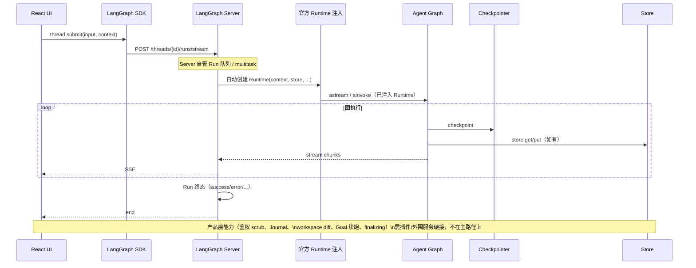
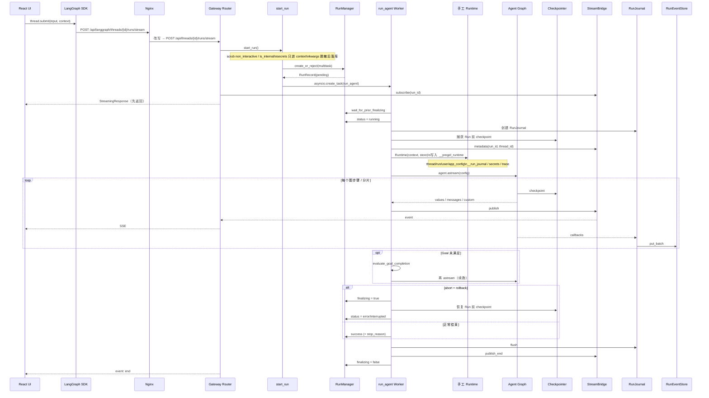
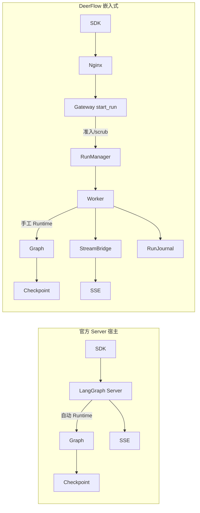

# 22 官方 LangGraph Server 与 DeerFlow 嵌入式运行时

## 1. 本章核心问题

> DeerFlow 为什么不用官方 LangGraph Server 当宿主，而选择 Gateway 嵌入式驱动图？相对原版 LangChain / LangGraph，它保留了什么、改了什么、代价是什么？

一句话心智模型：

> **复用 LangGraph 的图运行时与 SDK 协议表面，自建 Run 产品控制面。**  
> 用的仍是官方 `langgraph.runtime.Runtime`；自己做的是「谁创建 Run、谁注入 Runtime、谁管流与终态」。

阅读本章前建议先看：[01 系统架构](01-system-architecture.md)、[02 请求生命周期](02-request-lifecycle.md)、[06 LangGraph 运行时](06-langgraph-runtime.md)、[18 Gateway 设计](18-gateway-design.md)。

---

## 2. 先对齐三个容易混的概念

| 概念 | 是什么 | DeerFlow 是否自造 |
|---|---|---|
| LangGraph **图运行时**（StateGraph / Pregel / checkpoint） | 执行 Agent 循环的引擎 | **否**，直接使用 |
| LangGraph **`Runtime`** 对象 | 向节点/middleware/tools 注入 `context`、`store` 等 | **否**，`from langgraph.runtime import Runtime` |
| **宿主 / 控制面**（谁创建 Run、排队、流、鉴权、终态） | 官方 = LangGraph Server；DeerFlow = Gateway `RunManager` + `run_agent` | **是**，自建 |

因此：「DeerFlow 不用官方 Runtime」是误解。准确说法是：

```text
不用官方 Server 当宿主
  → Worker 直接 agent.astream(config=...)
  → Server 不会自动注入 Runtime
  → Worker 手工 Runtime(...) 并写入 configurable.__pregel_runtime
```

---

## 3. 时序对比

### 3.1 官方 LangGraph Server 宿主

前端 / SDK 仍可调用标准 runs API；**Server 进程**托管图，并自动创建与注入 `Runtime`。



特点：

- 部署上多一个（或一组）LangGraph Server 进程；
- Runtime 注入对应用透明；
- 产品安全与审计若要做深，往往要围着 Server 的扩展点打补丁。

### 3.2 DeerFlow 嵌入式改造后

Nginx 把 `/api/langgraph/*` 改写到同一 Gateway；**Gateway 自己实现兼容 Run API**，后台 task 驱动图。



特点：

- 拓扑更简单：Gateway 同时管 REST + agent runtime；
- 控制面与鉴权、Journal、Goal、rollback 同进程；
- 代价是必须手工挂 Runtime，并自己维护兼容 API 边界。

### 3.3 对照一览

```text
官方 Server                         DeerFlow 嵌入式
─────────────────────────────────────────────────────────
SDK → LangGraph Server              SDK → Nginx → Gateway
Server 管 Run                       RunManager 管 Run
Server 自动注入 Runtime             Worker 手工 Runtime + __pregel_runtime
SSE = Server stream                 SSE = StreamBridge 订阅
终态 = 图结束                       终态 = 图 + Goal/rollback/finalizing
产品安全靠外围                      scrub / redact / owner 在 start_run
```



关键源码：

- 准入与 scrub：`backend/app/gateway/services.py`（`start_run`、`strip_internal_context_keys`、`merge_run_context_overrides`）
- Run 控制：`backend/packages/harness/deerflow/runtime/runs/manager.py`
- Worker 与 Runtime 注入：`backend/packages/harness/deerflow/runtime/runs/worker.py`
- 拓扑说明：`backend/docs/ARCHITECTURE.md`

---

## 4. 相对原版 LangChain / LangGraph 的设计取舍

下面按「原版默认 → DeerFlow 选择 → 收益 → 代价」组织。这里的「原版」指：用 LangChain `create_agent` / LangGraph StateGraph +（可选）官方 LangGraph Server / Platform 搭一个标准 Agent 服务时的默认形态。

### 4.1 宿主：Server 托管 vs Gateway 嵌入

| | 原版常见路径 | DeerFlow |
|---|---|---|
| 宿主 | LangGraph Server / Platform | FastAPI Gateway 内嵌 `RunManager` + `run_agent` |
| 职责 | Server 管 Run；应用偏「注册 graph」 | Gateway 管鉴权、准入、流、审计、终态；graph 只是被驱动对象 |

**收益**

- 产品语义（`finalizing`、rollback、Goal 续跑、workspace snapshot）可写在同一 Worker 生命周期里；
- 单进程默认拓扑：`make dev` / Docker 不必再挂独立 `langgraph` 容器；
- 与 IM、Scheduler、内部 auth 共用同一 `start_run` 路径。

**代价**

- 必须自己实现（并持续维护）LangGraph **兼容** API 子集；
- 必须手工注入 `Runtime`；
- 不承诺完整 LangGraph Platform 语义（如 `enqueue`、完整 `events` stream mode）。

**面试一句话**：复用引擎，自建控制面。

### 4.2 Runtime：自动注入 vs 手工 `__pregel_runtime`

| | 原版 | DeerFlow |
|---|---|---|
| 注入方式 | Server / `context=` 官方路径自动建 `Runtime` | `Runtime(context=..., store=...)` → `configurable["__pregel_runtime"]` |
| context 内容 | 多为 user 定义 schema | 额外塞 `app_config`、`__run_journal`、secrets、trace、channel 临时字段 |

**收益**：middleware/tools 仍走标准 `runtime.context`，同时能挂上 DeerFlow 专有依赖而不污染 checkpoint。

**代价**：嵌入式调用路径（含测试、`debug.py`）都必须记得注入，否则 `runtime.context` 为空。

### 4.3 状态平面：一个 Checkpoint vs 多存储分工

原版教学 demo 往往「Checkpoint ≈ 全部真相」。DeerFlow 刻意拆开：

| 平面 | 职责 | 类比 |
|---|---|---|
| Checkpointer | 可恢复图状态 | 会话「当前可继续执行」的权威 |
| RunStore / RunRecord | Run 生命周期与元数据 | 一次执行尝试的业务记录 |
| RunEventStore + RunJournal | 追加型历史 / 审计 | 可查询的事件账本 |
| StreamBridge | 短命实时流 | 带 TTL 的 SSE 缓冲 |
| ThreadMeta | 列表投影 | 侧边栏标题/状态，不是完整 ThreadState |
| LangGraph Store | 跨 Run KV | 与 DeerFlow SQL 仓库不同层 |

**收益**：恢复、实时、历史、列表查询互不绑架；Summarization 压缩 messages 后 UI 仍能从 RunEvent 回放。

**代价**：多平面最终一致；title 同步、END 与落库之间存在短暂窗口（见 [02](02-request-lifecycle.md)）。

### 4.4 Agent 装配：手写 StateGraph vs `create_agent` + Middleware 链

| | 原版 | DeerFlow |
|---|---|---|
| 图结构 | 常手写 `StateGraph` 节点边 | Lead 用 LangChain `create_agent()` 生成编译图 |
| 扩展点 | 自定义节点 / 条件边 | 长 Middleware 链（安全、沙箱、压缩、循环检测等） |

**收益**：主循环与协议兼容由框架维护；产品行为用 Middleware 组合，顺序即系统行为。

**代价**：行为难从「一张图」一眼看完，必须读 Middleware 装配顺序（见 [03](03-agent-core.md)、[04](04-middleware.md)）；顺序错误会导致安全或协议回归。

### 4.5 配置通道：`configurable` 万能袋 vs 严格分层

原版示例常把 user_id、开关、甚至临时 token 塞进 `configurable`。DeerFlow 强制分层：

```text
configurable     → thread_id / checkpoint_* / 少量兼容开关（可能与 checkpoint 寻址相关）
runtime.context  → user、run、secrets、journal、channel token（请求级，默认不进 checkpoint）
ThreadState      → messages、todos、artifacts…（可恢复业务状态）
metadata         → 观测 / Langfuse 等
```

源码取舍示例：`github_token`、`disable_clarification` 只进 `context`，永不进 `configurable`（`services.py` 中 `_CONTEXT_RUNTIME_ONLY_KEYS`）。

**收益**：短命密钥不落 checkpoint；客户端无法用 `non_interactive` / `is_internal` 轻易提权。

**代价**：调用方必须理解「字段该进哪一层」；Gateway 要对 `body.context` / `body.config` 做白名单与 scrub。

### 4.6 流式协议：单一 Server SSE vs Bridge + Journal 双路径

| | 原版 Server | DeerFlow |
|---|---|---|
| 实时 | Server 直接 SSE | Worker → StreamBridge → SSE（可 `/join`、多订阅） |
| 历史 | 多依赖 checkpoint / history API | RunEventStore 追加事件；与 checkpoint 解耦 |
| 断连 | Server 策略 | `on_disconnect=cancel|continue` + Run 后台 task |

**收益**：刷新重连、IM 与 Web 共读同一 Run、历史不被 Summarization 吃掉。

**代价**：实现与测试面更大；`events` 等模式可能仅在协议层声明、Worker 未完整实现。

### 4.7 并发与取消：平台 multitask vs 产品级 `finalizing` / rollback

原版 Platform 提供 multitask；DeerFlow 实现子集并加上产品语义：

- `reject` / `interrupt` / `rollback`（`enqueue` 接口可能出现但不实现）；
- 取消后进入 `finalizing`：flush Journal、写 completion、fallback title、恢复 checkpoint；
- 新 Run 必须 `wait_for_prior_finalizing`，防止晚到写入覆盖新状态。

**收益**：interrupt/rollback 与 UI「停止」语义可预期；多 Worker 下用 DB 部分唯一索引做原子准入。

**代价**：状态机比「跑完即终态」复杂；排障要分清 task 取消 vs finalization 完成。

### 4.8 能力扩展：纯 Tool vs Tool + Skill + MCP + Sandbox

原版 LangChain 以 Tool 为主。DeerFlow 叠了产品层：

- **Skill**：文档化能力包 + 可选 `allowed-tools` / `required-secrets`；
- **MCP**：延迟加载与 `tool_search` 晋升；
- **Sandbox**：虚拟路径与执行隔离；
- **Subagent**：`task` 委派，独立预算与 step events。

**收益**：能力可运营（启停、扫描、审核），执行可隔离。

**代价**：授权是多层近似（Layer1/2、skill policy），不是单一 ACL；文档必须反复强调「机制 ≠ 完整安全边界」。

### 4.9 客户端：单一远程 SDK vs 远程 + 嵌入式双路径

| | 原版 | DeerFlow |
|---|---|---|
| 远程 | LangGraph SDK → Server | LangGraph SDK → Gateway 兼容 API |
| 本地 | 直接 `graph.invoke` | `DeerFlowClient` 同进程门面（TUI/脚本/测试） |

二者共享 Harness，**不共享** `RunManager` / StreamBridge（见 [17](17-sdk-design.md)）。

**收益**：浏览器与 Notebook 各走合适路径；Harness 可单独嵌入。

**代价**：两套流式与 Run id 语义，文档与测试要对齐「能力语义」而非强行合并执行栈。

### 4.10 协议策略：完整 Platform vs 兼容子集

DeerFlow 明确不做完整复刻：

- assistant schema 只给最小信息；
- 部分 stream mode / multitask 值在模型层可见但运行时拒绝或跳过；
- `langgraph.json` 留给 Studio / 直连兼容，**不是**默认生产入口。

**收益**：产品节奏自主；避免被 Platform 路线图绑死。

**代价**：外部「以为是标准 LangGraph 部署」的用户会踩差异；兼容层要持续对 SDK 版本做回归。

---

## 5. 取舍总表（面试用）

| 维度 | 贴近原版 LangChain/LangGraph | DeerFlow 选择 | 主要代价 |
|---|---|---|---|
| 宿主 | LangGraph Server | Gateway 嵌入式 Runtime | 自维兼容 API + 手工 Runtime |
| Runtime | 自动注入 | `__pregel_runtime` 手工挂 | 所有驱动路径都要记得注入 |
| 状态 | Checkpoint 中心 | Checkpoint + RunEvent + Bridge + Meta | 多平面一致性 |
| Agent 扩展 | 节点/边 | Middleware 长链 | 顺序即行为，难「一张图」看完 |
| 配置 | configurable 杂物箱 | context / state / configurable 分层 | 调用与 scrub 复杂度 |
| 流 | Server SSE | StreamBridge + Journal | 双路径实现成本 |
| 取消 | Run 终态 | `finalizing` + rollback 点 | 状态机更重 |
| 能力 | Tool | Tool+Skill+MCP+Sandbox+Subagent | 授权与运营复杂度 |
| 客户端 | 远程 SDK | SDK + `DeerFlowClient` | 双路径语义要对齐 |
| 协议 | Platform 全量 | 当前客户端所需子集 | 能力边界需文档写清 |

**保留的原版资产（不要误说成自研）**：

- LangChain Message / Model / Tool / `create_agent`；
- LangGraph State channel、reducer、checkpointer、store、stream mode、interrupt；
- 官方 `Runtime` 类型与 `runtime.context` 消费约定；
- LangGraph SDK 客户端协议形状（经 Nginx 兼容层）。

**自研的产品层**：

- `RunManager` / `run_agent` / `StreamBridge` / `RunJournal`；
- Gateway 鉴权、context scrub、secret redact；
- Goal 外环、workspace changes、IM/Scheduler 复用同一 Run 生命周期；
- Harness/App 分包与 Provider 模式。

---

## 6. 官方 Server 宿主的具体局限（对应源码能力）

若坚持 Server 宿主，下列 DeerFlow 能力很难「自然」落在主路径上（通常要插件或外围二次编排）：

1. **信任边界 scrub**：剥离客户端伪造的 `non_interactive` / `is_internal`；`github_token` 只进 context。  
2. **落库脱敏**：`redact_config_secrets` —— 活 config 有密、`runs.kwargs_json` 无密。  
3. **原子准入 + `finalizing`**：同 Thread 新旧 Run 交接，避免晚到写入覆盖。  
4. **Run 前 checkpoint + rollback**：取消策略与时间旅行绑定产品按钮。  
5. **图外 Goal 续跑 / workspace diff**：`astream` 结束后 Worker 继续工作。  
6. **双平面流**：实时 Bridge 与持久 RunEvent 分离。

这些不是 LangGraph「做不到」，而是 **Server 默认职责边界不包含完整产品控制面**；DeerFlow 选择把边界拉到 Gateway。

---

## 7. 面试题

### 1. DeerFlow 有没有自己实现一套 Runtime？

没有。使用官方 `langgraph.runtime.Runtime`。自建的是宿主与注入时机。

### 2. 为什么必须手工写 `__pregel_runtime`？

因为没有走官方 Server / `context=` 自动注入路径，而是 `agent.astream(config=...)` 直驱。Pregel 从该内部键取 parent runtime，middleware/tools 才能读到 `runtime.context`。

### 3. 相对原版，最大的架构赌注是什么？

用兼容子集换产品控制面自主权：鉴权、密钥、并发、审计、续跑都在自有 Worker 生命周期内，而不是旁路挂在 Server 外。

### 4. 最大的工程债是什么？

兼容 API 与双客户端路径的持续对齐；多存储平面的最终一致性；Middleware 顺序成为隐性架构。

### 5. 什么时候反而该用官方 Server？

团队只要标准 LangGraph 协议、少产品态控制、愿跟 Platform 升级节奏时；或仅需 Studio 调试（DeerFlow 仍保留 `langgraph.json` 作可选入口）。

---

## 8. 练习

1. 对照 `worker.py` 画出「创建 `runtime_ctx` → `Runtime` → `__pregel_runtime` → `astream`」五步，标出 journal / secrets 各在哪一步进入。  
2. 用一张表列出一次取消：`abort_event` → `finalizing` → rollback/checkpoint → `publish_end` → UI，说明若缺少 `wait_for_prior_finalizing` 会怎样。  
3. 假设把 Gateway 换成官方 Server：指出 `strip_internal_context_keys`、`StreamBridge`、`evaluate_goal_completion` 三者分别应迁到何处，或为何迁不动。  
4. 向他人用 2 分钟讲清：「保留引擎、自建控制面、手工注入 Runtime」三句话及各自代价。

---

## 9. 相关文档

- [01 系统架构](01-system-architecture.md) — Gateway 不是官方 Server  
- [02 请求生命周期](02-request-lifecycle.md) — 当前嵌入式主链路时序  
- [05 LangChain 基础](05-langchain-foundations.md) — Message / Runnable / configurable  
- [06 LangGraph 运行时](06-langgraph-runtime.md) — Runtime 与 context  
- [17 SDK 设计](17-sdk-design.md) — 远程 SDK 与嵌入式 Client  
- [18 Gateway 设计](18-gateway-design.md) — 控制面与兼容表面边界  
