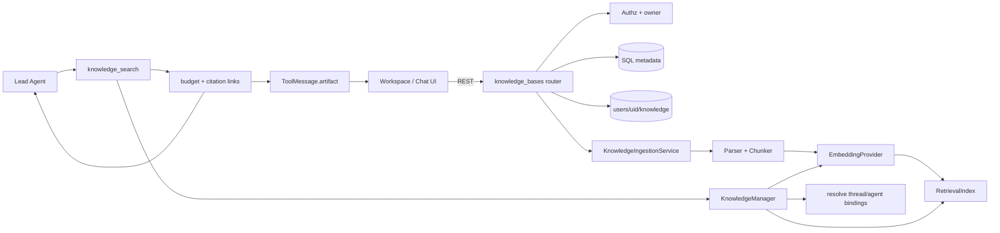
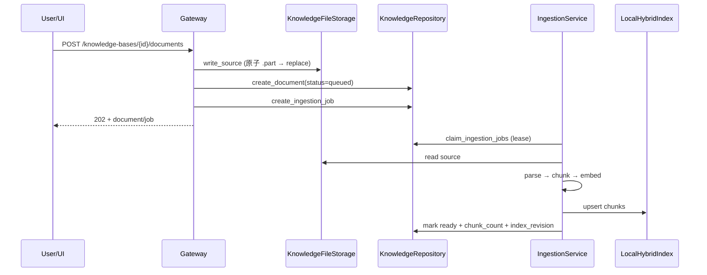
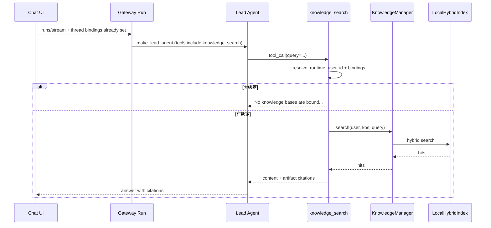

# 23 Knowledge Bases / RAG

## 1. 先回答核心问题

DeerFlow 的 RAG 不是“每轮对话自动往 Prompt 里塞检索结果”，而是：

> **用户维护的稳定文档集合**，经解析/切块/Embedding/混合索引后，由 Agent **按需调用** `knowledge_search`；检索范围由 **线程绑定或自定义 Agent 绑定** 决定，而不是扫描账号下全部知识库。

一句话心智模型：

```text
知识库文档 → 异步入库 → 本地混合索引
                ↓
聊天线程绑定 KB → Agent 调用 knowledge_search → 预算受控的片段 + citation → 模型作答
```

## 2. 通用 RAG 概念（不局限 DeerFlow）

| 阶段 | 做什么 | 常见坑 |
|---|---|---|
| Ingest | 解析原文 → 切块 → Embedding → 写入索引 | 切块过大/过碎、表格/中文切坏 |
| Retrieve | 按 query 召回候选 | 只靠向量漏关键词；只靠关键词漏语义 |
| Fuse / Rerank | 多路召回融合、去冗余 | 分数尺度不同，不能直接相加 |
| Generate | 模型基于片段回答并引用 | 文档注入、无引用幻觉 |

DeerFlow MVP 选的是：

- **混合检索**：向量余弦 + SQLite FTS5/BM25；
- **RRF（Reciprocal Rank Fusion）** 融合两路排名；
- **MMR** 降低近重复片段；
- **Tool-calling RAG**：不自动注入，由模型决定是否检索。

## 3. 为什么独立成 Knowledge，而不是塞进 Memory

| 能力 | 数据语义 | 生命周期 | 检索方式 |
|---|---|---|---|
| Memory | 用户偏好、事实、摘要 | 对话中自动/工具维护 | 事实搜索 + Prompt 注入 |
| Uploads | 单线程临时附件 | 跟随线程目录 | Agent 直接读文件 |
| Web Search | 公网实时信息 | 单次工具调用 | 远程搜索/抓取 |
| Knowledge RAG | 用户维护的稳定语料 | 跨线程、可版本化 | 混合检索 + 引用 |

不要把文档原文塞进 Memory：Memory 的写入语义是事实提取、合并与遗忘；RAG 的语义是**原文保真、版本化、批量索引、来源引用**。混在一起会破坏权限、删除和评测边界。

设计文档：`docs/plans/2026-07-31-rag-design.md`。

## 4. DeerFlow 分层与依赖方向

```text
frontend/src/core/knowledge
frontend/src/app/workspace/knowledge-bases
frontend/src/components/workspace/knowledge-base-selector.tsx
                         |
                         v
backend/app/gateway/routers/knowledge_bases.py
backend/app/knowledge/{runtime,ingestion,storage}.py
                         |
                         v
deerflow.persistence.knowledge     deerflow.knowledge
(SQL 元数据 / 绑定 / migration)      (ports, parser, chunker, index, tool)
```

硬规则：`deerflow.knowledge` **不得** import `app.*`（由 `tests/test_harness_boundary.py` 约束）。

| 层 | 职责 |
|---|---|
| `deerflow.knowledge` | Parser / Embedder / Index 协议、切块、混合检索、`KnowledgeManager`、`knowledge_search` |
| `deerflow.persistence.knowledge` | SQLAlchemy 模型、Repository、Alembic `0008_knowledge_bases` |
| `app.knowledge` | 用户隔离原文件、入库 worker、Gateway 启动时装配 runtime |
| Gateway router | REST schema、鉴权、状态码 |
| Frontend | 工作区管理页、线程绑定选择器、citation 渲染 |

## 5. 总体架构



## 6. 入库流水线（Ingestion）

关键路径：

- `backend/app/knowledge/ingestion.py`
- `backend/app/knowledge/storage.py`
- `backend/packages/harness/deerflow/knowledge/parsing/markitdown.py`
- `backend/packages/harness/deerflow/knowledge/chunking/markdown.py`
- `backend/packages/harness/deerflow/knowledge/embedding.py`
- `backend/packages/harness/deerflow/knowledge/retrieval/local.py`



要点：

1. **异步入库**：上传只排队；`ready` 后才可检索。
2. **Lease / 重试**：worker 认领任务，失败可重试到 `max_attempts`。
3. **幂等**：内容 hash 去重；索引 revision 支撑更新/删除一致性。
4. **文件类型**：md/txt/pdf/docx/pptx/xlsx（MarkItDown）。
5. **原文件与索引分离**：原文在用户目录；SQLite 索引是可重建派生状态。

## 7. 混合检索（LocalHybridIndex）

路径：`deerflow/knowledge/retrieval/local.py`

默认流程：

1. Embedding query；
2. 向量侧取 `vector_candidate_k` 候选（余弦相似度）；
3. FTS5 取 `text_candidate_k` 候选；
4. **RRF** 按排名融合：`score += 1 / (rrf_k + rank)`；
5. **MMR** 在融合序列上做多样性选择，输出 `top_k`。

每次查询都带 `user_id` + `knowledge_base_ids`（以及可选 `document_ids`）过滤，防止跨用户命中。

配置入口：`config.yaml → knowledge.retrieval`。

## 8. 绑定模型：为什么会说“当前会话没有绑定”

这是最容易踩坑的产品语义。

`knowledge_search` **不会**枚举你账号下全部知识库。它只检索：

1. **当前 thread** 的绑定；或
2. **当前自定义 agent** 的绑定。

源码：`deerflow/knowledge/tools.py`

```text
resolve_knowledge_base_ids(user_id, thread_id, agent_id)
  → 若为空 → "No knowledge bases are bound to this conversation."
```

| 场景 | 结果 |
|---|---|
| 工作区已有 KB，但新开聊天未勾选 | 工具拒绝检索 |
| 线程绑定了 KB A | 只能搜 A |
| `replace` + 空列表 | “显式不绑定”，区别于 inherit/未设置 |
| 其他用户的 thread_id | owner 校验后解析为空 |

前端：

- 管理页：`/workspace/knowledge-bases`
- 绑定控件：`knowledge-base-selector.tsx`（composer）
- Feature 门控：`/api/features → knowledge_bases.enabled`

REST：

- `GET/PUT /api/threads/{thread_id}/knowledge-bases`
- `GET/PUT /api/agents/{agent_name}/knowledge-bases`

## 9. `knowledge_search` 工具契约与安全

路径：`deerflow/knowledge/tools.py`  
装配：`deerflow/tools/tools.py`（仅当 `knowledge.enabled`）

模型可见 schema **故意没有**：

- `user_id`
- `knowledge_base_ids`

身份来自 `runtime.context`（Gateway 注入的认证用户）+ 绑定解析。模型不能靠猜 ID 越权。

返回：

| 通道 | 内容 |
|---|---|
| `ToolMessage.content` | 预算截断后的片段 + `[citation:filename](URL)` |
| `ToolMessage.artifact` | 完整 hit、分数、chunk_id、citation_url（给 UI/审计） |

安全处理：

- 检索结果进入 tool-result sanitization allowlist（防文档内 prompt injection）；
- 单 hit / 总 content 有字符预算；
- citation URL 指向 Gateway 文档内容接口，带 `chunk_id`。

## 10. 配置与启动边界

`knowledge` 是 **startup-only** 字段（见 `reload_boundary.py`）：改完必须重启 Gateway。

```yaml
knowledge:
  enabled: false   # 默认关闭；不配 Embedding 也能起服务
  parser: ...
  chunking: ...
  embedding:
    use: langchain_openai:OpenAIEmbeddings
    model: text-embedding-3-small
    api_key: $OPENAI_API_KEY
  index:
    use: deerflow.knowledge.retrieval.local:LocalHybridIndex
  retrieval: ...
  ingestion: ...
```

启用步骤：

1. `config.yaml` 设置 `knowledge.enabled: true`；
2. 配置可用 Embedding（含 API Key / base_url 若走兼容网关）；
3. **重启 Gateway**；
4. `/api/features` 中 `knowledge_bases.enabled` 应为 `true`；
5. 工作区创建 KB → 上传 → 等 `ready` → 聊天里绑定 → 提问。

未启用时：相关 UI 隐藏；`/api/knowledge-bases*` 返回 503。

## 11. 端到端调用链（聊天路径）



## 12. 设计取舍

| 选择 | 收益 | 代价 |
|---|---|---|
| Tool-calling RAG，而非每轮自动检索 | 省 token、模型可决定是否查库 | 依赖模型学会调工具；未绑定会“看起来像坏了” |
| Harness / App 拆分 | 可单测、可嵌入、边界清晰 | Gateway 生命周期装配多一层 |
| 本地 SQLite 混合索引 | 单机开箱、无外部向量库 | 大规模需换 pgvector/Qdrant |
| 线程绑定而非全局可见 | 最小权限、避免串库 | UX 必须显式选择 |
| content/artifact 分离 | 模型上下文可控，UI 仍有完整引用 | 前端要会读 artifact |

MVP **不做**：团队 ACL、OCR、Graph RAG、自动 query rewrite、多模态向量检索。

## 13. 故障模式速查

| 现象 | 常见原因 |
|---|---|
| “当前会话没有绑定可检索的知识库” | 线程未绑定；或绑了空 `replace` |
| 上传后搜不到 | 文档仍 `queued/running`，未到 `ready` |
| Feature 关闭 / 503 | `knowledge.enabled=false` 或 runtime 未装配 |
| Gateway 起不来 | Embedding 凭证无效（enabled=true 时启动期构造） |
| `reasoning_effort` 双重传参报错 | 模型配置与请求 context 同时写死同名字段 |
| 检索质量差 | 假 Embedding、切块参数、query 过宽 |
| 跨用户泄密 | 应被 user_id + binding 挡住；若出现是严重 bug |

## 14. 源码阅读顺序

1. `docs/plans/2026-07-31-rag-design.md` — 设计意图  
2. `deerflow/knowledge/types.py` / `ports.py` / `config.py` — 契约  
3. `deerflow/knowledge/chunking/markdown.py` — 结构感知切块  
4. `deerflow/knowledge/retrieval/local.py` — 混合检索  
5. `deerflow/knowledge/manager.py` — 用例入口  
6. `deerflow/knowledge/tools.py` — Agent 工具边界  
7. `deerflow/persistence/knowledge/*` + `migrations/.../0008_knowledge_bases.py`  
8. `app/knowledge/runtime.py` + `ingestion.py` + `storage.py`  
9. `app/gateway/routers/knowledge_bases.py`  
10. `frontend/src/core/knowledge/*` + `knowledge-bases/page.tsx` + `knowledge-base-selector.tsx`  
11. 测试：`backend/tests/test_knowledge_*.py`、`frontend/tests/unit/core/knowledge/*`、`frontend/tests/e2e/knowledge-bases.spec.ts`

## 15. 面试题

**Q1：RAG 和 Memory 有什么区别？**  
Memory 存“关于用户的事实与摘要”，偏自动维护；RAG 存“用户上传的原文语料”，偏版本化索引与引用。DeerFlow 刻意拆开，避免生命周期和权限纠缠。

**Q2：为什么不在每轮对话前自动检索？**  
自动注入浪费 token、难控相关性，且把不可信文档内容变成默认上下文。Tool-calling 让模型按需查，并配合 sanitization/预算。

**Q3：如何防止模型通过工具越权读别人的知识库？**  
工具 schema 不暴露 `user_id`/`knowledge_base_ids`；身份来自认证 runtime；检索强制 owner + binding；索引查询同样带 user 过滤。

**Q4：RRF 解决什么问题？**  
向量分与 BM25 分不可比。RRF 用排名倒数融合，稳健且实现简单，适合本地混合索引 MVP。

**Q5：索引和元数据双写不一致怎么办？**  
文档状态机 + job lease + index_revision；删除先撤销可检索 revision；索引可重建。

## 16. 练习

1. 画出 Memory / Uploads / Web Search / Knowledge 四象限，并指出各自存储路径。  
2. 本地启用 `knowledge.enabled`，上传一篇 md，观察 `queued → ready`。  
3. **不绑定**线程提问，确认出现 unbound 提示；绑定后再问，确认 citation。  
4. 阅读 `LocalHybridIndex.search`，手算一次两路候选的 RRF。  
5. 写一个假 Embedding，验证入库与检索链路不依赖真实 API。  
6. 故意用另一用户 token 访问他人 `knowledge_base_id`，确认 404/空结果。

## 17. 本章验收

你应能：

- 用一句话说明 DeerFlow RAG 是“绑定范围内的按需工具检索”；  
- 指出 harness / app / frontend 各自文件；  
- 解释为何新会话会报未绑定；  
- 说清混合检索四步（embed → vector → FTS → RRF/MMR）；  
- 说明 content 与 artifact 的分工；  
- 独立完成“创建 → 上传 → 绑定 → 提问 → 引用”闭环。

相关章节：`11-memory-and-persistence.md`（数据边界）、`08-tools-skills-mcp.md`（工具授权）、`09-sandbox-and-security.md`（不可信内容）、`20-prompt-engineering.md`（上下文注入）。
